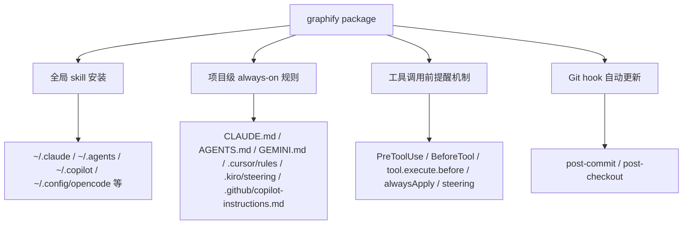
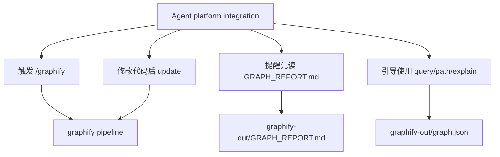
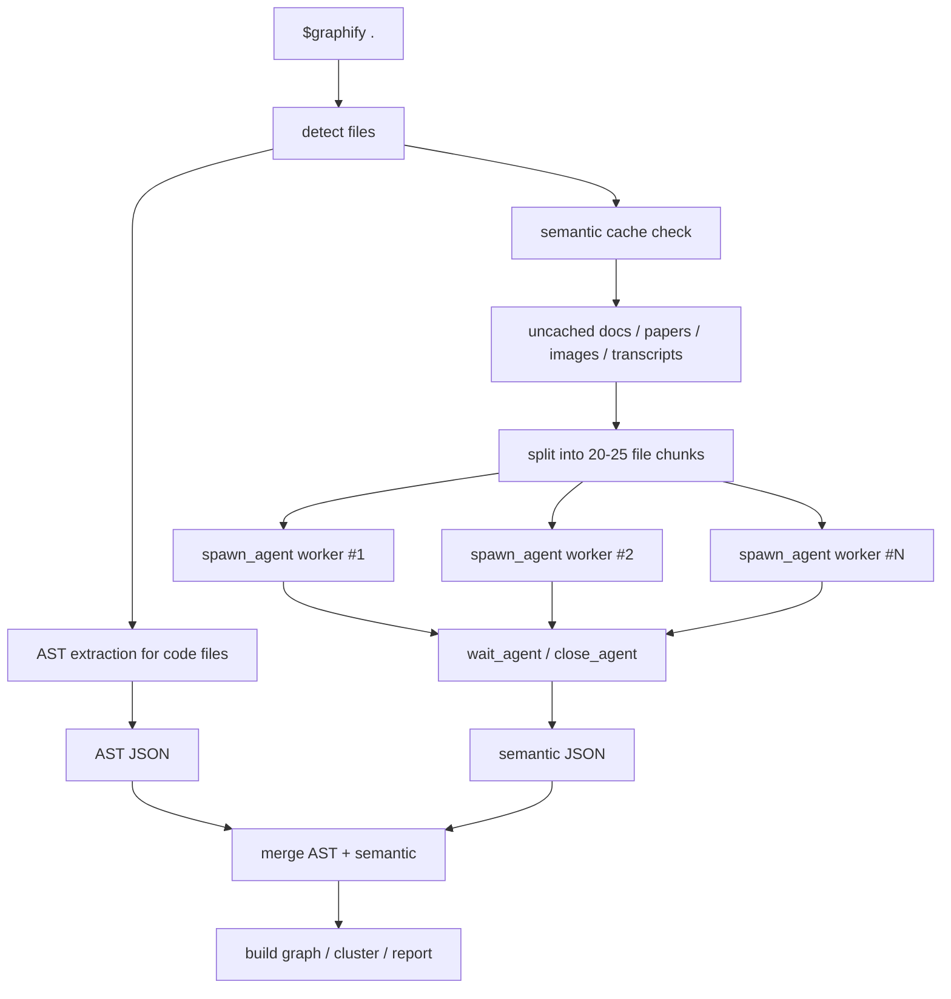

# graphify Agent 平台适配专题研究

## 1. 研究目标

本专题研究 `graphify` 如何适配不同代码 agent 平台。重点回答：

1. `graphify` 适配一个平台时到底安装了什么？
2. 不同平台的 skill、rules、hooks、steering、plugin 分别承担什么职责？
3. 为什么有的平台需要 hook，有的平台只写规则文件？
4. “显式触发 `/graphify`” 和 “always-on graph context” 是什么关系？
5. Codex、Claude Code、OpenCode、Cursor、Gemini CLI、Kiro、Copilot、Aider、Trae 等平台的差异在哪里？

本专题主要依据：

- [`graphify/graphify/__main__.py`](graphify/graphify/__main__.py)
- [`graphify/graphify/hooks.py`](graphify/graphify/hooks.py)
- [`graphify/graphify/skill.md`](graphify/graphify/skill.md)
- [`graphify/graphify/skill-codex.md`](graphify/graphify/skill-codex.md)
- [`graphify/graphify/skill-opencode.md`](graphify/graphify/skill-opencode.md)
- [`graphify/graphify/skill-vscode.md`](graphify/graphify/skill-vscode.md)
- [`graphify/graphify/skill-kiro.md`](graphify/graphify/skill-kiro.md)
- [`graphify/tests/test_install.py`](graphify/tests/test_install.py)
- [`graphify/tests/test_claude_md.py`](graphify/tests/test_claude_md.py)
- [`graphify/tests/test_hooks.py`](graphify/tests/test_hooks.py)

## 2. 总体适配模型

`graphify` 对 agent 平台的适配可以分成三层：



这三层解决的是不同问题：

- 全局 skill 安装
  让 agent 知道 `/graphify` 或平台等价触发词应该执行什么工作流。
- 项目级 always-on 规则
  让 agent 在普通代码问答中也知道“这个项目有 graphify 知识图谱”。
- 工具调用前提醒机制
  在 agent 即将 grep、glob、bash、read file 时注入提醒，避免它直接扫原始文件而忽略 `GRAPH_REPORT.md`。
- Git hook 自动更新
  不依赖特定 agent，在 Git commit / branch switch 后自动刷新 code graph。

这是 `graphify` 适配多个平台的核心思路：不是要求所有平台支持同一套插件 API，而是根据每个平台已有能力选择最接近的接入点。

## 3. 两种使用模式：explicit trigger 与 always-on

### 3.1 explicit trigger

explicit trigger（显式触发）指用户主动输入：

```text
/graphify .
```

或在 Codex 中使用对应 skill 调用方式。

这时 agent 会读取安装好的 `SKILL.md`，执行完整 pipeline：

- detect
- extract
- semantic extraction
- build
- cluster
- analyze
- report
- export

也就是说，explicit trigger 负责“建图或更新图”。

### 3.2 always-on context

always-on context（常驻上下文）指即使用户没有输入 `/graphify`，agent 在回答架构、依赖、跨模块问题时也会先意识到：

- 项目里可能已有 `graphify-out/GRAPH_REPORT.md`
- 项目里可能已有 `graphify-out/graph.json`
- 对跨模块问题应该优先用 `graphify query`、`graphify path`、`graphify explain`

这层通常通过项目文件实现：

- `CLAUDE.md`
- `AGENTS.md`
- `GEMINI.md`
- `.cursor/rules/graphify.mdc`
- `.kiro/steering/graphify.md`
- `.github/copilot-instructions.md`
- `.agents/rules/graphify.md`

### 3.3 二者的关系

可以把二者理解成：

- `/graphify` 是建图入口
- always-on 规则是用图入口

这也是 `graphify` 相比普通 CLI 工具更 agent-native 的地方：它不止生成文件，还尝试改变 agent 后续使用代码库的行为。

## 4. 平台适配总表

| 平台 | 显式触发安装 | 项目级 always-on | 工具前提醒/注入机制 | 主要文件 |
| --- | --- | --- | --- | --- |
| Claude Code | `~/.claude/skills/graphify/SKILL.md` | `CLAUDE.md` | `.claude/settings.json` `PreToolUse` | `skill.md` |
| Codex | `~/.agents/skills/graphify/SKILL.md` | `AGENTS.md` | `.codex/hooks.json` `PreToolUse` for Bash | `skill-codex.md` |
| OpenCode | `~/.config/opencode/skills/graphify/SKILL.md` | `AGENTS.md` | `.opencode/plugins/graphify.js` + `opencode.json` | `skill-opencode.md` |
| Cursor | 无传统全局 skill 依赖 | `.cursor/rules/graphify.mdc` | `alwaysApply: true` | Cursor rule |
| Gemini CLI | `~/.gemini/skills/graphify/SKILL.md` 或 Windows `~/.agents/skills/...` | `GEMINI.md` | `.gemini/settings.json` `BeforeTool` | `skill.md` |
| GitHub Copilot CLI | `~/.copilot/skills/graphify/SKILL.md` | 无项目规则写入 | 主要依赖 skill | `skill-copilot.md` |
| VS Code Copilot Chat | `~/.copilot/skills/graphify/SKILL.md` | `.github/copilot-instructions.md` | VS Code 自动读取 instructions | `skill-vscode.md` |
| Aider | `~/.aider/graphify/SKILL.md` | `AGENTS.md` | 无 hook，依赖规则 | `skill-aider.md` |
| OpenClaw | `~/.openclaw/skills/graphify/SKILL.md` | `AGENTS.md` | 无 hook，依赖规则 | `skill-claw.md` |
| Factory Droid | `~/.factory/skills/graphify/SKILL.md` | `AGENTS.md` | 无 hook，依赖规则 | `skill-droid.md` |
| Trae / Trae CN | `~/.trae/...` / `~/.trae-cn/...` | `AGENTS.md` | 无 PreToolUse，依赖规则 | `skill-trae.md` |
| Hermes | `~/.hermes/skills/graphify/SKILL.md` | `AGENTS.md` | 无 hook，依赖规则 | `skill-claw.md` |
| Kiro IDE/CLI | `.kiro/skills/graphify/SKILL.md` | `.kiro/steering/graphify.md` | steering `inclusion: always` | `skill-kiro.md` |
| Google Antigravity | `~/.agents/skills/graphify/SKILL.md` | `.agents/rules/graphify.md` + `.agents/workflows/graphify.md` | rules/workflow + 可选 MCP 配置 | `skill.md` |

## 5. 安装入口设计

### 5.1 `graphify install --platform`

`__main__.py` 中的 `_PLATFORM_CONFIG` 定义了多个平台的 skill 文件和目标安装位置。典型安装命令是：

```bash
graphify install --platform codex
graphify install --platform opencode
graphify install --platform aider
```

这类命令主要负责“把平台对应的 `SKILL.md` 拷贝到平台全局目录”。

例如：

- Codex 使用 `skill-codex.md`
- OpenCode 使用 `skill-opencode.md`
- Aider 使用 `skill-aider.md`
- Copilot CLI 使用 `skill-copilot.md`
- Kiro 使用 `skill-kiro.md`
- VS Code Copilot Chat 使用 `skill-vscode.md`

### 5.2 平台专用子命令

除了 `install --platform`，项目还提供平台专用子命令：

```bash
graphify claude install
graphify codex install
graphify opencode install
graphify cursor install
graphify gemini install
graphify vscode install
graphify kiro install
graphify antigravity install
```

这些命令通常做得更多，不只是复制 skill，还会写项目级 always-on 文件或 hook。

可以简单理解为：

- `graphify install --platform X` 偏向“全局技能安装”
- `graphify X install` 偏向“当前项目接入”

实际项目中这两类命令有部分重叠，但设计意图大致如此。

## 6. Claude Code 适配

Claude Code 是 `graphify` 最完整的适配之一。

安装动作包括：

1. 复制 skill 到 `~/.claude/skills/graphify/SKILL.md`
2. 写入项目 `CLAUDE.md`
3. 写入 `.claude/settings.json` 的 `PreToolUse` hook

`CLAUDE.md` 中的规则要求：

- 回答架构或代码库问题前，先读 `graphify-out/GRAPH_REPORT.md`
- 如果有 `graphify-out/wiki/index.md`，优先导航 wiki
- 对跨模块问题优先用 `graphify query/path/explain`
- 修改代码后运行 `graphify update .`

`PreToolUse` hook 的 matcher 是：

```text
Glob|Grep
```

这表示 Claude 在执行 Glob/Grep 前，会收到 graphify 提醒。如果 `graphify-out/graph.json` 存在，hook 会注入类似：

```text
graphify: Knowledge graph exists. Read graphify-out/GRAPH_REPORT.md ...
```

这是一种强 always-on 机制，因为它不是只靠模型“记得规则”，而是在工具调用前动态提醒。

## 7. Codex 适配

Codex 适配由两层组成：

1. 全局 skill：`~/.agents/skills/graphify/SKILL.md`
2. 项目级规则：`AGENTS.md`
3. 项目级 hook：`.codex/hooks.json`

Codex 的 hook matcher 是：

```text
Bash
```

含义是：当 Codex 准备执行 Bash 工具时，如果项目存在 `graphify-out/graph.json`，就向上下文注入 graphify 提醒。

Codex 还有一个重要差异：README 中提到 Codex 用户需要在 `~/.codex/config.toml` 中启用：

```toml
[features]
multi_agent = true
```

这是因为 `graphify` 的 semantic extraction（语义抽取）流程希望并行派发 subagents。Codex 对应的 `skill-codex.md` 里也有专门适配 Codex 工具名和并行 agent 调度方式。

## 8. OpenCode 适配

OpenCode 的适配方式和 Codex 类似，但工具前注入机制不同。

它写入：

- `AGENTS.md`
- `.opencode/plugins/graphify.js`
- `opencode.json`

`graphify.js` 注册的是：

```text
tool.execute.before
```

当 OpenCode 即将执行 bash 工具时，插件会把一条 graphify reminder 注入到命令输出前。它不是 Claude/Codex 那种 JSON hook，而是 OpenCode 插件机制。

这说明 `graphify` 的适配策略并不执着于统一 hook API，而是利用平台已有的“工具调用前插入逻辑”的能力。

## 9. Cursor 适配

Cursor 没有使用 shell hook，而是写入：

```text
.cursor/rules/graphify.mdc
```

这个文件带有：

```yaml
alwaysApply: true
```

也就是说，Cursor 会在每次对话中自动包含这条规则。

Cursor 适配的特点是：

- 没有显式 PreToolUse hook
- 没有命令前注入
- 依赖 Cursor rules 机制实现 always-on

这是一种“规则常驻型”适配。

## 10. Gemini CLI 适配

Gemini CLI 适配包括：

1. 复制 skill 到 `~/.gemini/skills/graphify/SKILL.md`
2. Windows 下优先复制到 `~/.agents/skills/graphify/SKILL.md`
3. 写入项目 `GEMINI.md`
4. 写入 `.gemini/settings.json` 的 `BeforeTool` hook

Gemini hook matcher 是：

```text
read_file|list_directory
```

也就是说，Gemini 在读取文件或列目录前，会被提醒先看 graphify 图报告。

这和 Claude 的 `Glob|Grep`、Codex 的 `Bash` 不同，体现了每个平台工具模型的差异。

## 11. GitHub Copilot CLI 与 VS Code Copilot Chat

### 11.1 GitHub Copilot CLI

Copilot CLI 主要安装：

```text
~/.copilot/skills/graphify/SKILL.md
```

源码中没有为 Copilot CLI 写入项目级 hook 或 instructions。它更多依赖 skill 调用本身。

### 11.2 VS Code Copilot Chat

VS Code Copilot Chat 是单独适配的，因为它不是 Copilot CLI。

安装动作包括：

- 复制 `skill-vscode.md` 到 `~/.copilot/skills/graphify/SKILL.md`
- 写入 `.github/copilot-instructions.md`

`skill-vscode.md` 有一个重要特点：它要求使用 Python 命令形式，而不是 Bash heredoc、shell redirect、`&&` / `||`。这是为了同时兼容：

- Windows PowerShell
- macOS/Linux shell

这说明 VS Code 适配更关注跨平台命令可执行性。

## 12. Aider / OpenClaw / Factory Droid / Trae / Hermes

这些平台共用一类适配思路：

- 复制平台对应 skill 文件
- 写入项目 `AGENTS.md`
- 不安装 PreToolUse hook

源码中 `_agents_install()` 明确提示：

```text
unlike Claude Code, there is no PreToolUse hook equivalent
```

因此这些平台的 always-on 机制主要依赖 `AGENTS.md`。

差异主要体现在 skill 文件和平台能力：

- Aider / OpenClaw 可能更偏 sequential extraction
- Factory Droid 使用 Task 工具进行并行 subagent dispatch
- Trae 使用 Agent 工具，但不支持 PreToolUse hooks
- Hermes 复用 `skill-claw.md`

从设计上看，这一组平台属于“AGENTS.md 规则型适配”。

## 13. Kiro IDE/CLI 适配

Kiro 适配写入两个项目内文件：

```text
.kiro/skills/graphify/SKILL.md
.kiro/steering/graphify.md
```

`steering` 文件带有：

```yaml
inclusion: always
```

这和 Cursor 的 `alwaysApply: true` 类似，都是平台原生的“常驻规则”机制。

Kiro 的特点是：

- skill 是项目本地的，而不是只放全局目录
- steering 文件明确用于每次对话注入 graphify 上下文
- 不需要单独 hook

## 14. Google Antigravity 适配

Antigravity 适配写入：

```text
.agents/rules/graphify.md
.agents/workflows/graphify.md
```

同时会把 skill 安装到：

```text
~/.agents/skills/graphify/SKILL.md
```

其中：

- `rules` 负责 always-on 项目规则
- `workflows` 负责把 `/graphify` 注册成 workflow
- skill 文件还会注入 YAML frontmatter，便于 Antigravity 工具发现

Antigravity 适配还提示用户可以配置 MCP：

```text
~/.gemini/antigravity/mcp_config.json
```

这说明它的理想形态不是只读 `GRAPH_REPORT.md`，还希望通过 MCP 工具直接查询 `graph.json`。

## 15. Service-like 运行形态

`graphify` 默认常被使用成一个一次性 CLI，但从源码和 skill 设计看，它其实至少有两种接近 service-like runtime（类服务运行时）的能力。

### 15.1 MCP stdio server

最接近“常驻服务”的是：

```bash
python3 -m graphify.serve graphify-out/graph.json
```

这会启动一个 MCP（Model Context Protocol，模型上下文协议）`stdio` server，而不是 HTTP server。`serve.py` 启动时会加载 `graph.json`，随后持续暴露图查询工具，包括：

- `query_graph`
- `get_node`
- `get_neighbors`
- `get_community`
- `god_nodes`
- `graph_stats`
- `shortest_path`

这类能力的关键价值是：

- agent 可以在同一会话中反复查询图，而不是每次都重新手工拼上下文
- 宿主平台若支持 MCP，可以把图访问变成真正的 tool call
- 对跨模块架构问题，交互体验更接近“在线查询图服务”

但这里要注意边界：

- 它是长期驻留进程，不是 `graphify` 自带的系统 daemon 管理器
- 当前实现是启动时加载图，源码里没有显式热重载 `graph.json` 的逻辑；图更新后通常需要重启该 server

### 15.2 `watch` 后台 watcher

另一种类服务能力是：

```bash
python3 -m graphify.watch INPUT_PATH --debounce 3
```

它会持续监控文件变化：

- code file 变更时，自动做 AST-only rebuild，更新 `graph.json`、`GRAPH_REPORT.md`、`graph.html`
- docs / papers / images 变更时，只写 `graphify-out/needs_update`，并提示运行 `/graphify --update`

所以 `watch` 更像 background sync worker（后台同步器），而不是 query server（查询服务）。

### 15.3 与默认 CLI 的区别

默认的 `graphify query`、`graphify path`、`graphify explain` 仍然属于 one-shot CLI：

- 每次命令独立启动
- 每次重新读取 `graph.json`
- 每次重新构造 NetworkX graph 后再执行查询

因此更准确的理解是：

- persistent artifact：`graph.json`、`GRAPH_REPORT.md`、wiki
- one-shot interface：`query`、`path`、`explain`、`update`
- long-running runtime：`serve`、`watch`

### 15.4 always-on rules 不等于常驻进程

这是研究 `graphify` 平台适配时最容易混淆的点之一。

文档里经常提到的 always-on context（常驻上下文）说的是：

- agent 在普通问答中会优先想到项目里已有 graph
- agent 会优先读 `GRAPH_REPORT.md` 或使用 `query/path/explain`
- hook / plugin / rule 会在工具调用前提醒它不要直接 grep 原始文件

它改变的是 agent behavior（代理行为），不是进程模型。也就是说：

- `AGENTS.md` / `CLAUDE.md` / rules / steering 是“常驻规则”
- `graphify.serve` / `graphify.watch` 才是“常驻运行时”

二者相关，但不是一回事。

## 16. Git hooks：平台无关的自动更新层

除了 agent 平台适配，`graphify` 还提供：

```bash
graphify hook install
graphify hook uninstall
graphify hook status
```

这会安装 Git hooks：

- `post-commit`
- `post-checkout`

作用是：

- commit 后自动重建 code graph
- branch switch 后自动重建 code graph
- 仅做 code-only rebuild，不触发 LLM semantic extraction

这层和 agent 平台无关。即使团队成员使用不同 agent，只要仓库安装了 Git hook，代码图就能更容易保持新鲜。

它还考虑了一些工程细节：

- 尊重 `core.hooksPath`
- rebase/merge/cherry-pick 时跳过
- 检测正确 Python interpreter
- hook 安装使用 marker 包裹，卸载时只删除 graphify 片段，不破坏其他 hook 内容

## 17. 适配机制分类

可以把所有平台按适配机制分成四类。

### 17.1 Hook 型

代表：

- Claude Code
- Codex
- Gemini CLI

特点：

- 平台支持工具调用前 hook
- graphify 能在模型即将搜索/读取/执行前插入提醒
- always-on 效果最强

### 17.2 Plugin 型

代表：

- OpenCode

特点：

- 通过平台 plugin API 注入逻辑
- 能在 tool execution 前改写或包装行为
- 比纯规则更强，但依赖平台插件机制

### 17.3 Rule / Steering 型

代表：

- Cursor
- Kiro
- Antigravity
- VS Code Copilot Chat

特点：

- 平台能自动读取项目规则或 steering 文件
- 不需要 hook
- 依赖模型遵守规则，无法像 hook 那样在工具调用前动态判断 graph 是否存在

### 17.4 AGENTS.md 型

代表：

- Aider
- OpenClaw
- Factory Droid
- Trae
- Hermes
- 部分 Codex/OpenCode 场景

特点：

- 使用通用项目说明文件
- 兼容性好
- 侵入性低
- 提醒强度弱于 hook/plugin

## 18. 为什么要做这么多平台适配

`graphify` 的目标不是只生成 `graph.json`，而是让 agent 在日常工作中“真的用图”。

如果只提供 CLI，用户需要每次主动提醒模型：

```text
先看 graphify-out/GRAPH_REPORT.md
```

但实际工作中，模型很容易直接 grep 或读文件。平台适配的价值就是把这条行为规则固化下来：

- 有的平台通过 hook 固化
- 有的平台通过 rules 固化
- 有的平台通过 AGENTS.md 固化
- 有的平台通过 steering 固化

这就是 `graphify` 的 agent-native 特征：它不是只在数据层做图谱，而是在 agent 行为层做引导。

## 19. 适配设计的工程取舍

### 19.1 优点

- 覆盖平台广
- 尽量使用各平台原生机制
- install/uninstall 基本成对
- idempotent（幂等）安装有测试覆盖
- hook/plugin/rules 分层清楚
- 项目规则与全局 skill 分离，便于团队共享

### 19.2 风险

- 平台机制差异大，维护成本高
- hook schema 可能随平台版本变化
- AGENTS.md 型适配依赖模型遵守规则
- 多平台共享 skill 目录时可能出现版本提醒与路径复用复杂度
- 项目级文件写入需要避免覆盖用户已有内容

源码中通过以下方式缓解：

- 使用 marker section 删除/更新 graphify 块
- 重复安装时避免重复写入 hook
- `.graphify_version` 做 skill 版本提醒
- `_refresh_all_version_stamps()` 同步多个已安装平台的版本戳
- 测试覆盖 Claude、AGENTS.md、OpenCode plugin、Cursor、Gemini、Git hooks 等安装卸载路径

## 20. 与主 pipeline 的关系

平台适配并不改变 `graphify` 的核心 pipeline。它只负责让 agent 更容易：

- 触发 pipeline
- 使用 pipeline 输出
- 在修改代码后刷新 pipeline 输出

也就是说：



## 21. 研究判断

`graphify` 的平台适配设计有一个很清晰的核心假设：

> 知识图谱只有被 agent 自动纳入工作流，才真正有长期价值。

因此它没有停留在“生成图，然后让用户自己记得使用”，而是把接入点铺到各类 agent 平台：

- skill 用于显式建图
- rules/AGENTS/CLAUDE/GEMINI 用于常驻上下文
- hook/plugin/steering 用于工具调用前提醒
- Git hook 用于图的新鲜度维护

这套设计的复杂度明显高于普通库，但它也解释了为什么 `graphify` 能被定位为 agent-native knowledge graph tool。它的重点不只是“图谱格式”，而是“如何把图谱嵌进 agent 的行为循环”。

## 22. FAQ

### Q1. 为什么不同平台不是共用同一个安装方式？

因为各平台能读取的配置位置和支持的扩展机制不同。Claude Code 支持 `CLAUDE.md` 和 `PreToolUse`，Codex 支持 `AGENTS.md` 和 `.codex/hooks.json`，Cursor 支持 `.cursor/rules/*.mdc`，Kiro 支持 steering。`graphify` 只能按平台能力做适配。

### Q2. 哪种适配效果最好？

一般来说，hook/plugin 型最强，因为它能在工具调用前动态提醒模型。规则型和 AGENTS.md 型更轻量，但更依赖模型遵守指令。

### Q3. 为什么已经有 skill，还要写 `AGENTS.md` / `CLAUDE.md`？

skill 主要用于用户显式调用 `/graphify`。而 `AGENTS.md` / `CLAUDE.md` 负责普通问题中的 always-on 规则，让 agent 在没有显式调用 graphify 时也知道先利用图。

### Q4. Git hooks 和 agent hooks 是一回事吗？

不是。

- agent hook 是模型工具调用前的提醒机制
- Git hook 是 Git commit / checkout 后自动刷新 graph 的机制

前者影响 agent 行为，后者维护图的新鲜度。

### Q5. 为什么有的平台只写 `AGENTS.md`？

因为这些平台没有公开或稳定的 PreToolUse 等价机制。`AGENTS.md` 是更通用、更保守的 fallback。

### Q6. Codex 中的 parallel subagent dispatch 具体是怎么做的？

它不是由 `graphify` Python 进程自己启动多线程完成的，而是写在 Codex 版 skill 工作流里，由 Codex 主 agent 调用平台提供的 agent delegation 工具完成。

流程可以概括为：



关键约束有四个：

- 用户需要在 `~/.codex/config.toml` 的 `[features]` 下启用 `multi_agent = true`。
- 每个 chunk 对应一个 `spawn_agent(agent_type="worker", message=...)`。
- 所有 `spawn_agent` 调用需要在同一轮响应里发出，才是真并行；逐个发起并等待会退化为串行。
- 主 agent 负责用 `wait_agent(handle)` 收集每个 worker 的 JSON，再用 `close_agent(handle)` 清理。

这个设计和 Claude Code 的 Agent tool 类似，但 Codex 使用的是 `spawn_agent` / `wait_agent` / `close_agent` 这套工具名。`skill-codex.md` 还要求 AST extraction 与 semantic extraction 同时启动，因为二者处理的文件类型不同，可以并行节省时间。

### Q7. Codex subagents 为什么只处理部分文件，而不是全量重读？

因为 `graphify` 在派发 subagents 前会先做 semantic cache check。

它会把检测到的非代码语料和缓存比对，已经抽取过且内容 hash 未变化的文件直接复用缓存；只有 uncached files 才进入 chunk splitting。这样可以让重复运行 `/graphify --update` 或 `$graphify --update` 时，成本主要落在变化过的 docs、papers、images、transcripts 上。

### Q8. Codex skill 里提到 chunk 文件和 `wait_agent` 返回 JSON，二者是什么关系？

这里有一个需要注意的文档不一致点。

Codex 版 `skill-codex.md` 在 Step B2 说主 agent 应该解析 `wait_agent(handle)` 的返回 JSON，并写入 `.graphify_semantic_new.json`；但 Step B3 又沿用了 Claude 版 skill 的说法，要求检查 `graphify-out/.graphify_chunk_NN.json` 是否存在。由于 Codex 子 agent 的提示强调 “Output ONLY the structured JSON response”，这与“子 agent 写 chunk 文件到磁盘”的成功信号并不完全一致。

研究上可以这样理解：

- Claude 版 workflow 更偏“subagent 写 chunk file，主 agent 检查磁盘文件”。
- Codex 版 workflow 更偏“subagent 返回 JSON，主 agent 汇总 wait result”。
- `skill-codex.md` 中的 chunk-file 检查很可能是从 Claude 版流程继承来的残留描述，需要在真实运行时验证。

这不是 `graphify` 核心图算法的问题，而是多平台 skill 文档同步中的工程细节风险。

### Q9. `graphify` 的 always-on context 算不算“常驻服务”？

不算。

always-on context 的意思是：

- agent 持续记得项目里有 `graphify-out/`
- agent 在普通问答中优先使用图，而不是直接搜索原始文件
- hook / plugin / rule 能在工具调用前提醒它先看图

这是一种持续生效的 behavior shaping（行为塑形），不是一个后台进程。

如果说“常驻服务”，更接近的是：

- `graphify.serve` 这种 MCP stdio server
- `graphify.watch` 这种后台 watcher

所以“常驻上下文”和“常驻运行时”在 `graphify` 中必须分开理解。

### Q10. Codex 会不会被默认告知“先启动 MCP server”？

就当前默认安装逻辑来看，不会。

`graphify codex install` 写入的 `AGENTS.md` 主要强调：

- 先读 `GRAPH_REPORT.md`
- 优先用 `graphify query/path/explain`
- 修改代码后运行 `graphify update .`

`.codex/hooks.json` 的 `PreToolUse` hook 也主要是在 Bash 工具调用前提醒“图已存在，先读报告”，而不是自动告诉它“如果还没启动 `graphify.serve`，先去启动一个 MCP server”。

因此，Codex 默认适配是 CLI-first，不是 MCP-first。

如果团队希望变成 service-first，一般需要：

- 由宿主或平台配置固定的 `mcpServers`
- 再在规则文件中补充“若 MCP graph server 可用则优先用 tools，否则回退 CLI”

这也是为什么 Antigravity 适配会显式区分 “MCP server is active” 和 “MCP server is not active” 两条路径。

## 23. 后续研究方向

建议后续继续研究：

1. 各平台 hook schema 随版本变化的兼容风险
2. `AGENTS.md` 型适配在真实 agent 中的遵守率
3. MCP 接入是否能替代部分 CLI query/path/explain
4. 多 agent 并行 extraction 在 Codex、Claude、Droid、Trae 中的实际差异
5. `graphify-out/` 作为团队共享 artifact 时，平台规则文件是否应该纳入 `.graphifyignore`
