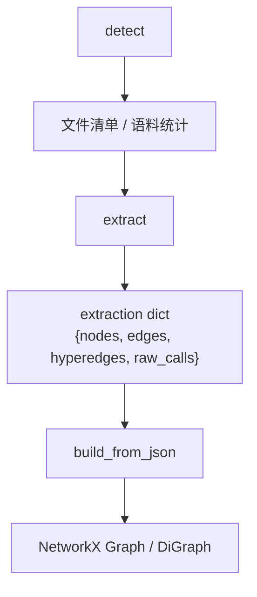
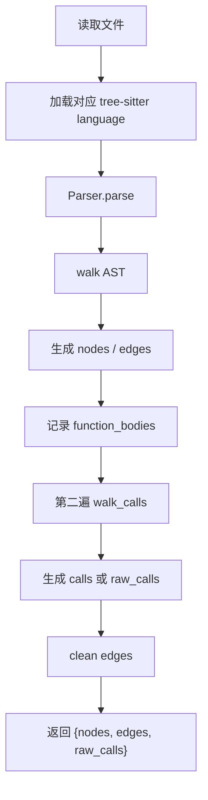
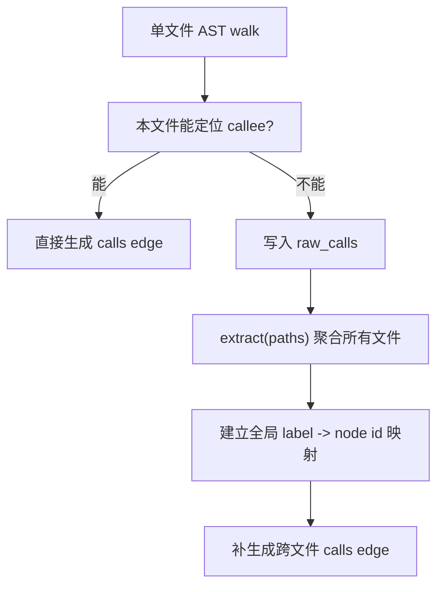

# graphify Extraction 专题研究

## 1. 研究目标

本专题聚焦 `graphify` 的 extraction（抽取）层，回答以下问题：

1. `graphify` 到底从源文件里抽什么？
2. 抽取流程内部如何组织？
3. 通用 extractor 和各语言定制逻辑如何协作？
4. 调用关系（calls）、导入关系（imports）、继承关系（inherits）是怎么来的？
5. Python rationale（设计动因）抽取是怎么做的？
6. 它的已知边界和局限在哪里？

这里主要研究的是源码中的 `graphify/graphify/extract.py` 及相关测试，而不是 README 中更高层的产品宣传。

## 2. extraction 在整体流水线中的位置

`graphify` 的前几步可以概括为：



其中：

- `detect` 负责“找文件”
- `extract` 负责“把文件转成图原料”
- `build_from_json` 负责“把图原料转成真正可运行的图对象”

也就是说，`extract` 是 `graphify` 真正开始形成知识图谱结构的第一步。

## 3. extraction 输出的基本形态

从 [`graphify/graphify/extract.py`](graphify/graphify/extract.py) 看，抽取层的核心输出是一个 dict，典型字段包括：

- `nodes`
- `edges`
- `raw_calls`
- 有时还会在更高层合并出 `hyperedges`
- `input_tokens` / `output_tokens` 在最终聚合时也会出现，但 AST 抽取通常为 `0`

一个简化后的抽取结果大致是：

```json
{
  "nodes": [
    {
      "id": "sample_transformer",
      "label": "Transformer",
      "file_type": "code",
      "source_file": "sample.py",
      "source_location": "L10"
    }
  ],
  "edges": [
    {
      "source": "sample_py",
      "target": "sample_transformer",
      "relation": "contains",
      "confidence": "EXTRACTED",
      "source_file": "sample.py",
      "source_location": "L10",
      "weight": 1.0
    }
  ],
  "raw_calls": []
}
```

其中最重要的语义有三层：

- `node`
  图中的实体，如文件、类、函数、方法、rationale 节点
- `edge`
  实体之间的关系
- `raw_calls`
  当前文件内未能解析到目标节点的调用名，留待跨文件后处理

## 4. 抽取设计总览

### 4.1 一个核心目标：deterministic structural extraction

`extract.py` 文件开头就表明该模块的定位是：

- 基于 Tree-sitter
- 做 deterministic（确定性）的 structural extraction（结构抽取）

这意味着它优先抽取“源代码里确实存在的结构事实”，而不是依赖 LLM 猜测架构关系。

### 4.2 一个核心抽象：`LanguageConfig`

`graphify` 并没有为每种语言都从头重写一套完整 extractor，而是抽象出了 `LanguageConfig` 这层描述对象。它把不同语言的差异压缩进一组配置项，比如：

- `class_types`
- `function_types`
- `import_types`
- `call_types`
- `name_field`
- `body_field`
- `call_function_field`
- `call_accessor_node_types`
- `function_boundary_types`
- `import_handler`
- `resolve_function_name_fn`
- `extra_walk_fn`

这套设计很关键，因为它表明：

- `graphify` 把多语言抽取看成“同一个问题在不同 AST 语法上的投影”
- 而不是“每种语言都是一套完全独立系统”

这让项目可以在保持统一输出 schema 的同时，逐步扩展语言支持。

### 4.3 一个核心工具：`_make_id()`

`_make_id(*parts)` 是 extraction 的基础设施之一。它会：

1. 拼接输入片段
2. 去掉前后多余的 `.` / `_`
3. 把非字母数字字符替换成 `_`
4. 转成小写

结果是一个稳定、可复用、跨阶段易于匹配的 node ID。

这也是为什么 extraction 专题和主报告中的 ID 对齐问题密切相关。AST 侧所有结构节点几乎都依赖 `_make_id()`。

## 5. 通用抽取框架 `_extract_generic()`

### 5.1 流程概览

`_extract_generic(path, config)` 是绝大多数语言 extractor 的主入口。其内部大致流程如下：



### 5.2 第一遍 walk：抽结构节点

第一遍主要做这些事情：

- 给文件本身创建 file node
- 识别 class / interface / protocol / struct / enum 等类型节点
- 识别 function / method / constructor 等函数节点
- 识别 import / using / include 等依赖边
- 收集函数体，留给第二遍调用分析

这一步最常见的边有：

- `contains`
- `method`
- `imports`
- `imports_from`
- `inherits`
- 某些语言特有的关系，如 `case_of`

### 5.3 第二遍 walk_calls：补调用关系

很多语言的调用关系不是在第一遍 AST walk 时直接写出来，而是先记住“哪些函数体需要分析”，第二遍再深入函数体寻找 call expression。

这一设计有几个好处：

- 逻辑上更清晰，把“定义抽取”和“调用分析”拆开
- 更容易控制函数边界，避免递归穿透到嵌套函数定义里
- 更方便做 caller -> callee 去重

### 5.4 clean edges：去掉无效边

最后会做一轮边清洗，只保留：

- source 在 `seen_ids` 中的边
- target 也在 `seen_ids` 中，或者关系属于 `imports` / `imports_from`

这意味着：

- 结构边通常必须连到真实节点
- 对外部包、stdlib、第三方 import，允许保留某些“未完全落地成本地节点”的导入边

## 6. 主要抽取对象

### 6.1 文件节点

几乎每个 extractor 都会先给文件本身建一个节点：

- `id` 往往是 `_make_id(str(path))`
- `label` 通常是文件名

这个 file node 是很多 `contains` / `defines` / `imports_from` 关系的起点。

### 6.2 类型节点

不同语言中类型节点包括：

- class
- interface
- protocol
- struct
- enum
- object
- trait
- module

这些节点通常由第一遍 walk 基于 `class_types` 或语言专用 walker 生成。

### 6.3 函数 / 方法节点

函数节点的标签通常是：

- 顶层函数：`function_name()`
- 方法：`.method_name()`

这种命名方式后面在分析层会被专门识别，用于过滤 file-level hub 和 method stub 噪声。

### 6.4 rationale 节点

Python extractor 还有一个额外 post-pass，会把：

- module docstring
- class docstring
- function docstring
- 特定前缀注释，如 `# NOTE:`、`# WHY:`、`# RATIONALE:`

转成 `file_type = "rationale"` 的节点，并通过 `rationale_for` 边挂回模块或函数。

这是 `graphify` 在 AST 抽取层里一个很有特色的设计，因为它试图在不依赖 LLM 的前提下，从代码中抓到“为什么这么做”的线索。

## 7. 主要关系类型

### 7.1 `contains`

最基础的结构边，表示：

- 文件包含类/函数
- 某些定制 extractor 中，文件定义了某个模块/类型

### 7.2 `method`

类或类型包含方法时使用。

### 7.3 `imports` / `imports_from`

用于表示：

- import / using / include
- 相对路径导入
- 某些语言中的 package import

这里的一个关键点是，很多 extractor 已经尽量把相对导入解析成与目标文件节点一致的 ID，而不是只存原始字符串。

### 7.4 `inherits`

用于类继承、协议实现、接口实现、类型继承等。

不同语言处理深度不同，但整体上这是结构抽取的一部分，而不是语义推断。

### 7.5 `calls`

`calls` 是 extraction 中最重要、也最容易出错的边之一。

当前实现里：

- 若在当前文件内能解析到目标节点，则直接写 `calls`
- 若当前文件内解析不到，则记入 `raw_calls`
- 之后在 `extract(paths)` 聚合阶段再做跨文件解析

在当前版本中，AST-resolved calls 被视为 deterministic fact，因此是：

- `confidence = EXTRACTED`
- `weight = 1.0`

这点在测试里也有明确约束。

### 7.6 语言专用关系

项目已经支持不少语言特定关系，例如：

- PHP 的 `uses_static_prop`
- PHP 的 `references_constant`
- PHP 的 `bound_to`
- PHP event/listener 的 `listened_by`
- Swift enum case 的 `case_of`
- Blade 模板中的 `includes`、`uses_component`、`binds_method`
- Verilog 的 `instantiates`

这说明 `graphify` 的 extraction 不是只停留在“最小公约数抽取”，而是在尝试吸收各语言生态中真正重要的结构习惯。

## 8. 跨文件调用解析

### 8.1 为什么需要 `raw_calls`

很多时候一个函数调用的目标不在当前文件里。例如：

- `client.py` 调 `models.py` 里的函数
- Go package 中不同文件上的方法互调
- Rust / Zig / PowerShell 的跨文件函数引用

如果 extraction 只做单文件分析，就会丢掉这类边。

因此项目的策略是：

1. 单文件 extractor 先尽量解析本地 calls
2. 本地解析不到的，记成 `raw_calls`
3. 在 `extract(paths)` 汇总所有文件后，再用全局 label map 做跨文件 resolution

### 8.2 这是一种两阶段 calls 解析

可以理解成：



这类设计的优势是：

- 保留单文件 extractor 的简单性
- 又能在多文件场景补回结构关系

它的代价是：

- 依赖 label 匹配，存在命名歧义
- 对重载、同名方法、多模块重复函数名等复杂场景不可能完全精准

## 9. 各语言支持概览

### 9.1 通用 Tree-sitter 驱动语言

大多数主流语言通过 `_extract_generic()` 加 `LanguageConfig` 处理，包括：

- Python
- JavaScript
- TypeScript
- Java
- C
- C++
- Ruby
- C#
- Kotlin
- Scala
- PHP
- Lua
- Swift

### 9.2 定制 extractor 语言

一些语言因为 AST 结构特殊、生态约定明显或现有通用框架不够贴合，使用了自定义 extractor，包括：

- Julia
- Go
- Rust
- Zig
- PowerShell
- Elixir
- Objective-C
- Verilog / SystemVerilog
- Dart
- Blade 模板

这说明项目在“抽象复用”和“语言特化”之间采取了折中路线，而不是强行统一。

### 9.3 Python 是最“增强”的 extractor

Python extraction 是目前最明显的“结构 + rationale”混合设计：

- 有通用 AST 结构抽取
- 有 docstring / rationale comment post-pass
- 有继承、调用、导入、why 类信息

从工程成熟度上看，Python 大概率是项目最优先维护的语言之一。

## 10. Python rationale 抽取

### 10.1 它抽什么

Python rationale 抽取关注两类信息：

- 足够长的 docstring
- 特定前缀的注释

前缀集合包括：

- `# NOTE:`
- `# IMPORTANT:`
- `# HACK:`
- `# WHY:`
- `# RATIONALE:`
- `# TODO:`
- `# FIXME:`

### 10.2 它怎么表示

这些内容不会只作为注释文本丢掉，而是被转成新的节点，然后通过 `rationale_for` 边连接到对应目标。

这一步很值得注意，因为它说明 `graphify` 把“解释性文字”也看成知识图谱中的一等公民，而不只是附属元数据。

### 10.3 它的边界

这套机制仍然是浅层 heuristic，不是完整的意图理解：

- 只对 Python 做了这套增强
- 依赖 docstring 长度阈值和注释前缀
- 不能真正理解复杂上下文里的设计动因

但即便如此，它已经比“完全忽略 why 信息”的 AST extractor 更进一步。

## 11. collect_files 与 extract 的关系

`extract.py` 里还提供了 `collect_files()`，它负责为 extraction 挑出支持的代码文件。它和 `detect()` 的关系是：

- `detect()` 是全语料、多类型、产品级扫描器
- `collect_files()` 更像 extraction 自己的代码文件选择器

在测试和部分直接调用场景里，`collect_files()` 能单独工作；但在完整产品流水线中，通常是 `detect()` 先做更宽口径的语料发现，再将代码文件交给 `extract()`。

## 12. 测试能说明什么

从 [`graphify/tests/test_extract.py`](graphify/tests/test_extract.py)、[`graphify/tests/test_languages.py`](graphify/tests/test_languages.py)、[`graphify/tests/test_rationale.py`](graphify/tests/test_rationale.py) 可以看到几个很明确的项目意图：

### 12.1 ID 稳定性是被测试的

测试会验证：

- `_make_id()` 的一致性
- 不出现多余前后下划线
- 结果可预期

### 12.2 结构边必须是 `EXTRACTED`

测试明确要求这几类关系必须是 `EXTRACTED`：

- `contains`
- `method`
- `inherits`
- `imports`
- `imports_from`

### 12.3 `calls` 也被当作 deterministic fact

当前版本中，AST-resolved `calls` 同样被要求是：

- `EXTRACTED`
- `weight = 1.0`

这说明项目已经不再把 AST call resolution 看成“弱推断”，而是把它升级为结构事实。

### 12.4 rationale 也是一等输出

测试会检查：

- module/function/class docstring 能否落成 rationale 节点
- `rationale_for` 边是否存在
- trivial docstring 是否应被忽略

这意味着 rationale 抽取并非附带实验，而是正式支持能力。

## 13. extraction 的优势

### 13.1 多语言支持广

从工程角度看，`graphify` 的 extractor 覆盖范围已经明显超过很多“只支持 Python/TS”的同类工具。

### 13.2 抽取层和图分析层解耦

extractor 只负责产出结构原料，不直接耦合后续聚类、报告、MCP、可视化。这样模块边界比较清楚。

### 13.3 对真实生态做了不少语言特化

不是只抽 class/function/import 这种最浅层元素，而是开始接触：

- Laravel 风格容器绑定与事件监听
- Blade 模板语义
- Verilog module instantiation
- Swift enum case

这说明作者关注的是“真实项目结构”，而不只是 AST demo。

### 13.4 对跨文件调用有务实补丁

用 `raw_calls` + 全局 label map 做二阶段解析，虽然不完美，但在工程上非常实用。

## 14. extraction 的局限

### 14.1 它不是编译器级语义分析

虽然用了 Tree-sitter，但 `graphify` 不是类型检查器，也不是完整静态分析器。它通常拿不到：

- 精确类型信息
- 重载分派结果
- 宏展开后的真实语义
- 动态绑定的最终目标

### 14.2 cross-file call resolution 依赖名字匹配

这在这些场景容易出错：

- 同名函数很多
- 重载严重
- 命名空间复杂
- 动态调用 / 反射 / metaprogramming

### 14.3 各语言支持深度不均衡

支持“覆盖面很广”不等于“每种语言都一样深入”。

目前看：

- Python / PHP / Go / Rust 等支持相对更丰富
- Dart、Blade 等更多是专项支持
- 某些语言仍只覆盖最常见结构

### 14.4 rationale 抽取仍是 heuristic

尤其是在多语言场景下，“why 信息”的抽取目前明显不均衡，Python 最强，其他语言还未形成同等级别支持。

## 15. 研究判断

`graphify` 的 extraction 设计体现出一种很典型的 agent-era engineering 思路：

- 不追求编译器级完美语义
- 优先抽出高价值、稳定、足以支撑导航的结构事实
- 遇到困难关系时先做工程上够用的近似
- 再把更高层的语义关系留给后续 LLM/subagent 流程补足

换句话说，它的 extraction 层不是“尽可能理解一切”，而是“尽可能用确定性方法搭出一个足够好的结构骨架（skeleton）”。

从整个系统看，这个骨架非常关键：

- 没有 extraction，就没有可稳定复用的结构锚点
- 没有结构锚点，后续语义层就更容易漂移
- 没有稳定 graph skeleton，社区检测、god nodes、路径查询和 always-on agent integration 都会失去基础

因此，`graphify` 的 extraction 不是整个系统中最显眼的部分，却很可能是最基础、最决定下限的一层。

## 16. 建议继续研究的问题

如果后续继续深挖 extraction，建议重点关注：

1. 哪些语言的 cross-file call resolution 最容易失真？
2. `_make_id()` 与 `_normalize_id()` 的配合是否足以支撑大规模异构项目？
3. Python rationale 模式能否推广到其他语言？
4. 针对 PHP / Go / Rust 的语言特化规则，是否可以进一步抽象成可配置 schema？
5. extraction 结果和后续 semantic extraction 之间，哪些边最适合由 AST 提前产出，哪些更适合交给 LLM？
