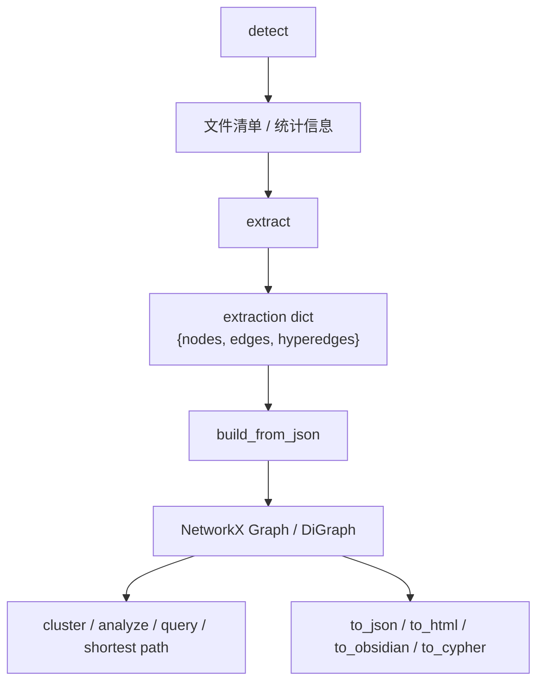
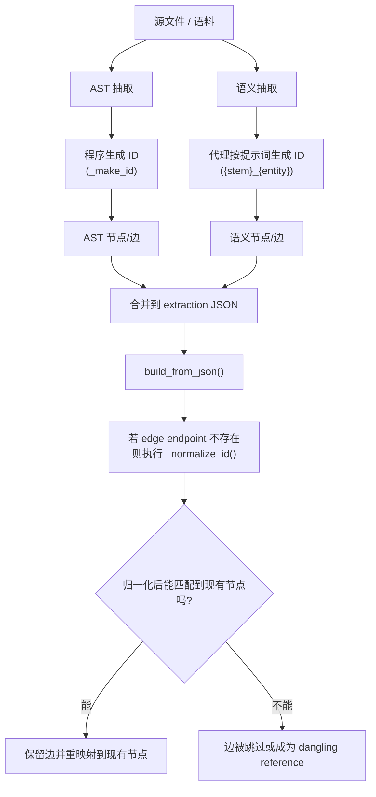

# graphify 研究报告

## 1. 项目概览

`graphify` 是一个面向 AI coding assistant 的知识图谱（knowledge graph）构建工具与技能（skill）集合。它的核心目标不是替代代码搜索，而是把代码、文档、论文（paper）、图片（image）、音视频（video/audio transcript）等异构材料转成一个统一的图结构，再把这个图反馈给 Claude Code、Codex、OpenCode、Cursor、Gemini CLI、GitHub Copilot CLI、Aider、OpenClaw、Factory Droid、Trae、Hermes、Kiro、Google Antigravity 等代理式开发环境使用。

从仓库实现看，`graphify` 同时具备三层产品形态：

- Python CLI 工具：负责检测语料、抽取、构图、聚类、分析、导出、查询、增量更新与平台集成。
- 多平台 skill/install 工具：把 `graphify` 的使用说明、常驻规则（always-on rules）和 hook 安装到不同 AI 助手环境。
- 图查询中间层：通过 `graph.json`、`GRAPH_REPORT.md`、HTML 可视化和 MCP（Model Context Protocol，模型上下文协议）服务，为后续问答提供结构化上下文。

从产品定位上看，`graphify` 更接近 “GraphRAG for coding assistants”，但它并不依赖向量数据库（vector database）或 embedding-first 检索，而是强调：

- 代码结构优先的 AST（Abstract Syntax Tree，抽象语法树）抽取。
- 多模态语料统一入图。
- 图拓扑（graph topology）而非 embedding 作为社区发现与路径分析的基础。
- 将“图摘要”和“图查询”直接接入代理工具链，而不是只导出一份静态图。

## 2. 仓库与发布状态

本地纳入的 submodule 版本为：

- 仓库：`safishamsi/graphify`
- 当前提交：`64e4c64d7bec574e5a56c1f0b9219e543ddbb5f3`
- 对应版本：`v0.4.27`

从源码 [`graphify/pyproject.toml`](graphify/pyproject.toml) 可核实：

- PyPI 包名是 `graphifyy`，CLI 命令仍为 `graphify`
- 当前版本号为 `0.4.27`
- Python 要求为 `>=3.10,<3.14`

这与项目 README 和 PyPI 页面上的官方说明一致，说明项目已经具备较成熟的打包与分发形态，而不是仅供仓库内部使用的脚本集合。

## 3. 解决的问题

### 3.1 典型痛点

`graphify` 试图解决的是大语料、多源异构、跨会话代码理解中的几个经典问题：

1. 仅靠 grep/全文搜索，助手能找到“出现过什么”，但不容易理解“谁依赖谁、为什么连接、结构中心在哪里”。
2. 代码库之外还存在大量半结构化知识，如架构文档、截图、白板照片、论文 PDF、录屏、音频讲解，传统代码索引无法统一吸收。
3. LLM 直接读取原始语料成本高、重复高、跨会话记忆差。
4. 向量检索虽然擅长语义相似，但对于调用链、模块边界、社区结构、桥接节点（bridge nodes）等结构问题并不天然占优。

### 3.2 graphify 的回答

它的思路是：

- 用 AST 抽取确定性结构事实。
- 用额外语义抽取补足概念关系与设计 rationale（设计动因）。
- 把所有实体和关系压缩成可查询图。
- 先给模型一份图摘要，再按问题取局部子图，而不是每次重读原始语料。

这也是它和传统 repo summarizer、静态 call graph 工具、纯 GraphRAG 框架之间最有区别的一点。

## 4. 总体架构

仓库文档 [`graphify/ARCHITECTURE.md`](graphify/ARCHITECTURE.md) 给出的主流水线为：

```text
detect() → extract() → build_graph() → cluster() → analyze() → report() → export()
```

源码核实后，可以把它拆成更清晰的七层。

### 4.1 检测层：`detect.py`

职责：

- 扫描目录并识别文件类型。
- 统计语料规模。
- 处理 `.graphifyignore`。
- 过滤噪音目录、锁文件、敏感文件。
- 支持增量检测。

关键实现特征：

- 支持代码、文档、论文、图片、音视频五大类。
- 支持的代码扩展名很多，覆盖 Python、JS/TS、Go、Rust、Java、C/C++、Ruby、C#、Kotlin、Scala、PHP、Lua、Zig、PowerShell、Elixir、Objective-C、Julia、Vue、Svelte、Dart、Verilog/SystemVerilog 等。
- 文本文件会用启发式规则识别“是否像论文”，而不是仅靠扩展名。
- 会跳过疑似 secrets 文件，如 `.env`、证书、私钥、`id_rsa`、`aws_credentials` 等。
- `.graphifyignore` 会向上递归查找，直到 `.git` 边界，这一点是对 `.gitignore` 心智模型的刻意对齐。

工程意义：

- 这是一个相当实用的 corpus hygiene 设计。很多“AI 帮我读仓库”的工具最大的问题不是算法，而是先把脏东西读进来了。`graphify` 在检测层就投入了较多规则，说明作者非常关注真实仓库场景。

### 4.2 抽取层：`extract.py`

职责：

- 对代码文件进行确定性结构抽取。
- 输出统一的 `{nodes, edges}` schema。

核心机制：

- 基于 Tree-sitter 做语言解析。
- 使用 `LanguageConfig` 抽象多语言 extractor 的共性。
- 为不同语言实现 import、class、function、call、body、name resolution 等处理逻辑。

抽取结果 schema 大致为：

```json
{
  "nodes": [
    {"id": "...", "label": "...", "source_file": "...", "source_location": "..."}
  ],
  "edges": [
    {"source": "...", "target": "...", "relation": "...", "confidence": "EXTRACTED|INFERRED|AMBIGUOUS"}
  ]
}
```

这里有几个值得注意的设计：

- `id` 会做规范化，便于不同抽取阶段合并。
- 关系带 `confidence` 标签，而不是把所有边当成同等真值。
- 代码 AST 抽取是“强结构事实”，为后续语义层提供锚点。

#### 4.2.1 为什么 detect 之后还需要 NetworkX

一个很容易混淆的点是：`detect` 阶段并没有生成图。

`detect.py` 的职责是：

- 发现要处理的文件
- 判断文件类型
- 统计语料规模
- 应用 `.graphifyignore`
- 过滤噪音与敏感文件

它输出的是“文件清单 + 统计信息”，而不是图结构。换句话说，`detect()` 解决的是“读什么”，不是“这些材料之间如何构成图”。

真正开始出现图形态数据的是 `extract()`。但 `extract()` 产出的也还只是一个 extraction dict，也就是类似：

```json
{
  "nodes": [...],
  "edges": [...]
}
```

这可以看作图的 JSON-like 序列化原料，仍然不是一个可运行的图对象。

NetworkX 在项目中的作用，是把这份静态原料升级为一个可计算、可分析、可查询、可导出的 graph runtime（图运行时）。也因此，`graphify` 的数据流更准确地应该理解为：



因此，项目里至少有三种不同的数据形态：

- detection result
  语料发现结果，不是图
- extraction dict
  图的中间表示，适合存盘、交换、合并
- NetworkX graph
  图的运行时表示，适合算法、分析、遍历、导出

如果没有 NetworkX，只保留原始 JSON，理论上也能继续做后处理，但你需要自己重写一整套图操作能力，包括：

- 节点/边去重与合并
- 邻接关系管理
- 度数统计
- BFS / DFS / shortest path
- community detection 的输入适配
- 图导出与再次序列化

`graphify` 选择 NetworkX，本质上是把 JSON 当作 exchange format（交换格式），把 NetworkX 当作 execution format（执行格式）。

### 4.3 构图层：`build.py`

职责：

- 将抽取结果合并成 NetworkX 图。
- 对节点、边和 ID 做规范化、去重、兼容处理。

关键实现：

- 默认使用 `nx.Graph()`，可选 `directed=True` 生成 `DiGraph`。
- 兼容 NetworkX 旧版 `links`/新版 `edges` 序列化差异。
- 对 edge endpoint 做二次 normalization，以减少 AST 与语义抽取 ID 略有差异时的丢边问题。
- 在 edge attr 中保留 `_src` / `_tgt`，用于在无向图场景下保留原始方向信息。

这说明项目明确处理过一个常见 GraphRAG 问题：多阶段抽取 ID 不一致导致边 silently dropped。`0.4.19` 的 changelog 也专门提到过这个修复。

#### 4.3.1 为什么 AST 与语义抽取 ID 会有差异

这个问题的根因在于：AST 抽取和语义抽取虽然都试图引用“同一个实体”，但它们不是由同一段代码直接生成 ID。

- AST 抽取是程序化生成。`extract.py` 中的 `_make_id(*parts)` 会把输入片段拼接后做统一规范化，如去掉非字母数字字符、转小写、用下划线连接，见 [`graphify/graphify/extract.py`](graphify/graphify/extract.py)。
- 语义抽取是由 skill 提示词要求代理按规则输出。`skill.md` 明确要求 Node ID 使用 `{stem}_{entity}` 形式，只能包含 `[a-z0-9_]`，并强调“必须与 AST extractor 生成的 ID 匹配”，见 [`graphify/graphify/skill.md`](graphify/graphify/skill.md)。

也就是说，一边是 deterministic code path（确定性代码路径），一边是 model-following-instructions（模型遵循文本指令）。目标格式一致，但生成机制不同，所以很容易在边缘情况上出现偏差。

最常见的偏差来源包括：

- 大小写或标点不同。
  例如 AST 生成 `session_validatetoken`，语义抽取可能写成 `Session_ValidateToken`、`session-validate-token`。
- `stem` 选取口径不同。
  AST 侧往往基于真实文件路径或其规范化结果；语义抽取侧如果只看到 chunk 内的局部上下文，可能只取了文件名，或者对相对路径理解不同。
- 实体粒度不同。
  AST 抽取面向语法实体，如 class、function、method；语义抽取可能把“概念”“设计模式”“文档章节标题”当成节点，粒度天然更松。
- 路径归一化不同。
  比如 `../subdir/file.mjs` 这类相对引用，如果一边做了 `normpath`，另一边没有，就会造成 target ID 对不上。
- 多 chunk 语义抽取的信息不完整。
  模型在局部上下文中做了“近似命名”，而不是严格复现 AST 已存在的那个 ID。

`graphify` 当前的兜底方式不是完全杜绝差异，而是在构图阶段尽量把差异“收口”。`build.py` 中的 `_normalize_id()` 会在合图时重新把 edge endpoint 做一次同规则归一化，再尝试映射到已存在节点，见 [`graphify/graphify/build.py`](graphify/graphify/build.py)。`0.4.19` 的 changelog 也明确记录了这次修复：对 LLM 生成的大小写和标点差异做归一化后再保边，见 [`graphify/CHANGELOG.md`](graphify/CHANGELOG.md)。

可以把这条链路理解为：



这个设计也揭示了一个更一般性的结论：只要系统是 “deterministic parser + LLM semantic extractor” 的混合架构，ID 对齐就几乎一定会成为核心工程问题。`graphify` 的处理方式属于比较务实的一类，不要求模型百分之百从不出错，而是允许它在输出端有轻微偏差，再在 merge/build 阶段做归一化补救。

### 4.4 社区发现层：`cluster.py`

职责：

- 对图做 community detection（社区发现）。

实现策略：

- 优先使用 `graspologic.partition.leiden` 执行 Leiden 算法。
- 如果未安装 `graspologic`，回退到 NetworkX 的 Louvain 社区发现。
- 对过大 community 执行二次拆分。
- 对 isolate 节点单独成社区。
- 对 directed graph 先转 undirected 再聚类。

几个重要判断：

- 作者没有自己发明聚类算法，而是依赖成熟图算法库，这一点是稳健的。
- “大社区二次拆分”是很现实的产品化补丁，因为原始社区发现往往会产生一个过大 cluster，导致报告可读性下降。
- 聚类基于图拓扑，不依赖 embedding。README 对这一点有明确强调，源码实现也印证了这一点。

### 4.5 分析层：`analyze.py`

职责：

- 从图中提炼人类可读 insight。

核心产物包括：

- `god_nodes`：高连接度核心抽象。
- `surprising_connections`：跨文件、跨社区、跨类型的有意思连接。
- `suggest_questions`：基于桥接节点、模糊边、低内聚社区、孤立点生成建议问题。
- `graph_diff`：图快照差异分析。

值得关注的实现细节：

- 分析阶段会显式排除“文件节点”“方法 stub”“概念注入节点”对结果的污染。
- `surprising_connections` 并不是简单按边度排序，而是综合 confidence、跨文件类型、跨目录、跨社区、外围节点接入 hub 等信号打分。
- `suggest_questions` 使用 betweenness centrality（介数中心性）识别 bridge nodes。

这说明项目不仅在“生成图”，也在尝试把图转译成开发者能直接消费的问题与洞见。

### 4.6 报告与导出层：`report.py`、`export.py`

职责：

- 生成人类摘要。
- 导出多种图表示。

已核实的导出形态包括：

- `graph.json`
- `graph.html`
- Obsidian vault
- Cypher
- Neo4j push
- GraphML
- SVG
- Canvas 相关导出

其中 [`graphify/graphify/report.py`](graphify/graphify/report.py) 生成的 `GRAPH_REPORT.md` 包含：

- 语料规模检查
- 节点/边/社区数
- `EXTRACTED / INFERRED / AMBIGUOUS` 占比
- token cost
- community hubs
- god nodes
- surprising connections
- ambiguous edges
- knowledge gaps
- suggested questions

这个报告其实是 `graphify` 很重要的产品层设计。因为大多数 AI 助手不需要每次直接查 `graph.json`，先读一页 `GRAPH_REPORT.md` 就足以让代理改变搜索路线。

### 4.7 查询与服务层：`serve.py`

职责：

- 将 `graph.json` 暴露为 MCP server。
- 提供 query/path/explain 等图查询能力。

已核实工具能力包括：

- `query_graph`
- `get_node`
- `get_neighbors`
- `get_community`
- `god_nodes`
- `graph_stats`
- `shortest_path`

CLI 中也提供：

- `graphify query`
- `graphify path`
- `graphify explain`
- `graphify add`
- `graphify update`
- `graphify cluster-only`
- `graphify benchmark`
- `graphify watch`
- `graphify save-result`

这让 `graphify` 不只是一次性生成器，而是一个持续交互的 graph interface。

## 5. 多模态能力与工作流

### 5.1 代码

代码是 `graphify` 最成熟、最确定的输入类型。AST 抽取不依赖 LLM，本地即可完成，适合：

- 识别类、函数、模块、导入、方法、部分调用关系。
- 在代码变更后执行 `graphify update .` 进行低成本刷新。

### 5.2 文档与论文

文档类输入包括：

- Markdown / MDX / TXT / RST / HTML
- PDF
- Office 文档的转换输入（`docx`、`xlsx`，需额外依赖）

设计上，文档/论文更依赖语义抽取而非纯 AST，因此更接近 GraphRAG 的“语义节点注入”。

### 5.3 图片

README 声称支持 screenshots、diagrams、whiteboard photos、多语言图片等多模态材料。就本地源码可见部分来看，图片文件会在检测层被识别并纳入整体语料；更细的视觉语义抽取逻辑主要体现在平台 skill 所编排的 LLM/subagent 过程中，而不是 Python 库内置的计算机视觉 pipeline。

这意味着：

- `graphify` 的“多模态”更多是代理工作流层的多模态，而不是库本身做端到端视觉理解。
- 这一点并不减分，但研究报告里应与传统 multimodal model pipeline 区分。

### 5.4 音视频

`graphify 0.4.x` 的一个显著升级是引入了视频/音频语料支持。

从 [`graphify/graphify/transcribe.py`](graphify/graphify/transcribe.py) 可核实：

- 使用 `faster-whisper`
- 默认模型为 `base`
- 支持 URL 识别
- 支持通过 `yt-dlp` 下载 YouTube/URL 音频
- 支持 transcript cache
- 可根据语料中的 god nodes 构造 domain-aware prompt

这条链路的意义在于：它把非结构化的口述设计、视频讲解、录屏 walkthrough 引入知识图谱，这比传统代码索引工具前进了一大步。

#### 5.4.1 什么是 domain-aware prompt

在 `graphify` 的语境里，`domain-aware prompt` 不是一个很长的 system prompt，而是给 Whisper 转录器的一句领域提示（domain hint）。

它的目的很直接：

- 在转录技术音视频时，提前告诉 ASR（Automatic Speech Recognition，自动语音识别）模型“这段内容大概属于什么技术领域”
- 从而提高术语、缩写、模块名、人名、方法名等技术词汇的转录准确率

从源码看，这个提示的构造逻辑在 [`graphify/graphify/transcribe.py`](graphify/graphify/transcribe.py) 的 `build_whisper_prompt()` 中。它会：

1. 从已有语料里拿到 `god nodes`
2. 取前几个核心节点标签
3. 把它们压缩成一句简短提示

一个典型形式类似：

```text
Technical discussion about GPT, Block, Attention, Layer, Response. Use proper punctuation and paragraph breaks.
```

这和普通转录 prompt 的差别在于：

- 普通 prompt 只会告诉模型“加标点、分段”
- `domain-aware prompt` 会再补一层“当前领域上下文”

也就是说，它不是让 Whisper 完整理解整个项目，而是给它一个低成本、高收益的先验线索（prior）。如果语料本身已经表明这个项目主要在讲 `auth`、`transport`、`DigestAuth`、`Response`，那么 Whisper 在听到相近发音时，更容易往这些正确术语上靠，而不是转成常见但错误的自然语言词。

README 和 changelog 中提到的 “domain-aware Whisper prompts” 说的就是这件事：使用来自现有语料的核心概念，为转录阶段提供一条领域提示，进而提升技术内容转录质量。

这里还要注意一个边界：

- `graphify` 当前做的不是“先用大模型深度理解整套代码库，再反哺 ASR”
- 它做的是“从已有图或语料中提炼少量核心术语，构造成一句简短提示，传入 `initial_prompt`”

这是一个很典型的工程化取舍：成本低、实现简单，但在技术讲解类音视频中往往能明显减少术语误转。

## 6. 平台集成设计

`graphify` 的一个鲜明特点是“不是只做数据层，而是主动改写 AI 助手行为”。

从 [`graphify/graphify/__main__.py`](graphify/graphify/__main__.py) 可核实：

- 对 Claude Code、Codex、OpenCode、Aider、Copilot、OpenClaw、Factory Droid、Trae、Hermes、Kiro、Antigravity 等平台都有专门安装逻辑。
- 集成方式包括：
  - 复制 skill 文件
  - 写入 `AGENTS.md` / `CLAUDE.md` / `GEMINI.md`
  - 安装 hook 或 before-tool 插件
  - 写入 Cursor rules / Kiro steering / Copilot instructions

其统一设计目标是：

- 如果图存在，让助手优先读 `GRAPH_REPORT.md`
- 在做原始搜索前先提醒“有图可用”
- 在工程层形成 always-on graph awareness

这比“用户记得时手动运行一个命令”要成熟得多。它本质上在做 agent behavior shaping（代理行为塑形）。

## 7. 核心技术选型分析

### 7.1 Tree-sitter

`graphify` 的代码抽取强依赖 Tree-sitter。Tree-sitter 官方定位是一个增量式解析系统（incremental parsing system），适合 editor/tooling 场景，擅长高性能、多语言、结构化解析。

为什么这个选型合理：

- 比 regex 稳健得多。
- 比运行完整编译器前端轻量。
- 天然适合多语言扩展。
- 很适合“快速抽结构，再交给后续语义层”。

对应官方资料见：

- Tree-sitter 文档：https://tree-sitter.github.io/tree-sitter/

### 7.2 NetworkX

项目使用 NetworkX 作为主图模型和图算法运行时。这是一个偏工程实用、而非极致性能的选择。

优点：

- Python 生态成熟。
- API 直观。
- 适合中小规模知识图谱处理。
- 便于导出多种格式。

局限：

- 在超大图场景下性能不如 graph-tool、igraph 或专用图库。
- 内存占用与交互速度可能成为瓶颈。

官方资料：

- NetworkX 文档：https://networkx.org/documentation/stable/

### 7.3 Leiden / Louvain

`graphify` 优先使用 Leiden，回退到 Louvain。

这是一种很合理的“效果优先，但允许简化依赖”方案。Leiden 相比 Louvain 的典型优势是：

- 社区质量更稳定。
- 能避免部分 disconnected / badly connected community 问题。

相关权威论文：

- Traag, Waltman, van Eck, “From Louvain to Leiden: guaranteeing well-connected communities”, *Scientific Reports*, 2019

### 7.4 faster-whisper

项目用 `faster-whisper` 做本地转录，而不是托管 API。

优点：

- 本地可运行
- 成本可控
- 与 corpus cache 模式更契合

官方项目：

- https://github.com/SYSTRAN/faster-whisper

### 7.5 MCP

将图查询暴露为 MCP server 是很关键的战略选择。MCP 的意义不只是“多一个接口”，而是让 LLM 在运行时可以按需请求子图，而不是在 prompt 里一次性塞入大上下文。

官方资料：

- Model Context Protocol 文档：https://modelcontextprotocol.io/introduction

## 8. 工程质量评估

### 8.1 优点

#### 8.1.1 模块边界清晰

从仓库结构看，几乎每个阶段都有独立模块：

- `detect.py`
- `extract.py`
- `build.py`
- `cluster.py`
- `analyze.py`
- `report.py`
- `export.py`
- `serve.py`
- `watch.py`
- `security.py`
- `validate.py`

这是一个非常利于维护和测试的分层方式。

#### 8.1.2 changelog 非常活跃且具体

`CHANGELOG.md` 显示该项目在 `0.4.x` 阶段进行了高频修复和平台扩展，修复内容很细，覆盖：

- 跨平台安装
- 缓存路径
- imports/calls 解析
- graph export
- watch/update 增量逻辑
- hook 兼容性
- 空图/大图/Windows 等边界问题

这说明项目已经过较多真实用户环境打磨。

#### 8.1.3 有较细粒度测试

仓库中存在大量测试文件，覆盖：

- pipeline
- extract
- detect
- report
- cache
- security
- benchmark
- serve
- watch
- export
- 多语言支持
- hypergraph
- cluster
- wiki
- transcribe

本地我未能实际执行测试，因为当前环境缺少 `pytest`，但从测试文件组织和断言密度看，它不是“完全无验证”的实验项目。

#### 8.1.4 安全考虑较到位

[`graphify/graphify/security.py`](graphify/graphify/security.py) 与 [`graphify/tests/test_security.py`](graphify/tests/test_security.py) 显示项目对以下问题有明确防护：

- 阻止 `file://`、`ftp://`、`data:` 等 scheme
- 阻止私网 IP / cloud metadata SSRF
- 限制下载大小
- redirect 重新校验
- graph path traversal 防护
- label sanitize

对于一个支持 URL ingest 的工具，这是非常必要的。

### 8.2 局限与风险

#### 8.2.1 AST 能力很强，但语义层依赖外部代理能力

仓库中最可验证、最稳定的是 AST pipeline；而 README 中最吸引人的“跨模态语义理解、子代理并行抽取、设计 rationale 发掘”很大一部分发生在 skill orchestration 层，依赖外部 assistant 平台。

这意味着：

- 纯 Python 包本身并不等于 README 全部能力。
- 不同平台上的结果质量可能会有差异。
- 如果离开受支持的代理环境，`graphify` 的价值更多体现在 AST + graph export，而不是完整语义抽取闭环。

#### 8.2.2 图质量高度依赖 node/edge schema 与 ID 对齐

虽然项目已经为 ID mismatch 做了不少修复，但这类系统天然存在风险：

- 语言 extractor 对同一实体命名略有不同
- 语义节点与 AST 节点对齐失败
- 外部概念节点污染分析结果

作者已经通过 `_normalize_id`、排除 file node/concept node、修复 edge cleanup 等方式尽量控制，但这仍然是知识图谱系统的长期维护点。

#### 8.2.3 benchmark 带有估算成分

[`graphify/graphify/benchmark.py`](graphify/graphify/benchmark.py) 的 token reduction 计算本质上是估算，不是基于特定模型 tokenizer 的精确计数：

- `_CHARS_PER_TOKEN = 4`
- 语料 token 数由词数做经验转换
- 查询子图 token 数由字符串长度估算

因此 README 中类似 “71.5x fewer tokens” 更适合作为产品级经验指标，而不是严格的、跨模型可复现的学术 benchmark。

#### 8.2.4 NetworkX 路线决定了它不是超大图平台

对一般代码库、文档库、研究材料库来说够用，但如果用户把它当作大型企业知识图谱或超大 repo knowledge platform，性能边界会比较快出现。

#### 8.2.5 社区命名与 insight 生成仍带启发式色彩

`surprising_connections`、`suggest_questions`、`knowledge gaps` 这些输出很有用，但它们是 heuristic-heavy（高度依赖启发式）的分析结果，而非严格可证明结论。研究使用时应把它们当“导航线索”，而非“最终事实”。

## 9. 与同类方向的比较

### 9.1 相比纯代码索引工具

优势：

- 支持文档、论文、图片、音视频
- 有社区分析和中心节点分析
- 有 always-on agent integration
- 有图查询接口

劣势：

- 安装与依赖更复杂
- 结果解释链更长
- 对代理平台依赖更强

### 9.2 相比纯 GraphRAG / embedding 检索方案

优势：

- 对代码结构更敏感
- 调用链、模块边界、社区分析更自然
- 不需要额外向量基础设施

劣势：

- 对非结构化语义相似检索可能不如 embedding-first 系统灵活
- 没有向量数据库提供的成熟 ANN（Approximate Nearest Neighbor，近似最近邻）能力

### 9.3 相比传统静态分析工具

优势：

- 输入类型更广
- 输出更适合 LLM/agent 使用
- 能纳入设计文档和外部知识

劣势：

- 不是编译器级的静态精确分析
- 在语言语义细节和类型系统精度上不如专门静态分析器

## 10. 适用场景

我认为 `graphify` 最适合以下场景：

1. 中大型代码库 onboarding
2. 代码 + 文档 + 论文混合研究仓库
3. 想让 AI 助手在项目里“先看结构再搜索”的团队
4. 需要把图产物提交进 Git、供团队共享理解的场景
5. 多语言仓库或研究材料库

不太适合的场景：

1. 非常小的项目
2. 只想做精确编译级静态分析
3. 超大规模图数据处理平台
4. 完全脱离代理平台、只想用一个离线 Python 库得到所有 README 宣称能力的场景

## 11. 对 graphify 的综合判断

如果把 `graphify` 看作“一个把代码库画成图的工具”，那低估了它。

更准确地说，它是一个：

- 用 AST 锚定结构事实
- 用代理工作流补足语义关系
- 用图分析生成导航摘要
- 再把摘要和查询能力反哺到 AI coding assistant 的 agent infrastructure

在这个定位下，`graphify` 的真正创新点不在某个单独算法，而在于它把：

- static extraction
- graph clustering
- multimodal corpus ingestion
- agent hooks
- always-on behavior shaping
- MCP graph serving

整合成了一个闭环。

它的优势是产品整合度高、工程意识强、真实使用场景导向明显；它的短板则主要来自：

- 语义层较依赖平台代理能力
- benchmark 与 insight 有启发式成分
- 图规模和图质量仍受底层表示约束

总体上，我会把 `graphify` 评价为一个“工程完成度明显高于普通开源 demo 的 agent-native knowledge graph tool”，尤其适合研究 “AI coding assistants 如何从结构化中间表示获益” 这一主题。

## 12. FAQ

### Q1. graphify 是不是一个标准的 GraphRAG 系统？

部分是，但不完全是。

它确实做了“把语料转成图，再按问题取局部结构”的事情，这与 GraphRAG 高度相近；但它并不以 embedding + vector DB 为核心，而是以 AST、图拓扑、社区检测和 agent skill integration 为核心。

### Q2. 它是不是完全不需要 LLM？

不是。

代码 AST 抽取和很多图处理步骤不需要 LLM，但文档、图片、论文、转录文本等更高层语义关系仍依赖外部代理/模型抽取。README 所展示的完整效果也明显包含了这一层。

### Q3. 为什么它强调 `GRAPH_REPORT.md`，而不是直接把 `graph.json` 喂给模型？

因为绝大多数时候，模型并不需要整个图。先读摘要能快速获得：

- 核心节点
- 主要社区
- 惊讶连接
- 潜在缺口

只有在需要精确追路径或局部解释时，才需要进一步查询 `graph.json`。

### Q4. 它的 token reduction 指标能不能直接当论文 benchmark？

不建议。

项目自带 benchmark 更适合作为工程估算和产品对比指标，而不是严格学术实验。若要做论文级 benchmark，建议：

- 使用固定 tokenizer
- 固定问题集
- 固定图查询深度
- 固定基线方法
- 报告方差与置信区间

### Q5. 它最大的工程价值是什么？

不是“生成了一张图”，而是“让代理在之后的每次工作里都倾向先利用这张图”。也就是把一次性分析结果转化成持续性的 agent behavior 改善。

### Q6. 为什么报告里会特别强调 AST 与语义抽取的 ID 对齐？

因为这是这类系统最容易“看起来没报错，但结果 quietly 变差”的地方。

如果 AST 与语义抽取对同一实体用了不同 ID，会直接带来三类后果：

- 本该连上的边没有连上，图结构变稀疏。
- 分析层把同一实体当成两个节点，导致 god nodes、surprising connections 和 community 结果失真。
- 增量更新时更容易出现语义节点漂移，旧图与新图难以稳定合并。

`graphify` 已经通过 `_normalize_id()`、skill 中的严格 ID 格式约束，以及 changelog 中多次针对路径归一化和 ID mismatch 的修复，尽量降低这个问题，但它仍然是混合抽取架构里的长期维护重点。更完整说明见本报告“4.3.1 为什么 AST 与语义抽取 ID 会有差异”。

### Q7. detect 阶段不是已经有图的 JSON 了吗？为什么还需要 NetworkX？

不是。

`detect` 只告诉系统“有哪些文件、是什么类型、规模多大、是否值得建图”，它不产生 `nodes`/`edges`。真正的图中间表示是 `extract()` 输出的 extraction dict，而真正用于算法和查询的图对象则是在 `build_from_json()` 里构造成的 NetworkX `Graph` / `DiGraph`。

可以简单记成：

- `detect`：文件发现层
- `extract`：图原料层
- `NetworkX`：图运行时层

`graphify` 后续很多能力都依赖这个运行时层，而不只是依赖静态 JSON：

- community detection
- degree / god nodes 分析
- shortest path / BFS / DFS
- query 与 MCP 服务
- HTML / Obsidian / Cypher / GraphML 等导出

更完整说明见本报告“4.2.1 为什么 detect 之后还需要 NetworkX”。

### Q8. `domain-aware prompt` 是什么？

在 `graphify` 里，`domain-aware prompt` 指的是传给 Whisper / faster-whisper 的领域提示，不是给代码 agent 的大型 system prompt。

它会从已有语料或图里的核心节点中提取少量关键词，组成一句类似“这是一段关于某些技术概念的技术讨论”的提示，再传入音视频转录流程。这样 ASR（Automatic Speech Recognition，自动语音识别）模型在听到相近发音时，更容易转成项目里的真实术语、模块名、论文概念或缩写。

它的关键价值是低成本提高技术音视频的 transcript（转录文本）质量。更完整说明见本报告“5.4.1 什么是 domain-aware prompt”。

### Q9. 项目说它受到 Karpathy 启发，Karpathy 的原始 idea 是什么？

从 `graphify` 仓库自己的表述看，这里的 Karpathy idea 不是一篇正式论文或标准协议，而是一种 `/raw` folder workflow（原始材料文件夹工作流）：把 papers、tweets、screenshots、notes 等未经整理的材料先放进一个 raw 目录，再让工具或 agent 从这些异构材料中提炼结构化理解。

`graphify` 对这个 idea 的工程化回应是：

- 不要求用户先把材料整理成统一格式。
- 允许 code、paper、Markdown、image、audio/video transcript 共存。
- 把这些 raw materials 抽取成 knowledge graph（知识图谱）。
- 后续查询时读 compact graph，而不是反复把原始文件整体喂给模型。
- 对关系标注 `EXTRACTED`、`INFERRED`、`AMBIGUOUS`，区分“来源中明确存在的事实”和“模型推断”。

所以它继承的是“先收集 raw corpus，再由智能系统组织它”的工作流思想；`graphify` 增加的是 AST 锚点、graph topology、agent subagents、cache、report 和多平台集成。

### Q10. 为什么要单独研究 extraction？

因为 extraction（抽取）是 `graphify` 能否可信的地基。后续的 clustering、analysis、report、query、MCP、HTML 可视化都依赖 extraction 产出的节点和边。

在 `graphify` 中，extraction 至少包含两类能力：

- AST extraction：用 Tree-sitter 等确定性工具从代码里抽取 class、function、import、call、rationale comment 等结构事实。
- Semantic extraction：通过 agent/subagent 从文档、论文、图片、转录文本中抽取概念、关系、设计 rationale 和跨材料联系。

如果 extraction 层的 ID、边类型、confidence、source_file、source_location 设计不稳定，后续图算法即使运行成功，结果也可能是错连、漏连或语义漂移。专题详见 [`graphify-extraction.md`](graphify-extraction.md)。

### Q11. `graphify` 是怎样适配不同代码 agent 平台的？

它不是靠一套统一插件 API 适配所有平台，而是按平台能力拆成三层：

- 全局 skill：让平台知道 `/graphify`、`$graphify` 或等价触发方式应该执行什么工作流。
- 项目级 always-on 规则：通过 `CLAUDE.md`、`AGENTS.md`、`GEMINI.md`、Cursor rules、Kiro steering 等，让 agent 在普通问答中也优先使用已有 graph。
- 工具调用前 hook/plugin：在 agent 准备执行 grep、glob、bash、read 等工具时动态提醒它先看 `graphify-out/GRAPH_REPORT.md` 或使用 `graphify query/path/explain`。

这种设计的重点不是“安装一个 CLI”，而是把知识图谱嵌入 agent 的工作循环。专题详见 [`graphify-agent-integration.md`](graphify-agent-integration.md)。

### Q12. `graphify` 在 Codex 中如何并行派发 subagents？

Codex 的并行语义抽取逻辑主要写在 [`graphify/graphify/skill-codex.md`](graphify/graphify/skill-codex.md)，不是 Python 库自动完成的后台线程。

核心流程是：

1. 在 `~/.codex/config.toml` 中启用 `multi_agent = true`。
2. 先用 semantic cache 过滤已处理文件，只保留 uncached files。
3. 把文档、论文、图片、转录文本按 20-25 个文件切 chunk，图片通常单独成 chunk。
4. 在同一轮响应中对每个 chunk 调用一次 `spawn_agent(agent_type="worker", message=...)`，这样多个 worker 才会并行执行。
5. 主 agent 用 `wait_agent(handle)` 收集结果，再用 `close_agent(handle)` 关闭子 agent。
6. 把各 chunk 返回的 `nodes`、`edges`、`hyperedges` 合并成 semantic extraction，再与 AST extraction 合并。

这里的关键点是“同一轮响应里一次性发出多个 `spawn_agent` 调用”。如果主 agent 发一个、等完、再发下一个，就退化成串行执行。更完整说明见 [`graphify-agent-integration.md`](graphify-agent-integration.md) 的 Codex 适配与 FAQ。

### Q13. 为什么要把上游 `graphify` 仓库作为 submodule 放在本知识库的 `graphify/` 子目录？

这样做可以让研究报告和源码证据保持可追溯。

当前知识库里的报告大量引用了上游源码、README、CHANGELOG、skill 文件和测试文件。如果只复制片段，很快会出现“报告说法和源码版本对不上”的问题。用 Git submodule 固定到一个明确 commit 后，可以同时获得两点好处：

- 报告中的源码链接都能落到本地 `graphify/` 目录，读者不用另找仓库。
- 后续要追踪上游变化时，可以明确比较 submodule commit 差异，再决定是否更新研究结论。

因此，这个 submodule 更像研究资料的 versioned source appendix（带版本的源码附录），而不是知识库自身要直接修改的代码。

### Q14. `graphify` 具有“常驻服务”型能力吗？

有，但不是默认所有能力都以常驻服务方式运行。

更准确地说，`graphify` 有三种不同运行形态：

- persistent artifact：`graphify-out/graph.json`、`GRAPH_REPORT.md`、wiki 等持久化产物
- one-shot CLI：`graphify query`、`graphify path`、`graphify explain`、`graphify update`
- long-running runtime：`graphify.serve` 和 `graphify.watch`

其中最接近“服务”的是：

- `python -m graphify.serve graphify-out/graph.json`
  这会启动一个 MCP `stdio` server，持续暴露 `query_graph`、`get_node`、`shortest_path` 等图查询工具。
- `python -m graphify.watch <path>`
  这会持续监控目录变化，在 code-only 变更时自动重建图。

但默认 CLI 并不会自动复用一个常驻图进程。像 `query/path/explain` 这类命令，本质上仍是每次启动新进程、重新读取 `graph.json`、再执行查询。因此，`graphify` 是“具备类服务能力”，而不是“默认就是一个常驻后台服务产品”。更完整说明见 [`graphify-agent-integration.md`](graphify-agent-integration.md) 的 “Service-like 运行形态”。

### Q15. Codex 等 agent 会自动知道“需要预先启动服务”吗？

默认不会。

当前 `graphify codex install` 的主路径，是给项目写入 `AGENTS.md` 和 `.codex/hooks.json`，其核心规则是：

- 先读 `graphify-out/GRAPH_REPORT.md`
- 跨模块问题优先用 `graphify query/path/explain`
- 修改代码后运行 `graphify update .`

也就是说，默认适配更偏向：

- graph file 已存在
- 用 CLI 或报告消费图
- 通过 hook/rule 提醒 agent 优先利用图

而不是默认教会 Codex “先启动 `graphify.serve` 作为 MCP server”。

如果想让 agent 稳定地使用服务型能力，更可靠的做法通常不是靠提示词记忆，而是：

- 在宿主平台配置 `mcpServers`，由平台负责拉起 `graphify.serve`
- 再在规则文件中写明“如果 MCP server 已激活，则优先使用 MCP tools；否则回退到 `graphify query/path/explain`”

`graphify` 在 Antigravity 适配中已经显式采用了这种“双路径”思路，但这不是当前 Codex 默认安装路径里的标准行为。更完整讨论见 [`graphify-agent-integration.md`](graphify-agent-integration.md)。

## 13. 建议的后续研究方向

如果要继续深挖 `graphify`，建议沿以下专题补充知识库：

1. [`graphify-extraction.md`](graphify-extraction.md)
   已补充。聚焦多语言 AST 抽取策略、节点/边 schema、调用关系构造与已知局限。
2. [`graphify-agent-integration.md`](graphify-agent-integration.md)
   已补充。聚焦各平台 hook/skill/AGENTS.md/rules/steering/plugin 机制对比。
3. `graphify-benchmarking.md`
   重新设计更严谨的 benchmark，评估结构化上下文是否真正提升回答质量。
4. `graphify-security.md`
   专门分析 URL ingest、MCP、路径校验与多平台 hook 的安全边界。
5. `graphify-vs-graphrag.md`
   将 `graphify` 与微软 GraphRAG 等代表性方案做方法论对比。

## 14. 拓展阅读

### graphify 官方资料

- GitHub 仓库：https://github.com/safishamsi/graphify
- GitHub Releases：https://github.com/safishamsi/graphify/releases
- PyPI 包：https://pypi.org/project/graphifyy/

### 核心依赖与相关规范

- Tree-sitter 官方文档：https://tree-sitter.github.io/tree-sitter/
- NetworkX 官方文档：https://networkx.org/documentation/stable/
- Model Context Protocol 文档：https://modelcontextprotocol.io/introduction
- faster-whisper 官方仓库：https://github.com/SYSTRAN/faster-whisper

### 相关研究

- Traag, V. A., Waltman, L., van Eck, N. J. “From Louvain to Leiden: guaranteeing well-connected communities.” *Scientific Reports*, 2019.
- 如需补充 GraphRAG 背景，建议后续另建专题文档系统比较微软 GraphRAG、知识图谱问答与代码图谱方法。

## 15. 参考依据

本报告综合了以下两类材料：

### 15.1 本地源码与文档

- `graphify/README.md`
- `graphify/ARCHITECTURE.md`
- `graphify/pyproject.toml`
- `graphify/CHANGELOG.md`
- `graphify/graphify/*.py`
- `graphify/tests/*.py`
- `graphify/worked/*`

### 15.2 外部权威来源

- graphify GitHub 官方仓库与 Releases
- graphifyy PyPI 官方页面
- Tree-sitter 官方文档
- NetworkX 官方文档
- Model Context Protocol 官方文档
- faster-whisper 官方仓库
- Leiden 算法相关论文

## 16. 备注

本报告尽量区分了三类信息：

- 官方声明：来自 README / Releases / PyPI 等官方资料。
- 源码核实：可直接从本地 submodule 代码中确认的实现细节。
- 研究判断：基于上述材料做出的工程与方法分析。

另需说明：

- 本地未执行 `pytest`，因为当前环境中缺少 `pytest` 命令。
- 因此，关于测试覆盖的判断基于测试文件内容与组织方式，而非本机实际通过结果。
