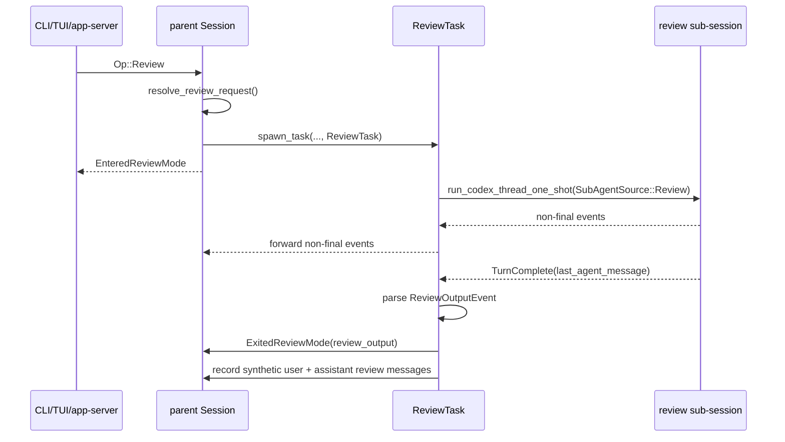
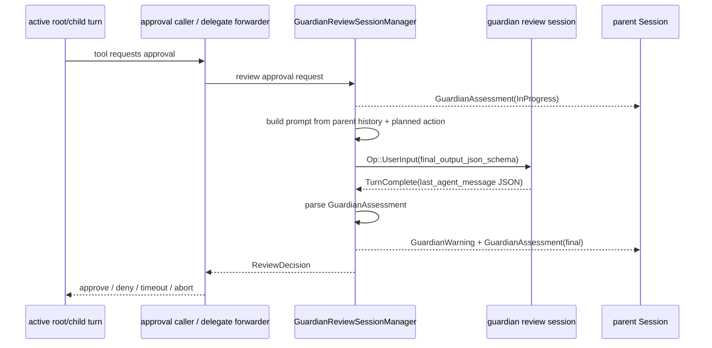
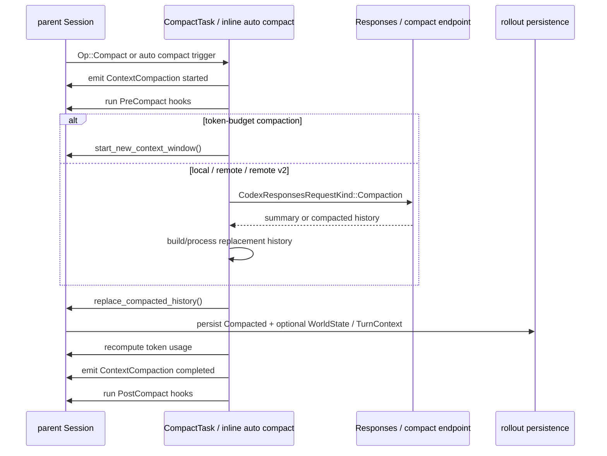
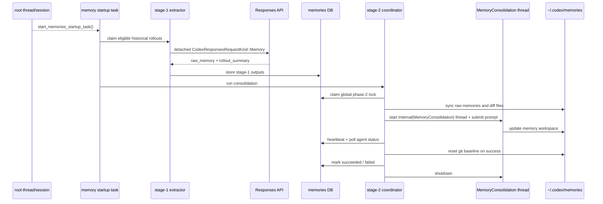

# Codex Multi-agent 机制分析

本文分析 `openai/codex` 当前源码中的 multi-agent / subagent 机制，重点回答两件事：

1. 架构上，Codex 如何把一个主 agent 扩展成可并行协作的 agent tree。
2. 对外接口上，模型、app-server、配置、hook 和批处理工具分别暴露了哪些能力。

分析以本 topic submodule commit `6d2168f06ae275d5e1f73cabf935d2bcc8549998` 为准。官方 Codex Subagents 文档用于校准产品语义：公开文档强调 subagent workflow 用于并行探索、测试、审查和总结，并且默认只在用户明确要求时触发。

## 核心结论

1. **Codex 的 subagent 不是轻量函数调用，也不是另起一个独立产品进程**：每个 thread-spawned subagent 都是一个真实的 [`CodexThread`](./codex/codex-rs/core/src/codex_thread.rs) / [`Session`](./codex/codex-rs/core/src/session/session.rs)，带自己的 history、turn、tool loop、sandbox/approval 视图和 event stream。
2. **控制面是 root-scoped `AgentControl`**：root thread 和所有子 agent 共享同一个 [`AgentControl`](./codex/codex-rs/core/src/agent/control.rs)，它持有 [`AgentRegistry`](./codex/codex-rs/core/src/agent/registry.rs)、V2 residency、execution limiter 和 shared rollout budget。这样可以在整棵 agent tree 内限流、定位、通信和回收。
3. **当前源码同时保留 V1 与 V2 两套模型工具接口**：稳定 feature `multi_agent` 默认启用，暴露 V1 `multi_agent_v1` namespace；under-development feature `multi_agent_v2` 默认关闭，启用后暴露 path/mailbox-based V2 工具，默认 namespace 是 `collaboration`。
4. **V1 是 id/status 导向，V2 是 path/mailbox 导向**：V1 工具围绕 `agent_id`、`send_input`、`wait_agent(targets)`、`close_agent` 工作；V2 工具要求 `task_name`，用 `/root/...` 的 [`AgentPath`](./codex/codex-rs/protocol/src/agent_path.rs) 定位 agent，用 `InterAgentCommunication` mailbox 传递任务和消息。
5. **spawn 继承的是 live turn 的运行边界**：子 agent config 从父 turn 的 effective config 派生，再复制当前 model/provider、reasoning、developer instructions、cwd、approval policy、permission profile、sandbox/runtime overrides、environment selection 和可复用 exec policy；然后才叠加 agent role、model/reasoning/service tier override。
6. **单 session 串行，多 session 并行**：每个 session 仍然最多一个 running task；多个 subagent session 可以并行跑。V1 主要用 spawn slot / `agents.max_threads` 控制数量；V2 还额外用 active execution guard 和 LRU residency 控制同时加载与执行的子 session。
7. **模型看到的是 tool specs + prompt hints + mailbox item，不是内部 registry**：provider request 里暴露的是 Responses tool specs、V2 usage hint、multi-agent mode developer message，以及 `ResponseItem::AgentMessage` 形式的 inter-agent message。app-server events、thread graph、registry metadata 是宿主侧控制面。
8. **app-server 和 hooks 暴露的是观测与集成面**：app-server 把 core collab events 映射为 `collabAgentToolCall` / `subAgentActivity` items，并在 thread list/read 中暴露 parent/agent metadata；hook 系统提供 `SubagentStart` / `SubagentStop`，以及普通 tool/permission/compact hook 里的 subagent context。
9. **review / compact / memory 也使用 subagent 语义，但不是同一类协作 agent**：协议层的 [`SubAgentSource`](./codex/codex-rs/protocol/src/protocol.rs) 覆盖 `Review`、`Compact`、`ThreadSpawn`、`MemoryConsolidation` 和 `Other`。其中 `ThreadSpawn` 才是模型通过 multi-agent tools 创建的协作 worker；review-mode、auto-review guardian、compact、memory consolidation 是宿主或系统触发的 internal/synthetic subagent，不共享同一套 mailbox / wait / SubagentStart lifecycle。

## 源码地图

| 主题 | 关键文件 | 作用 |
| --- | --- | --- |
| feature 与配置 | [`features/src/lib.rs`](./codex/codex-rs/features/src/lib.rs)、[`features/src/feature_configs.rs`](./codex/codex-rs/features/src/feature_configs.rs)、[`core/src/config/mod.rs`](./codex/codex-rs/core/src/config/mod.rs) | `multi_agent` / `multi_agent_v2` 开关、V2 timeout、namespace、并发上限、usage hints。 |
| 工具注册 | [`core/src/tools/spec_plan.rs`](./codex/codex-rs/core/src/tools/spec_plan.rs) | 根据 `MultiAgentVersion` 注册 V1 或 V2 工具族，处理 namespace / exposure。 |
| 工具 schema | [`core/src/tools/handlers/multi_agents_spec.rs`](./codex/codex-rs/core/src/tools/handlers/multi_agents_spec.rs) | 构造模型可见的 `spawn_agent`、`wait_agent`、`send_message` 等 tool specs 与 output schema。 |
| V1 handler | [`core/src/tools/handlers/multi_agents`](./codex/codex-rs/core/src/tools/handlers/multi_agents) | `spawn_agent`、`send_input`、`resume_agent`、`wait_agent`、`close_agent`。 |
| V2 handler | [`core/src/tools/handlers/multi_agents_v2`](./codex/codex-rs/core/src/tools/handlers/multi_agents_v2) | `spawn_agent`、`send_message`、`followup_task`、`wait_agent`、`interrupt_agent`、`list_agents`。 |
| 控制面 | [`core/src/agent/control.rs`](./codex/codex-rs/core/src/agent/control.rs)、[`control/spawn.rs`](./codex/codex-rs/core/src/agent/control/spawn.rs)、[`control/execution.rs`](./codex/codex-rs/core/src/agent/control/execution.rs)、[`control/residency.rs`](./codex/codex-rs/core/src/agent/control/residency.rs) | 创建/恢复 thread、fork history、共享预算、并发执行限制、V2 resident thread LRU 卸载。 |
| registry | [`core/src/agent/registry.rs`](./codex/codex-rs/core/src/agent/registry.rs) | spawn slot、agent path、nickname、thread metadata 和 live agent 列表。 |
| agent role | [`core/src/agent/role.rs`](./codex/codex-rs/core/src/agent/role.rs)、[`core/src/config/agent_roles.rs`](./codex/codex-rs/core/src/config/agent_roles.rs) | 内置/自定义 agent role 描述、role config layer、nickname candidates。 |
| mailbox / session | [`core/src/session/input_queue.rs`](./codex/codex-rs/core/src/session/input_queue.rs)、[`session/handlers.rs`](./codex/codex-rs/core/src/session/handlers.rs)、[`session/mod.rs`](./codex/codex-rs/core/src/session/mod.rs) | `InterAgentCommunication` 入队、触发 turn、记录为模型可见 `AgentMessage`。 |
| wire protocol | [`protocol/src/protocol.rs`](./codex/codex-rs/protocol/src/protocol.rs)、[`protocol/src/agent_path.rs`](./codex/codex-rs/protocol/src/agent_path.rs) | `SessionSource::SubAgent`、`SubAgentSource::ThreadSpawn`、`MultiAgentVersion`、`InterAgentCommunication`、collab events。 |
| app-server 投影 | [`app-server-protocol/src/protocol/event_mapping.rs`](./codex/codex-rs/app-server-protocol/src/protocol/event_mapping.rs)、[`protocol/v2/item.rs`](./codex/codex-rs/app-server-protocol/src/protocol/v2/item.rs)、[`app-server/README.md`](./codex/codex-rs/app-server/README.md) | core events 到 `ThreadItem::CollabAgentToolCall` / `SubAgentActivity` 的映射，JSON-RPC 对外说明。 |
| hooks | [`core/src/hook_runtime.rs`](./codex/codex-rs/core/src/hook_runtime.rs)、[`hooks/src/schema.rs`](./codex/codex-rs/hooks/src/schema.rs) | `SubagentStart` / `SubagentStop` hook 与 subagent context。 |
| 批处理扩展 | [`core/src/tools/handlers/agent_jobs.rs`](./codex/codex-rs/core/src/tools/handlers/agent_jobs.rs)、[`agent_jobs_spec.rs`](./codex/codex-rs/core/src/tools/handlers/agent_jobs_spec.rs) | `spawn_agents_on_csv` 与 worker-only `report_agent_job_result`。 |
| review / guardian | [`core/src/session/review.rs`](./codex/codex-rs/core/src/session/review.rs)、[`core/src/tasks/review.rs`](./codex/codex-rs/core/src/tasks/review.rs)、[`core/src/guardian`](./codex/codex-rs/core/src/guardian) | `/review` review-mode 子会话、approval auto-review guardian 子会话、严格审查 prompt 与结构化输出。 |
| compact | [`core/src/tasks/compact.rs`](./codex/codex-rs/core/src/tasks/compact.rs)、[`core/src/compact.rs`](./codex/codex-rs/core/src/compact.rs)、[`core/src/compact_remote.rs`](./codex/codex-rs/core/src/compact_remote.rs)、[`core/src/compact_remote_v2.rs`](./codex/codex-rs/core/src/compact_remote_v2.rs) | manual / auto compaction task、Responses compaction request、remote compact endpoint、replacement history 安装。 |
| memory consolidation | [`memories/write/src/start.rs`](./codex/codex-rs/memories/write/src/start.rs)、[`runtime.rs`](./codex/codex-rs/memories/write/src/runtime.rs)、[`phase1.rs`](./codex/codex-rs/memories/write/src/phase1.rs)、[`phase2.rs`](./codex/codex-rs/memories/write/src/phase2.rs) | startup memory pipeline、stage-1 rollout extraction、stage-2 global memory consolidation agent。 |

## 版本与开关

源码里的版本选择从 [`Config::multi_agent_version_from_features`](./codex/codex-rs/core/src/config/mod.rs) 开始：

| Feature key | `Feature` | 阶段 | 默认 | 对应版本 |
| --- | --- | --- | --- | --- |
| `multi_agent` | `Collab` | Stable | true | `MultiAgentVersion::V1` |
| `multi_agent_v2` | `MultiAgentV2` | UnderDevelopment | false | `MultiAgentVersion::V2` |
| `multi_agent_mode` | `MultiAgentMode` | Removed | false | 兼容 no-op |

如果 V2 enabled，优先使用 `MultiAgentVersion::V2`；否则如果 stable collab enabled，则使用 V1；否则 disabled。[`ThreadManagerState::effective_multi_agent_version_for_spawn`](./codex/codex-rs/core/src/thread_manager.rs) 还会在 spawn / resume / fork 时从父 thread 或历史记录继承版本，避免同一 agent tree 内混用不同协议。

需要区分两个“mode”：

- `MultiAgentVersion` 决定工具族和 runtime 机制：Disabled / V1 / V2。
- `MultiAgentMode` 只是 V2 下给模型的行为提示：普通 reasoning 是 `explicitRequestOnly`；`Ultra` reasoning 会变成 `proactive`。app-server 的旧 `multiAgentMode` request/setting 字段已经被 README 标为 ignored。

官方文档说当前 Codex releases 默认启用 subagent workflow，并且只有用户明确要求时才 spawn。当前源码与之对应的是：stable V1 默认开；V2 仍是 under-development，除非显式启用。

## 架构设计

### 1. 总体结构

Multi-agent 架构可以看成四层：

```text
Model-visible tool specs
  -> multi_agents / multi_agents_v2 tool handlers
  -> shared AgentControl
  -> ThreadManagerState creates/forks/resumes CodexThread
  -> each subagent owns a normal Session / turn loop / tool runtime
```

关键点是：subagent 不是一个特殊的 tool worker，而是普通 Codex thread 的一种来源。协议层用 [`SessionSource::SubAgent(SubAgentSource::ThreadSpawn { ... })`](./codex/codex-rs/protocol/src/protocol.rs) 表示它来自父 thread：

```text
SubAgentSource::ThreadSpawn
  parent_thread_id
  depth
  agent_path      # V2 canonical path, e.g. /root/reviewer
  agent_nickname  # UI 展示名
  agent_role      # agent_type / role name
```

`AgentControl` 是每棵 agent tree 的共享控制面。它挂在 `SessionServices` 中，root thread 创建一次，spawn 出来的 child thread 继续持有同一个 clone。因此：

- registry scope 是一棵 root tree，不是全局所有 Codex thread。
- 子 agent 可以再 spawn 子 agent，但 depth 和 slots 仍由同一个控制面限制。
- parent/child 可以通过 `ThreadManagerState::send_op` 给对方投递 `Op`。
- app-server 可以根据 persisted spawn edge 列出 parent/descendant thread。

### 2. Spawn 生命周期

一次模型调用 `spawn_agent` 后，主路径如下：

```text
Tool call spawn_agent
  -> parse args / validate role / depth / fork mode
  -> build child Config from parent TurnContext
  -> apply model/reasoning/service_tier overrides
  -> apply agent role config layer
  -> thread_spawn_source(parent, depth, role, task_name)
  -> AgentControl::spawn_agent_with_metadata
       -> decide effective MultiAgentVersion
       -> reserve spawn slot / V2 residency slot
       -> inherit environments and exec policy
       -> ThreadManagerState::spawn_new_thread_with_source or fork_thread_with_source
       -> registry.commit(agent metadata)
       -> notify_thread_created
       -> persist thread-spawn edge
       -> send initial Op to child
```

子 config 的构造由 [`build_agent_spawn_config`](./codex/codex-rs/core/src/tools/handlers/multi_agents_common.rs) 和 `build_agent_shared_config` 完成。它不是只 clone `config.toml`，而是把父 turn 的 live state 重新写入 config：

- effective model slug、provider、reasoning effort / summary
- developer instructions
- approval policy、approval reviewer
- cwd
- permission profile / sandbox policy
- service tier
- selected environments
- inherited exec policy（当 child 与 parent 可共享审批/执行策略时）

这解释了官方文档中“subagents inherit current sandbox policy / live runtime overrides”的源码依据：这些值来自 turn runtime，而不是只来自持久配置。

### 3. Fork 与上下文继承

Codex 支持两类 child 启动方式：

- **fresh child**：不 fork 父 history，只把初始 task/message 发给子 thread。
- **forked child**：从父 thread persisted rollout 读历史，过滤后作为 child 初始 history。

V1 用 `fork_context: true` 表示 full-history fork；默认 false。V2 用 `fork_turns`：

| `fork_turns` | 行为 |
| --- | --- |
| `all` 或省略 | full-history fork。 |
| `none` | 不带父上下文，只发送初始 message。 |
| 正整数字符串 | 只保留最近 N 个 turn。 |

full-history fork 会拒绝 `agent_type`、`model`、`reasoning_effort` override，因为 child 继承完整父上下文时不能再伪装成另一个 role/model。实现上 [`spawn_forked_thread`](./codex/codex-rs/core/src/agent/control/spawn.rs) 会先 flush 父 rollout，再过滤 history：保留 system/developer/user message、final assistant answer、session meta、compaction 等；丢弃 tool call/output、reasoning、inter-agent communication 等运行中噪声。V2 还会移除旧 usage hint，再按 child config 注入新的 subagent usage hint，避免父/子角色提示混在一起。

### 4. V1：agent id + final status

V1 工具族固定暴露在 `multi_agent_v1` namespace 下：

```text
multi_agent_v1.spawn_agent
multi_agent_v1.send_input
multi_agent_v1.resume_agent
multi_agent_v1.wait_agent
multi_agent_v1.close_agent
```

V1 的核心模型是“主 agent 持有 child thread id，然后显式 wait final status”：

- `spawn_agent` 返回 `{ agent_id, nickname }`。
- `send_input` 给既有 agent 投递 message/items，可选 `interrupt=true`。
- `wait_agent` 订阅目标 thread 的 [`AgentStatus`](./codex/codex-rs/core/src/agent/status.rs)，等任意目标进入 final status；返回 status map 和 `timed_out`。如果 completed status 带 final message，V1 直接把它作为 tool output 返回给模型。
- `resume_agent` 从 rollout 恢复 closed agent。
- `close_agent` shutdown 目标及 descendants，返回 previous status。V1 的 tool description 明确提醒 completed agents 仍会占用 concurrency limit，完成后应 close。

V1 还会为非 V2 child 启动 completion watcher。child 终态后，它会把 `<subagent_notification>...` 形式的 user-context message 注入 parent history，让 parent 即使没显式 wait 也能知道 child 完成。

### 5. V2：AgentPath + mailbox

V2 把“结果内容从 wait tool output 返回”改成“消息进入 mailbox / history，wait 只等活动信号”。默认在支持 namespace tools 的 provider 上暴露为 `collaboration` namespace，也可由 `features.multi_agent_v2.tool_namespace` 改名；底层 handler 的 plain tool names 是：

```text
spawn_agent
send_message
followup_task
wait_agent
interrupt_agent
list_agents
```

V2 的定位对象从 thread id 升级为 [`AgentPath`](./codex/codex-rs/protocol/src/agent_path.rs)。`spawn_agent` 必填 `task_name`，只能使用小写字母、数字和下划线；child path 通常是 `/root/<task_name>`，grandchild 是 `/root/<parent>/<task_name>`。工具 target 可以是 thread id，也可以是相对或绝对 path。

V2 通信数据结构是 [`InterAgentCommunication`](./codex/codex-rs/protocol/src/protocol.rs)：

```text
author: AgentPath
recipient: AgentPath
other_recipients: Vec<AgentPath>
content / encrypted_content
trigger_turn: bool
```

`send_message` 和 `followup_task` 共用 [`message_tool.rs`](./codex/codex-rs/core/src/tools/handlers/multi_agents_v2/message_tool.rs)：

- `send_message` 使用 `trigger_turn=false`，只排队，不主动启动 idle target 的 turn。
- `followup_task` 使用 `trigger_turn=true`，如果 target idle，会通过 pending-work scheduler 启动 regular turn；target 是 root 时会被拒绝。

session 收到 `Op::InterAgentCommunication` 后，[`inter_agent_communication`](./codex/codex-rs/core/src/session/handlers.rs) 会把通信放进 [`InputQueue`](./codex/codex-rs/core/src/session/input_queue.rs) 的 mailbox。`run_turn` 在采样边界 drain pending input，并由 [`record_inter_agent_communication`](./codex/codex-rs/core/src/session/mod.rs) 记录成 `ResponseItem::AgentMessage`。如果内容是 encrypted，模型看到的 header 是：

```text
Message Type: NEW_TASK | MESSAGE
Task name: <recipient>
Sender: <author>
Payload:
<encrypted content block>
```

child final answer 的返回也走 mailbox。V2 completion watcher 等 child 状态 final 后，调用 [`format_inter_agent_completion_message`](./codex/codex-rs/core/src/session_prefix.rs) 把 completed/error/shutdown/not_found 转成 parent 可读的 inter-agent message。这样 parent 看到的是“某 agent 发来 FINAL_ANSWER / error payload”，而不是 `wait_agent` 的大 JSON blob。

### 6. Wait 的设计变化

V1 `wait_agent` 和 V2 `wait_agent` 语义不同：

| 版本 | 输入 | 等待对象 | 返回内容 |
| --- | --- | --- | --- |
| V1 | `targets: string[]`, `timeout_ms` | 目标 agents 的 final status | `{ status: { target: AgentStatus }, timed_out }`，可能含 final message。 |
| V2 | `timeout_ms` | 当前 agent 的 mailbox activity 或 steered input | `{ message, timed_out }`，不返回 agent 内容。 |

V2 这样设计是为了避免 wait 工具承载大量子 agent 输出。子 agent 内容进入 history，wait 只作为“现在有新 mailbox / 新 steer 了”的阻塞点。`InputQueue::subscribe_activity` 同时监听 mailbox 和 steer，因此用户在 active turn 中追加输入也能打断 wait，返回 “Wait interrupted by new input.”。

### 7. 并发与回收

Multi-agent 并发控制有三层：

| 层 | 机制 | 约束 |
| --- | --- | --- |
| session 内 | `Session.active_turn` / `RunningTask` | 每个 agent session 最多一个 running task。 |
| tree 数量 | `AgentRegistry::reserve_spawn_slot` | 控制一棵 agent tree 内已 spawn/open 的 agent 数量。 |
| V2 执行 | `AgentExecutionLimiter` + `AgentExecutionGuard` | 只限制 V2 subagent 正在启动 turn 的数量；root 和 V1 不计入。 |

默认值来自 config：

- V1 `agents.max_threads` unset 时默认 `6`。
- `agents.max_depth` 默认 `1`，允许 root spawn direct child，但阻止更深递归。
- V2 `max_concurrent_threads_per_session` 默认 `4`，注入给模型的 usage hint 会说包含 root 在内有 4 个 concurrency slots；源码计算 child slots 时会 `saturating_sub(1)`。

V2 还有 residency 层：[`V2Residency`](./codex/codex-rs/core/src/agent/control/residency.rs) 维护 resident thread LRU。容量不足时，它会尝试卸载 completed / errored / interrupted、无 active turn、mailbox 为空的 resident subagent：先 materialize rollout，再 shutdown thread 并从 manager remove。后续 `send_message` / `followup_task` / `interrupt_agent` 命中 unloaded V2 agent 时，会通过 `ensure_v2_agent_loaded` 从 stored rollout 恢复。

这也是 V2 没有暴露 `close_agent` / `resume_agent` 的原因之一：V2 更偏 resident thread 自动卸载/重载，而不是让模型直接管理 thread 生命周期。

### 8. Role 与自定义 agents

模型工具参数里仍叫 `agent_type`，源码里逐步使用 `agent_role`。role 决定两件事：

1. tool description 里如何告诉模型有哪些 agent 类型可用。
2. spawn 时是否把一个 role config layer 叠加到 child config。

内置 role 在 [`core/src/agent/role.rs`](./codex/codex-rs/core/src/agent/role.rs)：

- `default`：默认 agent。
- `explorer`：面向具体代码库问题的只读探索。
- `worker`：面向实现、修复、测试等执行工作。

用户可通过 `[agents.roles]` 或 `.codex/agents` / `~/.codex/agents` 之类的 agent role 文件定义自定义 agent。role 文件可以包含 `description`、`developer_instructions`、`nickname_candidates`，也可以像普通 config 一样设置 model、reasoning、sandbox、MCP、skills 等。[`apply_role_to_config`](./codex/codex-rs/core/src/agent/role.rs) 会把 role TOML 作为高优先级 config layer 插入，同时尽量保留父 turn 当前 provider 和 service tier。

### 9. Internal / synthetic subagents

源码里的 “subagent” 不是单一概念。协议层 [`SubAgentSource`](./codex/codex-rs/protocol/src/protocol.rs) 同时包含 `Review`、`Compact`、`ThreadSpawn`、`MemoryConsolidation` 和 `Other(String)`；但只有 `ThreadSpawn` 是模型通过 `spawn_agent` 等 collaboration tools 显式创建、进入 `AgentRegistry` / mailbox / wait 生命周期的协作 agent。其余更像系统内部为了隔离 prompt、权限、上下文污染或后台维护而启动的特殊模型任务。

| 类型 | 触发入口 | 是否新 thread/session | 是否走 collaboration mailbox | 主要目的 |
| --- | --- | --- | --- | --- |
| `ThreadSpawn` | 模型调用 V1/V2 multi-agent tools | 是，`CodexThread` / `Session` | 是，V2 用 `InterAgentCommunication` | 并行委派探索、实现、验证、总结。 |
| `Review` | `Op::Review` / `/review` | 是，one-shot review 子会话 | 否 | 用专门 review prompt 审查 diff/commit/worktree 并返回结构化 findings。 |
| `Other("guardian")` | approval auto-review | 是，可复用 trunk review session，也可临时 ephemeral session | 否 | 在命令、网络、patch、MCP approval 前自动做安全评估。 |
| `Compact` | `Op::Compact` 或 auto compact | 通常不是新 thread，而是当前 session 的特殊 compaction request | 否 | 总结并替换长 history，维持上下文窗口。 |
| `MemoryConsolidation` | memory startup pipeline | stage 1 是 detached memory request；stage 2 是 internal thread | 否 | 从历史 rollout 抽取 raw memory，再合并成全局 memory 文件。 |

这些 internal/synthetic subagents 和父 agent 的“协作”不共用同一种协议。`ThreadSpawn` 的协作核心是 mailbox + `wait_agent` + 可恢复 child session；internal/synthetic 路线的协作核心则分别是事件转发、approval decision 回填、父 history 替换、后台 DB/文件系统状态推进。

| 类型 | 父侧是否阻塞 | 结果如何回到父侧 | 是否写父 history | 是否唤醒父模型继续推理 |
| --- | --- | --- | --- | --- |
| `Review` | 是，父 session 中的 `ReviewTask` 消费子会话事件直到 complete/abort | `ExitedReviewMode` event + synthetic review rollout messages | 是，一条 synthetic `user` message 和一条 synthetic `assistant` message | 不是 mailbox 唤醒；这是宿主触发的 review task 完成 |
| `Other("guardian")` | 是，只阻塞正在等待 approval 的 tool/runtime 分支 | `ReviewDecision` 回填给 approval caller，并发 `GuardianAssessment` / warning event | 通常不写普通对话 history | 否；等待中的 tool call 根据 approved/denied/timeout 继续或失败 |
| `Compact` | 是，manual compact 作为 `CompactTask`；auto compact 在当前 turn 内联执行 | `replace_compacted_history()` 直接替换父 session history | 是，持久化 `RolloutItem::Compacted` 及 replacement history | 否；下一次模型请求自然使用新 history |
| `MemoryConsolidation` | 否，startup pipeline 后台运行 | DB stage 状态 + `~/.codex/memories` git workspace | 不写当前父 thread history | 否；只影响后续 memory 注入 |

#### `/review` 时序：事件转发 + review rollout 回写

`/review` 的路径从 [`session/handlers.rs`](./codex/codex-rs/core/src/session/handlers.rs) 的 `Op::Review` 开始，解析 review target 后进入 [`spawn_review_thread`](./codex/codex-rs/core/src/session/review.rs)。它会构造一个 review 专用 `TurnContext`，把 `multi_agent_version` 设为 `Disabled`，禁用 web search、goals 等能力，并用 [`ReviewTask`](./codex/codex-rs/core/src/tasks/review.rs) 启动子会话。`ReviewTask` 再通过 [`run_codex_thread_one_shot`](./codex/codex-rs/core/src/codex_delegate.rs) 创建 `SessionSource::SubAgent(SubAgentSource::Review)`，把 base instructions 替换为 `REVIEW_PROMPT`，把 approval policy 固定为 `Never`，并可使用 `review_model` override。



关键点在 [`process_review_events`](./codex/codex-rs/core/src/tasks/review.rs)：review 子会话的普通事件会被父侧消费后转发；最终 `last_agent_message` 被当作结构化 review payload 解析，而不是直接作为最终 assistant 文本展示。随后 [`exit_review_mode`](./codex/codex-rs/core/src/tasks/review.rs) 先记录一条 synthetic `user` message 表示 review 结果对话上下文，再记录一条 synthetic `assistant` message 保存格式化后的 review output，并显式 materialize rollout。这里没有 mailbox，也没有 `wait_agent`；父 session 等的是 review task 自己的子会话事件流。

#### guardian 时序：approval 阻塞点上的同步判定

auto-review guardian 只在 approval policy 是 `on-request` / `granular` 且 `approvals_reviewer = "auto_review"` 时接管 approval，而不是替代普通 code review。[`guardian/mod.rs`](./codex/codex-rs/core/src/guardian/mod.rs) 注释把流程概括为：提取 compact transcript、让 dedicated guardian review session 审查 exact planned action、严格 JSON 输出、失败关闭。

guardian 有两种入口：

- root turn 自己的 shell / patch / network / MCP approval 路径直接调用 [`review_approval_request`](./codex/codex-rs/core/src/guardian/review.rs)。
- delegated subagent 的 approval event 会先被 [`codex_delegate.rs`](./codex/codex-rs/core/src/codex_delegate.rs) 拦截；如果父 turn 启用了 auto-review，就调用 [`spawn_approval_request_review`](./codex/codex-rs/core/src/guardian/review.rs)，等结果后再向 child 提交 `Op::ExecApproval`、`Op::PatchApproval` 或 synthetic MCP approval answer。



[`GuardianReviewSessionManager`](./codex/codex-rs/core/src/guardian/review_session.rs) 会优先复用 trunk reviewer；trunk 忙或配置不匹配时再开 ephemeral reviewer。它通过 `run_codex_thread_interactive` 创建 `SubAgentSource::Other("guardian")`，但 config 被锁成 read-only、approval never、清空 MCP servers、禁用 collab / multi-agent v2 / hooks / apps / plugins / web search，并关闭 memory 注入。每次 review 前，guardian 会从父 session history 收集 user/assistant/tool/inter-agent transcript，拼上 exact planned action，再用 `final_output_json_schema` 要求结构化 JSON。超时、执行失败、输出解析失败都会 fail closed；连续 denial 还会触发 circuit breaker 中断父 turn。它与父 agent 的协作结果不是一条消息，而是一个 approval decision。

#### compact 时序：模型/endpoint 产物直接替换父 history

compact 的 `SubAgentSource::Compact` 更像协议/metadata 标签，而不是 collaboration agent。`Op::Compact` 会在 [`session/handlers.rs`](./codex/codex-rs/core/src/session/handlers.rs) 中启动 [`CompactTask`](./codex/codex-rs/core/src/tasks/compact.rs)。如果启用 token-budget compaction 走专门路径；否则根据 provider 能力选择 local Responses compaction、remote compaction endpoint 或 remote v2。



local 路线在 [`compact.rs`](./codex/codex-rs/core/src/compact.rs) 中把 summary prompt 作为合成 user input 加进临时 history，用 `CodexResponsesRequestKind::Compaction` 发一次特殊 request，取最后 assistant message 组成 `CompactedItem` 和 replacement history。remote 路线由 [`compact_remote.rs`](./codex/codex-rs/core/src/compact_remote.rs) / [`compact_remote_v2.rs`](./codex/codex-rs/core/src/compact_remote_v2.rs) 调用 compact endpoint 或发送 `ResponseItem::CompactionTrigger`，再过滤 remote 输出、注入必要初始上下文并安装新 history。成功边界是 [`replace_compacted_history`](./codex/codex-rs/core/src/session/mod.rs)：它替换父 session 的 live history，持久化 `RolloutItem::Compacted`，必要时再持久化 world-state baseline 和 turn context。这里没有 child turn 可等，也没有回信；下一次 provider request 看到的是 replacement history。

#### memory 时序：root session 后台维护，不反向唤醒父 agent

memory 的后台链路分两阶段。入口在 memory startup pipeline 的 [`start_memories_startup_task`](./codex/codex-rs/memories/write/src/start.rs)：ephemeral session、未启用 memories、以及 `source.is_non_root_agent()` 的线程都会跳过，避免 subagent 自己再生成 memory。



stage 1 在 [`phase1.rs`](./codex/codex-rs/memories/write/src/phase1.rs) 中 claim 合格的历史 rollout，把可用于 memory 的 `ResponseItem` 和 inter-agent message 过滤、序列化、redact 后，用 `CodexResponsesRequestKind::Memory` 做 detached model request，要求结构化输出 `{ rollout_summary, rollout_slug, raw_memory }`，并写入 memories DB。stage 2 在 [`phase2.rs`](./codex/codex-rs/memories/write/src/phase2.rs) 中 claim 全局 consolidation lock，把 stage-1 raw memories 同步到 `~/.codex/memories` git workspace，再通过 [`MemoryStartupContext::spawn_consolidation_agent`](./codex/codex-rs/memories/write/src/runtime.rs) 创建 `SessionSource::Internal(InternalSessionSource::MemoryConsolidation)` / `ThreadSource::MemoryConsolidation` 的新 thread。这个 agent 的 cwd 是 memory root，配置是 ephemeral、禁用 memory 生成/使用、禁用 collab / apps / plugins / skill MCP dependency install、approval never、无网络，只能写 memory workspace；外层用 DB heartbeat 和状态轮询等待完成，成功后 reset git baseline 并 shutdown thread。父 agent 不会因此被 mailbox 唤醒；真正的协作点是后续 root turn 读取 memory 时看到更新后的 memory 文件。

这些 internal/synthetic subagents 的共同设计目的，是把“高风险审查”“长上下文压缩”“跨线程记忆维护”从主 agent 常规 turn 中隔离出来：它们可以有独立 prompt、独立模型、独立 request kind、独立权限边界和独立失败策略。但它们不会出现在模型可调用的 collaboration tool surface 里，也不应被理解为用户要求并行工作时产生的 worker agent。

## 对外接口设计

### 1. 模型可见工具接口

Multi-agent 最主要的对外接口是 Responses tool specs。它们由 [`multi_agents_spec.rs`](./codex/codex-rs/core/src/tools/handlers/multi_agents_spec.rs) 生成，再经 [`spec_plan.rs`](./codex/codex-rs/core/src/tools/spec_plan.rs) 加入当前 turn 的 tool plan。

#### V1 工具族

| Tool | 主要参数 | 输出 | 语义 |
| --- | --- | --- | --- |
| `multi_agent_v1.spawn_agent` | `message` 或 `items`、`agent_type`、`fork_context`、`model`、`reasoning_effort`、`service_tier` | `{ agent_id, nickname }` | 创建 child thread 并提交初始任务。 |
| `multi_agent_v1.send_input` | `target`、`message` 或 `items`、`interrupt` | `{ submission_id }` | 给既有 agent 追加输入，可先 interrupt。 |
| `multi_agent_v1.resume_agent` | `id` | `{ status }` | 从 rollout 恢复 previously closed agent。 |
| `multi_agent_v1.wait_agent` | `targets`、`timeout_ms` | `{ status, timed_out }` | 等一个或多个 agent 到 final status。 |
| `multi_agent_v1.close_agent` | `target` | `{ previous_status }` | 关闭 agent 与 open descendants，释放 slots。 |

V1 工具支持 `ToolSearchInfo`。如果 provider 支持 search/deferred tool loading，V1 collab tools 可以以 deferred source “Multi-agent tools” 出现在 `tool_search` 里；否则直接暴露。

#### V2 工具族

| Tool | 主要参数 | 输出 | 语义 |
| --- | --- | --- | --- |
| `spawn_agent` | `task_name`、`message`、`agent_type`、`fork_turns`、`model`、`reasoning_effort`、`service_tier` | 默认只返回 `{ task_name }`；若不隐藏 metadata，则返回 `{ task_name, nickname }` | 创建 path-addressed child agent。 |
| `send_message` | `target`、`message` | empty success output | 给 live/unloaded agent 投递 queue-only message。 |
| `followup_task` | `target`、`message` | empty success output | 给非 root target 投递任务，并在 idle 时触发 turn。 |
| `wait_agent` | `timeout_ms` | `{ message, timed_out }` | 等 mailbox activity 或新 steer，不承载消息内容。 |
| `interrupt_agent` | `target` | `{ previous_status }` | 中断目标 agent 当前 turn，但保留 agent。 |
| `list_agents` | `path_prefix` | `{ agents: [{ agent_name, agent_status, last_task_message }] }` | 列出当前 root tree 的 live agents，可按 path prefix 过滤。 |

V2 默认配置：

- `tool_namespace = "collaboration"`。
- `hide_spawn_agent_metadata = true`，模型只拿到 canonical `task_name`，不鼓励依赖 UI nickname。
- `non_code_mode_only = true`，在 code-mode-only 场景用 `DirectModelOnly` exposure 让模型可见但不暴露给某些宿主工具枚举。
- message fields 使用 encrypted schema，减少敏感 task payload 在普通 JSON 参数中的暴露。

当 provider 支持 namespace tools，V2 会被包成 `collaboration.spawn_agent` 这类 namespace tool；如果配置清空 namespace 或 provider 不支持 namespace，则保留 plain function names。测试覆盖了 namespace 改成 `agents`、Bedrock provider namespace 支持、V2 message schema encrypted 等场景。

### 2. Prompt / context 接口

模型除了 tool specs，还会看到 multi-agent 相关 prompt：

- [`MultiAgentModeInstructions`](./codex/codex-rs/core/src/context/multi_agent_mode_instructions.rs)：V2 下告诉模型当前是 explicit-request-only 还是 proactive；普通 reasoning 是 explicit，Ultra reasoning 是 proactive。
- V2 root/subagent usage hints：[`core/src/config/mod.rs`](./codex/codex-rs/core/src/config/mod.rs) 默认提示 collaboration tools 必须作为直接工具调用，不能从 `functions.exec` 内部调用；所有 agents 共享同一目录、同一 filesystem、同一 cwd；并提示可用 concurrency slots。
- environment context subagents：[`AgentControl::format_environment_context_subagents`](./codex/codex-rs/core/src/agent/control.rs) 会把已 open child agents 作为环境上下文行展示给 parent。
- inter-agent messages：[`InterAgentCommunication::to_model_input_item`](./codex/codex-rs/protocol/src/protocol.rs) 转成 `ResponseItem::AgentMessage`，这是子 agent 消息真正进入 provider input 的形式。

因此，“provider 最终看到什么”可以总结为：

```text
Base/model instructions
  + developer/user context fragments
  + multi-agent mode and usage hints
  + model-visible tool specs
  + AgentMessage items for delivered inter-agent messages
  + tool outputs for model-called collaboration tools
```

内部 `AgentRegistry`、spawn reservation、resident LRU、thread graph、app-server event mapping 不直接进入 provider request。

### 3. app-server / SDK 可见接口

app-server 并不直接暴露 “spawn child thread” JSON-RPC 方法；spawn 是模型工具行为。但它向宿主客户端暴露多 agent 的观测面和 thread graph：

- `thread/list` 支持 experimental `parentThreadId` 和 `ancestorThreadId` filter，用于列出某个 subagent tree。
- `thread/read` / list result 中，subagent thread 可带 `parentThreadId`、`agentNickname`、`agentRole`。
- core `CollabAgentSpawnBegin/End`、`CollabAgentInteractionBegin/End`、`CollabWaitingBegin/End`、`CollabClose/Resume` events 会被 [`event_mapping.rs`](./codex/codex-rs/app-server-protocol/src/protocol/event_mapping.rs) 映射成 `ThreadItem::CollabAgentToolCall`。
- V2 `SubAgentActivityEvent` 会映射成 `ThreadItem::SubAgentActivity { kind, agent_thread_id, agent_path }`。
- app-server README 的 `collabToolCall` item 是客户端协议兼容描述，工具枚举包括 `spawn_agent`、`send_input`、`resume_agent`、`wait`、`close_agent`。

相邻的 internal subagent 接口不通过 collaboration tools 暴露：`Op::Review` / `/review` 进入 review-mode 子会话；`turn/start` 的 `approvalsReviewer = "auto_review"` 会把 approval request 路由给 guardian reviewer；`memory/reset`、`thread/memory_mode/set` 和 memory startup pipeline 影响 memory 生成/使用；compact 则通过 `Op::Compact`、auto-compact 触发和 `PreCompact` / `PostCompact` hook 观测。这些能力可被 app-server/TUI/CLI 触发或展示，但不是模型可自行调用的 `spawn_agent` worker surface。

### 4. 配置接口

用户/集成方可通过 config 控制多 agent：

| 配置 | 作用 |
| --- | --- |
| `[features] multi_agent = true/false` | 稳定 V1 collaboration tools。 |
| `[features.multi_agent_v2] enabled = true` | 启用 V2 path/mailbox runtime。 |
| `features.multi_agent_v2.max_concurrent_threads_per_session` | V2 root+subagents 的总并发 slots；默认 4。 |
| `features.multi_agent_v2.min_wait_timeout_ms / max_wait_timeout_ms / default_wait_timeout_ms` | V2 `wait_agent` timeout 边界。 |
| `features.multi_agent_v2.root_agent_usage_hint_text / subagent_usage_hint_text / usage_hint_text` | 覆盖 V2 prompt hints。 |
| `features.multi_agent_v2.tool_namespace` | V2 namespace，默认 `collaboration`。 |
| `features.multi_agent_v2.hide_spawn_agent_metadata` | 是否隐藏 spawn 输出里的 nickname 等 metadata。 |
| `features.multi_agent_v2.non_code_mode_only` | 是否把 V2 tools 暴露为 DirectModelOnly。 |
| `[agents] max_threads` | V1/open thread cap；V2 启用时不能同时设置。 |
| `[agents] max_depth` | thread-spawn nesting depth，默认 1。 |
| `[agents] job_max_runtime_seconds` | `spawn_agents_on_csv` worker 默认超时。 |
| `[agents.roles]` / agent role file | 自定义 `agent_type`、instructions、nickname candidates 和 config overrides。 |

V2 配置校验会拒绝非法 timeout、非法 namespace、`max_concurrent_threads_per_session = 0`，也会拒绝与 legacy `agents.max_threads` 混用。

### 5. Hook 接口

hook 系统提供 subagent lifecycle 和上下文：

- `SubagentStart`：thread-spawned child start 时触发，输出只作为 additional context 注入；`continue:false` 不会阻止 child start。
- `SubagentStop`：thread-spawned child turn stop 时触发，可像 Stop hook 一样产生 decision / continuation 行为。
- 普通 `PreToolUse`、`PostToolUse`、`PermissionRequest`、`PreCompact`、`PostCompact` 等 hook 输入里可带 `subagent` context，字段是 `agent_id` 和 `agent_type`。

[`hook_runtime.rs`](./codex/codex-rs/core/src/hook_runtime.rs) 明确只对 thread-spawned subagents 暴露这些 user-configured lifecycle hooks；review、compact、memory consolidation 等 internal/synthetic subagents 不走同一套 SubagentStart/Stop hook。

### 6. 批处理工具：spawn_agents_on_csv

`spawn_agents_on_csv` 是建立在 `AgentControl` 上的批处理扩展，不是核心 collaboration tool family。它由 `Feature::SpawnCsv` 和 multi-agent runtime 共同决定是否可用。

接口：

| Tool | 参数 | 作用 |
| --- | --- | --- |
| `spawn_agents_on_csv` | `csv_path`、`instruction`、`id_column`、`output_csv_path`、`output_schema`、`max_concurrency/max_workers`、`max_runtime_seconds` | 读取 CSV，每行生成一个 worker subagent，阻塞直到完成并导出结果 CSV。 |
| `report_agent_job_result` | `job_id`、`item_id`、`result`、`stop` | worker-only 工具，报告单个 item 的 JSON 结果，可请求取消剩余 items。 |

实现要求当前 turn 只有一个 local environment，暂不支持 remote environments；状态写入 sqlite state db。默认 job concurrency 是 16，硬上限 64，还会受 agent thread cap 约束。

## 生命周期图

### V1

```text
parent model
  -> multi_agent_v1.spawn_agent(message)
  -> AgentControl creates child thread
  -> parent receives { agent_id, nickname }
  -> child runs regular turn
  -> parent calls wait_agent([agent_id])
  -> wait returns final AgentStatus, possibly final message
  -> parent calls close_agent(agent_id) to release slot
```

### V2

```text
parent model
  -> collaboration.spawn_agent(task_name="reviewer", message, fork_turns="all")
  -> AgentControl creates /root/reviewer child thread
  -> parent receives { task_name: "/root/reviewer" }
  -> parent may call wait_agent(timeout_ms)
  -> child final answer becomes InterAgentCommunication
  -> parent mailbox activity wakes wait
  -> parent next sampling sees AgentMessage FINAL_ANSWER payload
```

## 设计权衡

### 为什么用 thread/session 做 subagent？

好处是复用 Codex 已有能力：每个 child 都有完整的 prompt/history、tool router、approval/sandbox、MCP、hooks、compaction、rollout persistence 和 app-server event stream。代价是成本较高：每个 child 都是一个会消耗 token、工具调用、线程状态和本地资源的完整 agent。

### 为什么 V2 不让 wait 返回内容？

V1 wait 把 final message 放进 tool output，简单直接，但大输出会污染 parent 的工具结果上下文，也让 wait 成为内容传输通道。V2 改用 mailbox + `AgentMessage`，把“等通知”和“读消息”拆开：wait 只负责阻塞到活动发生，消息本身进入 history，并能保留 sender/recipient/message type 等结构信息。

### 为什么有 path 而不只用 thread id？

Thread id 适合宿主程序，但不适合模型协作。`/root/reviewer/security` 这种 path 更接近 task tree，模型可以用相对引用给当前 agent 的 child 发 follow-up，也能通过 `list_agents(path_prefix)` 查看子树。源码仍允许 thread id target，是为了兼容宿主和 unloaded thread 查找。

### 为什么 V2 要 residency？

V1 的 `close_agent` 把回收责任交给模型；模型忘记 close 时 completed agents 会继续占用 slots。V2 的 resident thread LRU 把 idle completed/errored/interrupted child 卸载到 persisted rollout，后续按需 reload，减少模型显式生命周期管理负担。

### 为什么还保留 explicit-request-only prompt？

官方文档强调 Codex 不应自动 spawn subagents，因为每个 subagent 都有自己的模型和工具成本，而且并行写代码会带来冲突。源码中的 [`MultiAgentModeInstructions`](./codex/codex-rs/core/src/context/multi_agent_mode_instructions.rs) 把这个产品策略变成 provider 可见 developer message；只有 Ultra reasoning 下才切到 proactive。

## 容易混淆的点

### Q1. `multi_agent` 和 `multi_agent_v2` 是同一个功能吗？

不是。`multi_agent` 是 stable V1 collaboration tools；`multi_agent_v2` 是 path/mailbox-based V2 runtime。当前源码会优先选择 V2，否则回退 V1。

### Q2. V2 的 `task_name` 是不是 UI nickname？

不是。`task_name` 参与 `AgentPath`，是 canonical identity 的一部分；nickname 只是 UI 展示名。默认 `hide_spawn_agent_metadata = true` 时，模型甚至拿不到 nickname。

### Q3. 子 agent 能看到父 agent 的全部上下文吗？

取决于 spawn 参数。V1 只有 `fork_context=true` 才 full-history fork；V2 `fork_turns` 默认 `all`，可设 `none` 或最近 N turn。fresh child 只看到初始任务和常规环境/配置上下文。

### Q4. 子 agent 的 final answer 怎么回到父 agent？

V1 可以通过 `wait_agent` 的 final status 返回，也有 completion watcher 注入 notification。V2 则主要通过 `InterAgentCommunication` mailbox，把 child final answer 转成 parent 可见的 `AgentMessage`。

### Q5. app-server 客户端能直接调用 `spawn_agent` 吗？

没有看到独立 JSON-RPC `spawn_agent` 方法。app-server 客户端通过 `turn/start` 驱动模型；模型在 turn 内调用 multi-agent tool。app-server 对外暴露的是 thread graph、collab tool item 和 subagent activity 事件。

### Q6. subagent 是否共享文件系统？

是。默认 V2 usage hint 明确告诉模型所有 agents 共享同一 container/filesystem/cwd；源码上 child config 也继承父 turn 的 cwd、environment selection 和权限边界。这意味着并行写操作需要人为分配 ownership，避免互相覆盖。

### Q7. internal review/compact/memory subagent 和 thread-spawn subagent 一样吗？

不一样。`ThreadSpawn` 是 multi-agent tools 创建的协作 worker，进入 `AgentRegistry`、受 V1/V2 tool lifecycle 管理，并可通过 V2 mailbox 回消息。`/review` 和 guardian 会创建专门 reviewer 子会话，但禁用 collab/multi-agent 能力；compact 通常只是当前 session 的特殊 compaction request；memory stage 2 会创建 internal memory consolidation thread，但不属于父 agent tree 的 mailbox worker。它们可能共享 `SubAgentSource` / subagent header / telemetry 标签，却不共享 `spawn_agent`、`wait_agent`、mailbox、`SubagentStart` / `SubagentStop` 这一套协作协议。

## 小结

Codex multi-agent 的核心设计不是“让模型多调用几个工具”，而是把每个 delegated worker 提升为一条可持久化、可恢复、可观测、可审批的 Codex thread。V1 用 thread id 和 final status 快速建立了 collaboration tool surface；V2 则向更结构化的 task tree 演进：`AgentPath` 做身份，mailbox 做通信，resident thread 做资源回收，app-server/hook/config 负责把这棵树投影给宿主客户端和集成方。

同时，Codex 还把 review、auto-review guardian、compact、memory consolidation 这类系统任务放进相邻的 internal/synthetic subagent 设计空间。它们说明 Codex 的 “subagent” 概念有两层：一层是用户/模型可见的并行协作 agent tree，另一层是宿主为了隔离上下文、权限、失败策略和后台维护而创建的专用模型任务。
