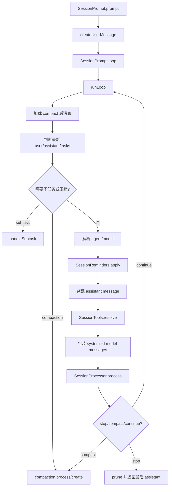
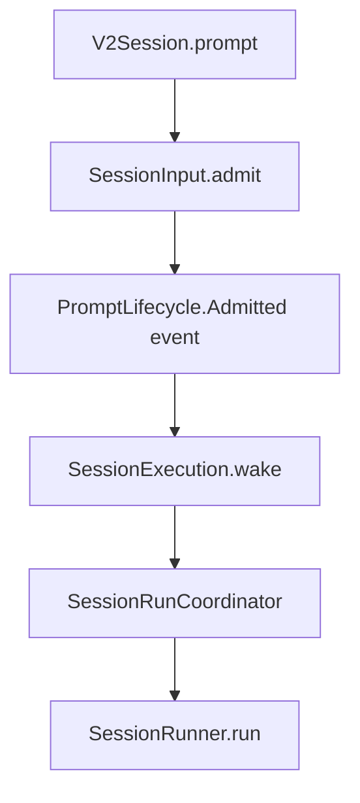

# opencode AI 编码代理核心执行链路

本报告分析对象为 `anomalyco/opencode` submodule，源码位于 [`./opencode`](./opencode)，当前本地分支为 `dev`，提交为 `45e4606fa`。本文只关注 opencode 作为 AI coding agent 进入工作、规划、编码、调用工具、继续推进任务时参与的主干系统；不展开配置系统、企业版能力和 TUI 交互层。

## 核心结论

opencode 的编码代理不是“发一次 prompt，等一次 answer”的结构，而是一个 session 级执行循环：

1. 用户输入被写成 session user message。
2. runner 从历史消息、系统上下文、agent 配置、工具定义、权限状态中组装一次 provider 请求。
3. LLM 流式返回 text、reasoning、tool call、usage、finish 等事件。
4. processor/runner 把流事件持久化为 assistant message、message parts 或 V2 durable events。
5. 如果本轮产生工具调用或需要压缩/继续，循环会把工具结果重新纳入历史，再发起下一次 provider turn。

当前代码里同时存在两套重要路径：

- **当前公开 HTTP/SDK 路径**：入口仍主要走 [`SessionPrompt`](./opencode/packages/opencode/src/session/prompt.ts) 这条旧版主循环，并通过 [`SessionProcessor`](./opencode/packages/opencode/src/session/processor.ts) 和 [`LLM`](./opencode/packages/opencode/src/session/llm.ts) 对接 AI SDK 或 native LLM runtime。
- **V2 durable runner 路径**：[`packages/core/src/session`](./opencode/packages/core/src/session.ts) 下已经实现新的 prompt admission、execution coordinator、session runner、typed tool registry 和 durable event 投影，是迁移目标和更清晰的核心模型。但从 HTTP handler 看，主 prompt 接口仍调用旧版 `SessionPrompt.Service`。

这意味着阅读源码时需要把“正在服务现有 API 的实现”和“V2 迁移中的目标架构”分开看。

## 当前公开路径

HTTP API 的 session prompt 路由定义在 [`groups/session.ts`](./opencode/packages/opencode/src/server/routes/instance/httpapi/groups/session.ts)，`prompt` 和 `promptAsync` 分别对应同步返回与异步接收。handler 位于 [`handlers/session.ts`](./opencode/packages/opencode/src/server/routes/instance/httpapi/handlers/session.ts)，核心调用是：

```ts
const message = yield* promptSvc.prompt({
  ...ctx.payload,
  sessionID: ctx.params.sessionID,
})
```

`promptAsync` 也是调用同一个 `promptSvc.prompt`，只是 fork 到后台 scope，并在失败时发布 session error。也就是说，公开 HTTP path 的真正执行核心不是 route 层，而是 [`packages/opencode/src/session/prompt.ts`](./opencode/packages/opencode/src/session/prompt.ts)。

## 旧版 SessionPrompt 主循环

[`SessionPrompt.prompt`](./opencode/packages/opencode/src/session/prompt.ts) 做三件事：

1. 读取 session 并清理 revert 状态。
2. 调用 `createUserMessage` 写入用户消息和 parts。
3. 如果不是 `noReply`，进入 `loop({ sessionID })`。

真正的 agent 工作发生在 `runLoop`。它是一个 `while (true)` 循环，每一轮都代表一次可能的 provider turn 或维护动作：



几个关键点：

- 历史消息先经过 `MessageV2.filterCompactedEffect`，所以模型看到的是压缩后的上下文，而不是无限增长的原始 session。
- `MessageV2.latest(msgs)` 提取最新 user、assistant、finished assistant 和任务队列。任务可以是 subtask，也可以是 compaction。
- 如果最后一个 assistant 已经以非 tool-call finish 结束，并且没有未处理工具调用，循环退出。
- 第一轮会异步生成标题；之后每轮都可能触发 summary、compaction、tool execution 和下一次 provider turn。
- agent、model、permission、system prompt、tools 都是在每一轮重新解析的，因此用户中途切 agent、切模型或插入新消息会影响后续 turn。

## 一次 provider turn 如何执行

旧版路径里，一次 provider turn 由 [`SessionProcessor.process`](./opencode/packages/opencode/src/session/processor.ts) 驱动。它调用 [`LLM.stream`](./opencode/packages/opencode/src/session/llm.ts)，再逐个消费流事件：

```ts
const stream = llm.stream(streamInput)

yield* stream.pipe(
  Stream.tap((event) => handleEvent(event)),
  Stream.takeUntil(() => ctx.needsCompaction),
  Stream.runDrain,
)
```

`LLM.stream` 内部先通过 [`LLMRequestPrep.prepare`](./opencode/packages/opencode/src/session/llm/request.ts) 组装请求：

- system prompt：provider 默认 prompt、agent prompt、运行时 system、用户 message system。
- model messages：由上层传入，来自 session history 到 model message 的转换。
- tools：根据 agent permission、session permission、用户针对工具的开关过滤。
- params/headers/provider options：由 provider、model、agent、plugin hook 共同调整。

之后 `LLM.run` 选择 runtime：

- 如果开启 `experimentalNativeLlm` 且 provider 支持，则走 native runtime，并直接返回统一的 `LLMEvent` stream。
- 否则走 AI SDK `streamText`，再通过 [`llm/ai-sdk.ts`](./opencode/packages/opencode/src/session/llm/ai-sdk.ts) 把 AI SDK 的 `fullStream` 转换成 opencode 自己的 `LLMEvent`。

`LLMAISDK.toLLMEvents` 把 AI SDK 的 `text-start/text-delta/text-end`、`reasoning-*`、`tool-input-*`、`tool-call`、`tool-result`、`finish-step`、`finish` 归一化。这样 processor 只需要面对统一事件模型。

## Processor 的职责

[`SessionProcessor`](./opencode/packages/opencode/src/session/processor.ts) 是旧版执行链路里“把流变成 session 状态”的关键对象。

它负责：

- text/reasoning parts 的增量写入。
- tool call 生命周期：pending、running、completed、error。
- 工具输入流的暂存和结束。
- provider-executed tool 和本地 tool 的差异标记。
- doom loop 检测：如果短时间内重复相同工具调用，会触发权限询问。
- 错误、重试、上下文溢出、interrupt cleanup。
- V2 event 双写：代码中多处 `TODO(v2)` 表明旧版 message/part 与 V2 durable events 正在并行迁移。

因此旧版链路的实际分工是：

- `SessionPrompt.runLoop` 决定是否继续、压缩、切换任务、组装下一轮。
- `SessionProcessor.process` 消费单轮 LLM stream 并落库。
- `LLM.stream` 屏蔽 provider runtime 差异。
- `SessionTools.resolve` 把 opencode tool registry 包装成 AI SDK tool。

## 工具调用如何让循环继续

在旧版路径中，工具执行主要由 AI SDK tool execution 机制触发。[`SessionTools.resolve`](./opencode/packages/opencode/src/session/tools.ts) 把 opencode 的每个 tool 包装成 AI SDK `tool({ execute })`。模型发出 tool call 后，AI SDK 调用对应 `execute`，执行结果再以 `tool-result` 事件回到 `LLMEvent` stream，最后由 processor 写入 session。

循环继续的条件在 `SessionPrompt.runLoop` 里判断。只要 processor 返回 `"continue"`，或者产生 `"compact"`，主循环就不会直接结束。下一轮会把刚刚持久化的工具结果纳入历史，再交给模型继续推理。这是 coding agent 能够“读文件 -> 分析 -> 编辑 -> 跑命令 -> 再修复”的根本机制。

停止条件则包括：

- assistant 已经完成，并且没有未处理工具调用。
- structured output 已经成功生成。
- provider/processor 返回 stop。
- 用户拒绝权限或 tool 被阻塞。
- 错误被记录为 assistant/session error。

## V2 durable runner

V2 路径把旧版 monolith 拆成更明确的 durable execution pipeline。

### Prompt admission

[`V2Session.prompt`](./opencode/packages/core/src/session.ts) 不直接跑模型，而是先调用 [`SessionInput.admit`](./opencode/packages/core/src/session/input.ts) 记录 prompt admission event。admission 成功后，如果 `resume !== false`，通过 `enqueueWake` 唤醒 execution：



`SessionInput` 把输入分成两类 delivery：

- `steer`：当前活跃任务中的用户引导，可在 active run 中被提升。
- `queue`：排队的下一项用户输入，等当前 open activity 结束后再推进。

`promoteSteers` 和 `promoteNextQueued` 会把 admitted input 变成真正进入 history 的 user message。这个设计让 prompt 接收和执行推进解耦，也让后续恢复、重放、并发 wake 更可控。

### Execution coordinator

[`SessionExecution` local layer](./opencode/packages/core/src/session/execution/local.ts) 通过 [`SessionRunCoordinator`](./opencode/packages/core/src/session/run-coordinator.ts) 保证每个 session 同时最多只有一个 drain chain：

- `wake`：说明 durable work 可能可用；如果已有 run，会合并成 pending wake。
- `run`：显式 resume，优先级高于 advisory wake。
- `interrupt`：中断当前 ownership chain，并压制中断之前的 stale wake。

这解决了 agent loop 最容易出错的一类问题：用户连续发送消息、工具结果回写、后台恢复、手动 resume 同时发生时，不能让同一个 session 被多个 runner 并发消费。

### SessionRunner.run

V2 的核心 runner 在 [`packages/core/src/session/runner/llm.ts`](./opencode/packages/core/src/session/runner/llm.ts)。它的 `runTurnAttempt` 大致做这些事：

1. 确认 session location 与当前 location service 匹配。
2. 解析 agent。
3. 通过 [`SessionContextEpoch`](./opencode/packages/core/src/session/context-epoch.ts) 初始化或更新 system context baseline。
4. 根据 delivery 提升 steer/queue input。
5. 解析 model。
6. 用 [`SessionHistory.entriesForRunner`](./opencode/packages/core/src/session/history.ts) 加载 compact 后、baseline 之后的上下文。
7. 用 [`toLLMMessages`](./opencode/packages/core/src/session/runner/to-llm-message.ts) 转成 `@opencode-ai/llm` 的 canonical messages。
8. 通过 [`ToolRegistry.materialize`](./opencode/packages/core/src/tool/registry.ts) 得到本轮可用工具定义。
9. 构造 `LLM.request` 并调用 `llm.stream(request)`。
10. 通过 [`createLLMEventPublisher`](./opencode/packages/core/src/session/runner/publish-llm-event.ts) 把 text/reasoning/tool/usage 等事件发布为 durable session events。
11. 对本地 tool call 调用 `toolMaterialization.settle`，再把 tool result 作为 LLM event 发布。
12. 如果有本地工具结果或新 steer，启动下一次 provider turn。

V2 runner 有显式步数上限 `MAX_STEPS = 25`。这相当于给一次 open activity 加了保护，避免模型不断工具调用导致无限循环。

### V2 与旧版的关键差异

旧版路径让 AI SDK 承担较多 tool dispatch；V2 runner 则把工具定义、工具调用记录、工具执行和工具结果发布放回 core：

- 旧版：`streamText({ tools })` 中的 AI SDK 执行 tool，processor 消费 tool-result。
- V2：provider stream 只产生 tool-call；runner 记录 call，再由 `ToolRegistry.settle` 执行本地工具，最后发布 tool-result 并决定是否 continuation。

这让 V2 更接近 durable agent runtime：每个 prompt admission、message projection、tool call、tool result 都可以成为可重放、可恢复的事件。

## Location layer 的意义

V2 的 runner 不直接全局持有所有服务，而是通过 [`LocationServiceMap`](./opencode/packages/core/src/location-layer.ts) 为一个工作目录组合 location-scoped services：

- filesystem、watcher、pty、git、ripgrep 等本地能力。
- policy、permission、tool registry。
- system context、skill/reference guidance。
- model resolver、LLM client、runner。

这表明 opencode 的 agent runtime 是以“工作目录 location”为边界装配能力的。对于编码代理来说，这个边界很重要：工具权限、文件系统、project context、system context 都应当跟当前工作目录绑定。

## 阅读主线建议

如果只想理解 opencode 如何作为 AI coding agent 工作，建议按这个顺序读：

1. [`session/prompt.ts`](./opencode/packages/opencode/src/session/prompt.ts)：当前主循环。
2. [`session/processor.ts`](./opencode/packages/opencode/src/session/processor.ts)：LLM stream 到 session state 的映射。
3. [`session/llm.ts`](./opencode/packages/opencode/src/session/llm.ts) 和 [`session/llm/request.ts`](./opencode/packages/opencode/src/session/llm/request.ts)：provider request 构造与 runtime 选择。
4. [`session/tools.ts`](./opencode/packages/opencode/src/session/tools.ts)：工具如何进入 model request。
5. [`packages/core/src/session/runner/llm.ts`](./opencode/packages/core/src/session/runner/llm.ts)：V2 runner 的目标形态。
6. [`packages/core/src/session/input.ts`](./opencode/packages/core/src/session/input.ts) 与 [`run-coordinator.ts`](./opencode/packages/core/src/session/run-coordinator.ts)：V2 的 durable prompt queue 和执行互斥。

可以暂时跳过 TUI、企业版、配置加载细节。它们影响入口、展示和策略，但不是 agent loop 的主干。
