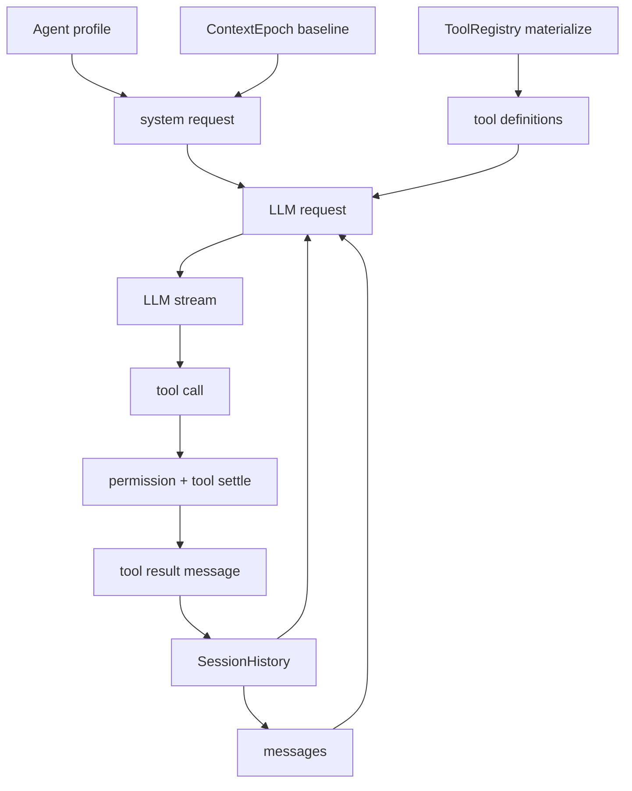

# opencode 提示词系统深度研究

本文研究 opencode 如何把提示词、工具描述、skills、MCP、agent profile 和运行时上下文组织成一个 AI coding agent。重点关注编码主干，不展开 TUI 和企业版。

需要先说明一个边界：当前代码里同时存在两条路径。

- **V2 core runner**：位于 `packages/core/src/session/runner`、`packages/core/src/tool`、`packages/core/src/system-context`。这是更清晰、provider-neutral、typed-tool 化的目标架构。
- **旧 SessionPrompt 路径**：位于 `packages/opencode/src/session/prompt.ts`、`packages/opencode/src/session/system.ts`、`packages/opencode/src/tool`。当前公开 HTTP/SDK prompt 路径仍大量依赖它，且 MCP、Task、旧版 plan/shell prompt 等能力主要还在这里。

因此本文会分别描述“V2 已经怎样设计”和“旧路径仍如何提供能力”，避免把迁移中的两套实现混为一个完全统一的系统。

核心文件：

- [`packages/core/src/session/runner/llm.ts`](./opencode/packages/core/src/session/runner/llm.ts)
- [`packages/core/src/plugin/agent.ts`](./opencode/packages/core/src/plugin/agent.ts)
- [`packages/core/src/system-context/builtins.ts`](./opencode/packages/core/src/system-context/builtins.ts)
- [`packages/core/src/instruction-context.ts`](./opencode/packages/core/src/instruction-context.ts)
- [`packages/core/src/skill/guidance.ts`](./opencode/packages/core/src/skill/guidance.ts)
- [`packages/core/src/reference/guidance.ts`](./opencode/packages/core/src/reference/guidance.ts)
- [`packages/core/src/tool/tool.ts`](./opencode/packages/core/src/tool/tool.ts)
- [`packages/core/src/tool/builtins.ts`](./opencode/packages/core/src/tool/builtins.ts)
- [`packages/opencode/src/session/system.ts`](./opencode/packages/opencode/src/session/system.ts)
- [`packages/opencode/src/session/prompt.ts`](./opencode/packages/opencode/src/session/prompt.ts)
- [`packages/opencode/src/session/prompt/*.txt`](./opencode/packages/opencode/src/session/prompt)
- [`packages/opencode/src/tool/*.txt`](./opencode/packages/opencode/src/tool)
- [`packages/opencode/src/mcp/index.ts`](./opencode/packages/opencode/src/mcp/index.ts)
- [`packages/opencode/src/command/index.ts`](./opencode/packages/opencode/src/command/index.ts)

## 总览：提示词不是一个字符串

opencode 的 prompt system 不是“一个巨大 system prompt”，而是一组分层输入：

```text
provider request
├─ system parts
│  ├─ agent system / provider-specific persona
│  ├─ environment/date/location
│  ├─ AGENTS.md ambient instructions
│  ├─ skill guidance
│  └─ reference guidance
├─ conversation messages
│  ├─ user / assistant / tool history
│  ├─ synthetic reminders
│  ├─ compaction checkpoint
│  └─ command / MCP resource / attachment induced messages
└─ tool definitions
   ├─ tool name
   ├─ description
   ├─ input JSON schema descriptions
   ├─ output schema
   └─ model-facing tool result text
```

这套设计的基本方法论是：**不把所有行为都写进 system prompt，而是把稳定身份、当前环境、可用能力、执行约束和运行时状态分层放置**。

这有几个后果：

- agent 行为不是只由 prompt 文本决定，也由 permission、tool registry、event loop、compaction 和 session projection 共同决定。
- 工具提示词不是单独的“说明书”，而是 schema + description + result rendering 的组合。
- skills/MCP 不是默认全部塞进上下文，而是“先列可用摘要，再按需加载/调用”。
- 运行时会插入 `<system-reminder>`、`<conversation-checkpoint>` 之类局部提示，改变当前 turn 的语义边界。

## 系统提示词组成

### V2 core runner 的 system 结构

V2 runner 在 [`runner/llm.ts`](./opencode/packages/core/src/session/runner/llm.ts) 中构造请求：

```ts
system: [agent.info?.system, system.baseline]
  .filter((part): part is string => part !== undefined && part.length > 0)
  .map(SystemPart.make),
messages: toLLMMessages(context, model),
tools: toolMaterialization.definitions,
```

因此 V2 system prompt 的直接组成是：

1. `agent.info.system`
2. `SessionContextEpoch.prepare(...).baseline`

其中 `agent.info.system` 来自 agent profile。默认 build agent 的系统文本非常短：

```text
You are an AI coding agent. Help the user accomplish software engineering tasks by inspecting the workspace, making targeted changes, and using tools according to the configured permissions.
```

这和旧版 provider prompt 很不同。V2 默认 agent system 有意保持小而通用，把大量上下文交给 `ContextEpoch` 和工具层承担。

### ContextEpoch baseline

`system.baseline` 是多个 system context source 的渲染结果。当前主要来源：

- `core/environment`
- `core/date`
- `core/instructions`
- `core/skill-guidance`
- `core/reference-guidance`

其中 `core/environment` 和 `core/date` 在 [`system-context/builtins.ts`](./opencode/packages/core/src/system-context/builtins.ts)：

```text
Here is some useful information about the environment you are running in:
<env>
  Working directory: ...
  Workspace root folder: ...
  Is directory a git repo: yes/no
  Platform: ...
</env>

Today's date: ...
```

`core/instructions` 在 [`instruction-context.ts`](./opencode/packages/core/src/instruction-context.ts)，它会向上查找 `AGENTS.md`，并同时加载全局配置目录下的 `AGENTS.md`：

```text
Instructions from: /path/to/AGENTS.md
...
```

这个 source 还有一个重要特性：当 instructions 变化时，不是直接改写旧 baseline，而是生成 replacement 或 update 文本：

```text
These instructions replace all previously loaded ambient instructions.

Instructions from: ...
```

这说明 opencode 把 AGENTS.md 当作 ambient system context，而不是普通用户消息。

### skill guidance

V2 skill guidance 在 [`skill/guidance.ts`](./opencode/packages/core/src/skill/guidance.ts)：

```text
Skills provide specialized instructions and workflows for specific tasks.
Use the skill tool to load a skill when a task matches its description.
<available_skills>
  <skill>
    <name>...</name>
    <description>...</description>
  </skill>
</available_skills>
```

这里的设计非常克制：baseline 只放 skill 的 name/description，不直接放完整 skill 内容。完整内容要通过 `skill` tool 动态加载。

### reference guidance

V2 reference guidance 在 [`reference/guidance.ts`](./opencode/packages/core/src/reference/guidance.ts)：

```text
Project references provide additional directories that can be accessed when relevant.
<available_references>
  <reference>
    <name>...</name>
    <path>...</path>
    <description>...</description>
  </reference>
</available_references>
```

它和 skill guidance 的模式相同：系统上下文只提供索引，不直接展开外部目录内容。

### 旧 SessionPrompt 的 provider-specific prompt

旧路径中，系统提示词在 [`session/llm/request.ts`](./opencode/packages/opencode/src/session/llm/request.ts) 里拼接：

```ts
system = [
  agent.prompt ? agent.prompt : SystemPrompt.provider(model),
  ...input.system,
  input.user.system,
].join("\n")
```

`SystemPrompt.provider(model)` 在 [`session/system.ts`](./opencode/packages/opencode/src/session/system.ts) 按模型选择 prompt：

- `gpt` -> `gpt.txt`
- `claude` -> `anthropic.txt`
- `codex` -> `codex.txt`
- `gemini` -> `gemini.txt`
- `kimi` -> `kimi.txt`
- fallback -> `default.txt`

这些 txt 是旧路径里真正的“长系统提示词”。例如 `default.txt` 包含：

- CLI 身份与风格。
- 不要乱猜 URL。
- concision rules。
- proactiveness。
- following conventions。
- coding task workflow。
- tool usage policy。
- code references。

`gpt.txt` 更像 Codex 风格，强调：

- 先读代码、不要过早假设。
- 小而正确的改动。
- 不显式要求计划时直接实现。
- dirty worktree hygiene。
- `apply_patch` 编辑约束。
- code review stance。
- frontend design rules。
- final answer formatting。

旧路径和 V2 的差异很明显：旧路径把大量 agent 行为准则写在 provider prompt 文本里；V2 试图把行为准则拆成 agent profile、ContextEpoch、typed tools、permission 和 runner 机制。

## 工具提示词设计

### V2 工具提示词的结构

V2 工具定义由 [`Tool.make`](./opencode/packages/core/src/tool/tool.ts) 生成：

```ts
new ToolDefinition({
  name,
  description: config.description,
  inputSchema: toJsonSchema(config.input),
  outputSchema: toJsonSchema(config.output),
})
```

因此模型看到的工具提示来自三层：

1. `description`
2. input schema field descriptions
3. tool result 的 `toModelOutput`

这是一种 typed tool prompt 设计。工具说明不只是自然语言，还嵌在 schema 里，执行结果也经过专门渲染。

### bash

V2 [`bash`](./opencode/packages/core/src/tool/bash.ts) 的 description 强调能力边界：

```text
Execute one shell command string with the host user's filesystem, process, and network authority.
The active Location is the default working directory.
Relative workdir values resolve from that Location.
External workdir values require external_directory approval...
Timeout values are milliseconds...
Uses the configured shell...
```

input schema 包含：

- `command`: shell command string
- `workdir`: 默认 active Location，relative 从 Location resolve
- `timeout`: 默认 2 分钟，最大 10 分钟
- `description`: command purpose

模型收到的结果是：

```text
<stdout/stderr compact output>

Warnings:
- ...

Command exited with code N.
```

或 timeout 文本。

值得注意的是：V2 bash 的 prompt 较短，没有旧版 `shell.txt` 那种详尽 shell 使用策略。很多安全边界下沉到了 permission：

- `bash` action approval
- external directory approval
- timeout/capture bound
- output truncation

旧版 [`tool/shell/shell.txt`](./opencode/packages/opencode/src/tool/shell/shell.txt) 和 [`tool/shell/prompt.ts`](./opencode/packages/opencode/src/tool/shell/prompt.ts) 则更“prompt-heavy”：它会注入 OS/shell、tmp 目录、Git/GitHub policy、不要用 shell 做读写搜索、用 workdir 而不是 `cd`、不要用 `head/tail` 截断输出等。这个旧版 shell prompt 有很强的“训练模型怎么使用 shell”的味道。

### edit

V2 [`edit`](./opencode/packages/core/src/tool/edit.ts) 是 exact edit：

```text
Replace exact text in one file.
Relative paths resolve within the active Location.
Absolute paths inside the Location are accepted.
Explicit external absolute paths require external_directory approval before edit approval.
```

schema 字段：

- `path`: 文件路径
- `oldString`: exact text to replace
- `newString`: replacement text，必须不同
- `replaceAll`: 是否替换所有 exact occurrences

执行层还会强制：

- `oldString !== newString`
- `oldString` 不能为空
- 找不到 exact match 就失败
- 多个 match 且未 `replaceAll` 就失败
- 文件变更后审批过期会要求 reread

模型结果是一个小 diff preview：

```text
Edited file successfully: path
Replacements: 1
```diff
- old...
+ new...
```
```

旧版 [`tool/edit.txt`](./opencode/packages/opencode/src/tool/edit.txt) 明确提示“必须 Read 后才能 Edit”、不要把行号前缀放进 oldString、优先 edit existing file、避免 emoji。这些在 V2 core 里尚未完全通过 prompt 继承；V2 目前更靠 exact-edit 失败条件和 permission 保底。

### write

V2 [`write`](./opencode/packages/core/src/tool/write.ts) 的设计很简单：

```text
Write content to one file.
Relative paths resolve within the active Location.
Absolute paths inside the Location are accepted.
Explicit external absolute paths require external_directory approval before edit approval.
```

结果文本：

```text
Wrote file successfully: path
Created file successfully: path
```

旧版 [`tool/write.txt`](./opencode/packages/opencode/src/tool/write.txt) 包含更多行为约束：已有文件必须先 read、优先 edit、不要主动创建 README/docs。这些同样属于旧 prompt-heavy 工具策略。

### read

V2 [`read`](./opencode/packages/core/src/tool/read.ts) 支持：

- 读 UTF-8 文本文件
- 分页读大文件
- 列目录
- 读支持的图片并作为 file part 返回

description：

```text
Read a text file or supported image, page through a large UTF-8 text file by line offset, or list a directory page.
Relative paths resolve from the current location; absolute paths are read directly.
```

schema 里 offset/limit 明确是 1-based line/directory entry offset 和最大条目数。

旧版 [`tool/read.txt`](./opencode/packages/opencode/src/tool/read.txt) 更详细地告诉模型：

- filePath 应该是 absolute path。
- 默认返回最多 2000 行。
- 内容带行号前缀。
- 大文件用 grep。
- 多文件 read 应并行。
- 避免 30 行小切片。

V2 read 的行为已经是 typed/paged，但“如何高效使用 read”的策略提示在 V2 core 中没有旧版那么强。

### grep / glob

V2 [`grep`](./opencode/packages/core/src/tool/grep.ts)：

```text
Search file contents by regular expression within the active Location...
Use a path to narrow the search, include to filter files by glob, and limit to bound the match count.
Returns concise file resources, line numbers, and bounded line previews.
```

模型结果格式是：

```text
Found N matches
/abs/path:
  Line 42: ...
```

V2 [`glob`](./opencode/packages/core/src/tool/glob.ts)：

```text
Find files by glob pattern within the active Location.
Returns concise relative file resources.
Use a relative path to narrow the search and limit to bound the result count.
```

结果是文件路径列表。

这两个工具体现了 opencode 工具 prompt 的一个方法：**工具输出专门为模型下一步决策压缩过，不是原始命令输出**。

### todowrite

V2 [`todowrite`](./opencode/packages/core/src/tool/todowrite.ts)：

```text
Create and maintain a structured task list for the current coding session.
Use it to track progress during multi-step work and keep todo statuses current.
```

这是把“计划状态”从自然语言回复转成 session-structured state 的工具。它不是 memory system，但承担了短期工作记忆的一部分。

### skill tool

V2 [`skill`](./opencode/packages/core/src/tool/skill.ts)：

```text
Load a specialized skill when the task at hand matches one of the available skills in the system context.

Use this tool to inject the skill's instructions and resources into the current conversation.
...
The skill name must match one of the available skills in the system context.
```

加载后返回：

```text
<skill_content name="...">
# Skill: ...

...SKILL.md content...

Base directory for this skill: file://...
Relative paths in this skill ... are relative to this base directory.
Note: file list is sampled.

<skill_files>
<file>...</file>
</skill_files>
</skill_content>
```

这套设计很关键：skills 不是默认展开进 system prompt，而是先在 system context 中列出目录，再通过 tool 动态注入完整说明。这样可以节省 context，也避免所有 skill 互相污染当前任务。

### question

V2 [`question`](./opencode/packages/core/src/tool/question.ts) 明确告诉模型何时问用户：

- 收集偏好/需求。
- 澄清模糊指令。
- 获取实现决策。
- 提供方向选择。

返回结果是：

```text
User has answered your questions: "...".
You can now continue with the user's answers in mind.
```

这说明 opencode 不是只靠 assistant 文本问问题，而是把“询问用户”变成可权限控制、可持久化、可恢复的工具。

## MCP 提示词设计

### 旧路径中的 MCP

MCP 主要仍在旧 `packages/opencode` 路径中实现。MCP service 提供三类东西：

- tools
- prompts
- resources

在 [`SessionTools.resolve`](./opencode/packages/opencode/src/session/tools.ts) 中，MCP tools 被加入同一张 tool 表：

```ts
for (const [key, item] of Object.entries(yield* mcp.tools())) {
  tools[key] = item
}
```

执行时先触发 permission ask，再调用 MCP tool。MCP tool 的 description 和 input schema 来自 MCP server 自身，opencode 只做 schema transform、权限包裹、输出截断和附件转换。

这意味着 MCP tool prompt 的来源不是 opencode 自己写的长 prompt，而是 MCP server 发布的 tool definition。opencode 负责把它纳入同一套工具运行时。

### MCP prompts 作为 command

[`command/index.ts`](./opencode/packages/opencode/src/command/index.ts) 会把 MCP prompts 变成 slash command：

```ts
for (const [name, prompt] of Object.entries(yield* mcp.prompts())) {
  commands[name] = {
    source: "mcp",
    description: prompt.description,
    template: mcp.getPrompt(...).messages.map(...).join("\n"),
    hints: prompt.arguments?.map((_, i) => `$${i + 1}`) ?? [],
  }
}
```

也就是说 MCP prompt 不是自动进 system prompt，而是变成用户可触发的 command template。它更像“外部 prompt library”，不是 ambient instruction。

### MCP resources

旧 `SessionPrompt` 在处理用户附件时能读取 MCP resources。相关逻辑会生成类似：

```text
Reading MCP resource: name (uri)
```

或者失败消息。MCP resource 更像用户显式附加的上下文，不是系统默认记忆。

### V2 core 中的 MCP 状态

V2 `runner/llm.ts` 的 TODO 中写着：

```text
Resolve policy-filtered built-in, MCP, plugin, and structured-output tool definitions.
```

同时 [`tool/builtins.ts`](./opencode/packages/core/src/tool/builtins.ts) 注释也说 MCP/plugin tools 后续应通过 separate scoped canonical registrations 加入，而不是混入静态 built-in list。

因此目前可以判断：

- V2 typed tool registry 已经为 MCP/plugin tools 预留了插槽。
- MCP 的完整 prompt/tool/resource 整合仍主要由旧路径承担。
- 设计方向是把 MCP 也降到 provider-neutral typed tool / application tool 注册体系里。

## Skill 系统提示词设计

Skill 系统有两条路径，但方法论一致：**先发现和索引，再按需加载**。

V2 core 中：

1. `ConfigSkillPlugin` 从配置目录、`skill/`、`skills/`、URL 等来源注册 skill sources。
2. `SkillV2.list()` 解析 markdown/frontmatter，得到 `name`、`description`、`content`。
3. `SkillGuidance` 把可用 skill 的 name/description 放进 system baseline。
4. 模型调用 `skill` tool 加载完整 `content` 和 sampled file list。

旧路径中：

- [`SystemPrompt.skills`](./opencode/packages/opencode/src/session/system.ts) 也会把 skills 列入 system。
- 注释明确说：模型似乎更容易吸收“system 中 verbose skill list + tool description 中简短说明”的组合。
- [`Command`](./opencode/packages/opencode/src/command/index.ts) 还会把 skill 内容暴露为 command template，前提是没有重名 command。

这说明 opencode 对 skill 的定位不是“永久记忆”，而是“任务相关 workflow capsule”。它通过 description 做检索入口，通过 `skill` tool 做内容注入。

## 提示词设计的方法论

### 1. Prompt 分层，而非单体

opencode 把不同稳定性的内容放在不同层：

- 长期身份：agent system/provider prompt。
- 当前环境：ContextEpoch baseline。
- 项目规范：AGENTS.md instruction source。
- 可用扩展：skill/reference guidance。
- 运行时状态：conversation messages、synthetic reminders、compaction checkpoint。
- 可执行能力：tool definitions。
- 行为硬约束：permission 与 runtime validation。

这比单体 prompt 更适合 agent runtime，因为每层更新频率不同，权限级别不同，缓存和 compaction 策略也不同。

### 2. 少量 system，大量 tool

V2 的方向明显是减少长篇 system prompt，把能力交给 typed tools。工具不是“你可以 bash”这种一句话，而是一个可执行合约：

```text
description + input schema + output schema + permission + settle + result rendering
```

这使提示词和运行时边界绑定，而不是只靠模型自觉。

### 3. 索引优先，按需展开

skills 和 references 都采用索引式提示：

- system 里列 name/description/path。
- 真正内容通过 tool 或 read/resource 再加载。

这样避免把所有潜在上下文一次性塞进 prompt，也降低无关 instruction 的干扰。

### 4. 权限不是 prompt，而是 prompt 的地基

agent profile 的差异主要由 permission 决定：

- build：可 edit，可 question，可 plan_enter。
- plan：禁止 edit，允许 plan_exit，部分 plan 文件可写。
- explore：只允许 read/search/web fetch 等。
- compaction/title/summary：几乎所有工具 deny。

这说明 opencode 不只提示模型“不要做某事”，还在工具注册和执行层让模型做不到或必须审批。

### 5. 运行时提醒负责局部状态切换

旧路径里有大量 `<system-reminder>`：

- plan mode active。
- 用户中途插入消息后提醒模型处理。
- max steps reached。
- structured output must call tool。

V2 里也有 `<conversation-checkpoint>`。这些标签的共同作用是：在不重写全局 system prompt 的前提下，局部改变当前 turn 的语义。

### 6. Provider-specific prompt 是适配层，不是核心抽象

旧路径中 provider-specific prompt 很重：`gpt.txt`、`anthropic.txt`、`codex.txt` 等针对不同模型写不同风格和工具习惯。

V2 core 则更倾向 provider-neutral：

- canonical messages
- typed tool definitions
- SystemPart
- ContextEpoch
- model route limits

这是一种迁移方向：从“为每个模型写一套行为 prompt”转向“用统一 runtime 合约约束模型”。

## 提示词如何组织编码任务

一次编码任务中，提示词和模块大致这样协作：



在这个循环中：

- system prompt 决定“你是谁、当前环境是什么、有哪些指导索引”。
- message history 决定“任务已经发生了什么”。
- tool definitions 决定“你现在能做什么”。
- permission 决定“你实际被允许做什么”。
- tool result rendering 决定“工具输出怎样回到模型上下文”。
- compaction 决定“旧上下文如何变成低权限历史 checkpoint”。
- ContextEpoch 决定“system context 如何跨 turn 稳定和更新”。

这不是普通 chat prompt，而是一个 agent runtime 的控制平面。

## Magic 的地方

### Magic 1：AGENTS.md 作为 system context source

AGENTS.md 不是普通文件，也不是用户消息。它被读成 system baseline 的一部分，并通过 snapshot/update/replacement 管理。这让项目规范天然高于普通对话历史。

### Magic 2：skill list 不展开，skill tool 才展开

这避免了“所有 workflow 同时污染模型”。模型先看到目录，再按需加载。这和 IDE 中按需打开文档类似。

### Magic 3：tool result 是 prompt 的一部分

工具描述只是前半段，`toModelOutput` 才是后半段。比如 edit 返回 diff preview，bash 返回 exit code，grep 返回行号和匹配预览。这些输出格式会强烈影响模型的下一步判断。

### Magic 4：permission 和 tool materialization 会改变模型可见世界

`ToolRegistry.materialize` 会根据 agent permissions 过滤掉完全 deny 的工具。模型并不是看到所有工具再被拒绝，而是某些工具根本不会出现。这是 prompt surface 级别的权限。

### Magic 5：compaction checkpoint 降权

compaction 后旧历史以 user role 的 `<conversation-checkpoint>` 出现，并明确声明是 historical context, not new instructions。这是把历史压缩和 prompt injection 降权结合在一起。

### Magic 6：旧路径 plan mode 用 reminder + permission 双保险

plan mode prompt 强烈禁止编辑，同时 agent permission deny edit，只放开 plan file。这是“软提示 + 硬权限”的典型组合。

### Magic 7：MCP prompts 被命令化，而不是自动系统化

MCP prompt 被转成 command template，需要用户触发；MCP tool 被转成工具定义，需要模型选择调用。opencode 没有把 MCP server 的所有 prompt 都自动提升为 system instruction，这降低了外部 MCP 对核心 agent 行为的污染。

## 是否存在记忆系统？

目前没有看到一个独立的、跨 session 的“memory system”，即类似：

```text
用户偏好长期记忆
项目长期事实库
自动检索记忆
可写 memory store
```

但存在几类“近似记忆”的机制：

### 1. Session history

普通 user/assistant/tool 消息是最基础的短期记忆。V2 通过 event/projected message 使它 durable。

### 2. Compaction summary

compaction 会把旧历史压缩成 `summary + recent-context`，作为后续历史 checkpoint。这是 session 内长期上下文，不是跨 session 用户记忆。

### 3. ContextEpoch baseline/snapshot

系统上下文 source 的 snapshot/baseline 是 system context 的记忆。它记住“上一代 baseline 是什么”，用于增量更新和 replacement。

### 4. AGENTS.md / skills / references

这些是外部文件化记忆。opencode 不自己写入用户偏好，而是读取用户或项目维护的文件。

### 5. Permission saved rules

权限系统有 remembered rules，例如用户选择 always allow 后保存规则。这是权限记忆，不是语义记忆。

### 6. Session title / summary / diffs

旧路径会生成 title、session diff summary、message summary metadata，用于 UI、检索或展示。它不直接构成下一轮 prompt 的长期记忆，和 compaction 不同。

所以准确结论是：

```text
opencode 当前有 session memory、context-source memory、permission memory、file-based ambient memory；
但没有独立的跨 session semantic memory subsystem。
```

## FAQ：工具定义、MCP、V1->V2 迁移与路径权限

### Q1：tool definition 目前是自行定义一套序列化规范注入 system prompt，还是使用 provider 提供的工具注册接口？

结论：**两层并存，但最终走的是 provider 原生 tool/function calling 接口，不是把工具定义拼成 system prompt 文本。**

V2 core 中，opencode 先定义自己的 canonical tool abstraction。[`Tool.make`](./opencode/packages/core/src/tool/tool.ts) 会把工具描述组织成：

- `name`
- `description`
- `inputSchema`
- `outputSchema`

然后 runner 在 [`session/runner/llm.ts`](./opencode/packages/core/src/session/runner/llm.ts) 中构造请求时，把这些工具定义直接放进：

```ts
tools: toolMaterialization.definitions
```

再往下，`packages/llm` 会把这套 canonical `ToolDefinition` lower 到各 provider 的原生格式：

- OpenAI Responses: `type=function + name + description + parameters`
- Anthropic Messages: `tools + input_schema`
- Bedrock Converse: `toolSpec + inputSchema.json`

因此更准确的说法是：

```text
opencode 自己维护 provider-neutral 的工具中间表示；
真正发请求时，再适配为各 provider 的原生工具注册格式。
```

这也是为什么 V2 能把“提示词中的工具说明”与“provider tool API”分开处理：

- 工具说明依然重要，但主要体现在 `description` 与 schema 字段描述里。
- 工具是否可调用、如何返回 tool-call、如何回传 tool-result，则交给 provider 的原生协议。

所以工具不是被“序列化成一段 system prompt”来模拟调用，而是作为 request 的 `tools` 字段参与模型请求。

### Q2：opencode 是否是在用户主动调用 MCP 命令后，才从指定 MCP 服务加载工具？加载后会引发 system prompt 更新吗？是增量更新还是替换？

结论：**不是。MCP tools 的加载以“连接 server 并列出能力”为中心，而不是以“用户先执行某个 MCP command”为前提。**

旧路径中，MCP service 初始化后会根据配置连接 MCP server，并在连接成功后调用 `listTools`，把结果缓存到内部状态 `defs`。相关逻辑在 [`mcp/index.ts`](./opencode/packages/opencode/src/mcp/index.ts)。

随后，每个 agent turn 在 [`session/tools.ts`](./opencode/packages/opencode/src/session/tools.ts) 里调用：

```ts
for (const [key, item] of Object.entries(yield* mcp.tools())) {
  tools[key] = item
}
```

也就是说：

- 只要 MCP server 已连接、且 server 暴露了 tools，
- 这些 tools 就会在下一次 prompt request 组装时进入可用工具表，
- 不需要用户先手工调用某个 MCP command。

但要把 MCP 的三类能力区分开：

1. **MCP tools**
   连接后列出，作为 tool definitions 进入模型可调用工具集合。

2. **MCP prompts**
   在 [`command/index.ts`](./opencode/packages/opencode/src/command/index.ts) 中被转成 slash command template。这里通常要等用户触发命令时，才真正 `getPrompt(...)` 拉取完整 prompt 内容。

3. **MCP resources**
   更像可显式附加的外部资源。只有在用户引用/附加时，才会去读取 resource 内容。

那么，MCP tools 加载后是否会更新 system prompt？

答案基本是：**不会以 system baseline update/replacement 的方式更新。**

原因是 MCP tools 不属于 `ContextEpoch` 管理的 system context source。它们属于 request 的 `tools` surface，而不是 `system.baseline` 的文本组成部分。MCP server 后续如果通过 `tools/list_changed` 通知工具列表变化，opencode 会更新 MCP 内部缓存，并在后续 turn 重新 materialize tool definitions；但这不是：

- system replacement
- system incremental update
- baseline text rewrite

更接近：

```text
system prompt 不变；
下一轮请求中的 tools 列表发生变化。
```

所以这里发生的是**工具面更新**，不是**system context 更新**。

### Q3：V1 工具拥有详细的工作说明 prompt，这些信息如何迁移到 V2？以 edit 工具为例。

结论：**V2 不是把 V1 的长工具说明原封不动搬过去，而是把它拆到 schema、runtime invariant、permission 和 result rendering 几层里。**

V1 的 [`tool/edit.txt`](./opencode/packages/opencode/src/tool/edit.txt) 很典型。它同时承担了几类信息：

- 行为约束：先 Read 再 Edit。
- 输入约束：不要把 Read 的行号前缀带进 `oldString/newString`。
- 策略建议：优先 edit 现有文件，不要随便新建文件。
- 错误模型：找不到 `oldString`、有多重匹配时会失败。
- 任务经验：rename 场景可使用 `replaceAll`。

这是一种典型的 prompt-heavy tool design：把“怎么正确使用工具”的经验，主要写成自然语言说明。

V2 `edit` 在 [`core/src/tool/edit.ts`](./opencode/packages/core/src/tool/edit.ts) 中把这些内容拆开：

1. **简化后的 tool description**

```text
Replace exact text in one file...
```

它只保留工具本体语义，不再承载大量 workflow 教学。

2. **input schema 描述化**

- `path`
- `oldString`
- `newString`
- `replaceAll`

这些字段都带 description，告诉模型该如何构造结构化参数。

3. **运行时硬约束**

V2 把很多原来只是“文档说明”的东西，改成真正的执行前/执行中校验：

- `oldString === newString` 直接失败
- `oldString === ""` 直接失败
- `oldString` 找不到就失败
- 多重匹配且没开 `replaceAll` 就失败
- 权限审批后文件变更了，会要求 reread

这类约束已经不再依赖模型“自觉遵守说明”，而是 runtime 保证。

4. **路径与权限分离**

V1 edit 中已经有 `assertExternalDirectoryEffect` 一类路径边界处理；V2 则更显式地通过 `LocationMutation.resolve + PermissionV2.assert` 分层：

- 先 resolve 路径
- 外部路径先 `external_directory`
- 再申请 `edit`

5. **tool result 反向塑形**

V2 的 `toModelOutput` 会返回一个小 diff preview。也就是说，V2 不只关心“如何向模型介绍工具”，也关心“工具执行结果怎样以最适合模型的形式回流上下文”。

不过要注意：V2 并没有完成所有迁移。`edit.ts` 中明确保留了若干 TODO：

- fuzzy correction strategies
- block-anchor fallback
- indentation correction
- formatter integration
- watcher events
- snapshots / undo
- LSP diagnostics

因此更准确的高层判断是：

```text
V1 -> V2 的迁移不是“把工具 prompt 复制过去”，
而是“把 prompt 中的一部分知识下沉为 typed schema、runtime contract 和 permission boundary”。
```

代价是：某些经验性、启发式、面向模型使用习惯的“软知识”，在 V2 里暂时还没完全补齐。

### Q4：路径的权限控制机制是如何实现的？如何从 LLM tool call 中识别出路径？

结论：**路径控制不是从自然语言里猜，而是由具体工具的结构化输入 schema 主动暴露路径字段，再由工具实现自己做 resolve 和 permission assert。**

以 V2 `edit` 为例，模型发出的 tool call 是结构化 JSON：

```json
{
  "path": "...",
  "oldString": "...",
  "newString": "...",
  "replaceAll": false
}
```

工具执行时，从 `input.path` 读取路径，然后交给 [`location-mutation.ts`](./opencode/packages/core/src/location-mutation.ts) 的 `resolve`：

1. 相对路径按 active Location 解析。
2. 禁止相对路径 lexical escape。
3. 对真实路径做 canonicalization，防止 symlink 把路径带出 Location。
4. 若仍在 Location 内，生成 location-relative resource。
5. 若是外部绝对路径，则生成 `external_directory` 审批边界与 canonical resource。

也就是说，permission system 处理的不是原始字符串路径，而是**已经被 resolve/canonicalize 后的 permission resource**。

随后工具会调用 `PermissionV2.assert(...)`：

- 对外部路径，先断言 `external_directory`
- 再断言具体动作，如 `edit`
- `PermissionV2` 用 `(action, resource, effect)` 规则做 wildcard 匹配

这里的 `resource` 可能是：

- 内部文件：相对 Location 的 `src/foo.ts`
- 外部目录边界：`/abs/external/path/*`

保存“always allow”时，也正是把这些 `(action, resource)` 规则写入本地 permission 表。

需要特别强调的是：**路径提取是 tool-specific 的，不是通用 NLP。**

不同工具识别路径的方式不同：

- `edit` / `write` / `read`: 直接读取 schema 中的 `path`
- `apply_patch`: 先 parse patch，再从 hunk 中提取每个文件路径
- `bash`: 主要只识别 `workdir`，并不会可靠解析 shell command 字符串里所有文件路径
- MCP tools: 旧路径中通常按工具名整体 ask，不对其自定义参数做通用路径级 introspection

所以从架构上说，opencode 的路径权限并不是“全局有个组件扫描每一次 tool call 的任意 JSON，自动找出路径”，而是：

```text
每个带路径语义的工具，
自己定义输入字段、
自己做路径解析、
自己申请对应 permission。
```

## 附录：provider-specific prompt 对比

旧路径里的 provider-specific prompt 不是“同一份系统提示词的轻微变体”，而是一组明显不同的 agent persona 和操作策略。选择逻辑位于 [`session/system.ts`](./opencode/packages/opencode/src/session/system.ts)：

```ts
if (model.api.id.includes("gpt-4") || model.api.id.includes("o1") || model.api.id.includes("o3"))
  return [PROMPT_BEAST]
if (model.api.id.includes("gpt")) {
  if (model.api.id.includes("codex")) return [PROMPT_CODEX]
  return [PROMPT_GPT]
}
if (model.api.id.includes("gemini-")) return [PROMPT_GEMINI]
if (model.api.id.includes("claude")) return [PROMPT_ANTHROPIC]
if (model.api.id.toLowerCase().includes("trinity")) return [PROMPT_TRINITY]
if (model.api.id.toLowerCase().includes("kimi")) return [PROMPT_KIMI]
return [PROMPT_DEFAULT]
```

这个分流本身就很值得注意：`gpt-4`、`o1`、`o3` 不是走 `gpt.txt`，而是走 `beast.txt`；只有普通 `gpt` 非 codex 模型才走 `gpt.txt`；包含 `codex` 的 GPT 模型走 `codex.txt`。

### 总体对比

| prompt | 触发条件 | 核心取向 | 最值得注意的行为偏置 |
| --- | --- | --- | --- |
| [`default.txt`](./opencode/packages/opencode/src/session/prompt/default.txt) | fallback | 极简 CLI assistant | 强制短回复、少解释、不主动 commit、完成后 lint/typecheck |
| [`anthropic.txt`](./opencode/packages/opencode/src/session/prompt/anthropic.txt) | `claude` | 工具化、计划可见、客观纠偏 | 非常强调 TodoWrite、Task subagent、专业客观性 |
| [`gpt.txt`](./opencode/packages/opencode/src/session/prompt/gpt.txt) | 普通 `gpt` | pragmatist senior engineer | 强调小改动、并行工具、apply_patch、dirty worktree hygiene |
| [`codex.txt`](./opencode/packages/opencode/src/session/prompt/codex.txt) | `gpt` 且包含 `codex` | 已具备 coding-agent 习惯的轻量适配 | 比 `gpt.txt` 更短，集中补编辑、工具、git、前端和最终回复约束 |
| [`gemini.txt`](./opencode/packages/opencode/src/session/prompt/gemini.txt) | `gemini-` | 高规训 workflow agent | 强调绝对路径、先理解再计划、关键命令解释、工具确认语境 |
| [`kimi.txt`](./opencode/packages/opencode/src/session/prompt/kimi.txt) | `kimi` | 强 action default、多语言、谨慎本地执行 | 任务/问题歧义时偏向任务执行，要求使用用户语言，禁止越出工作目录 |
| [`trinity.txt`](./opencode/packages/opencode/src/session/prompt/trinity.txt) | `trinity` | 低并发、短回复、单步工具 | 明确一次只用一个工具，模糊请求优先 question |
| [`beast.txt`](./opencode/packages/opencode/src/session/prompt/beast.txt) | `gpt-4` / `o1` / `o3` | 极高自主性、强研究、强持久化 | 强制互联网研究、todo、反复测试，并声明文件型 memory |

从这个表可以看到，旧路径的 provider-specific prompt 实际承担了三种不同职责：

- **provider adapter**：规避或利用某类模型的行为特征，例如 Trinity 的“单工具调用”约束、Gemini 的绝对路径要求。
- **agent persona**：把模型塑造成不同风格的工程师，例如 GPT 的 pragmatic senior engineer、Anthropic 的 objective technical collaborator。
- **runtime policy shim**：在 runtime 没有硬约束或尚未迁移到 V2 时，用 prompt 临时承载策略，例如 todo 频率、是否解释命令、是否创建文件、是否必须使用 WebFetch。

### default：保守极简的基线

[`default.txt`](./opencode/packages/opencode/src/session/prompt/default.txt) 是 fallback prompt，也是最能体现旧版 opencode CLI 基线风格的文件。它强调：

- CLI 输出要非常短，甚至要求默认少于 4 行。
- 不要有多余 preamble/postamble。
- 不要随便创建注释。
- 按项目约定做事，先查依赖和邻近代码。
- 完成后尽量运行 lint/typecheck。
- 不要主动 commit。

它的设计哲学是“少说、多做、别惊扰用户”。和 V2 的最小 agent system 相比，`default.txt` 仍然把很多编码代理习惯写在 system prompt 里，但语气非常克制。

### anthropic：用 Todo/Task 稳定长任务

[`anthropic.txt`](./opencode/packages/opencode/src/session/prompt/anthropic.txt) 的特点不是“更像 Claude 的人格”，而是更明显地通过 prompt 约束任务组织方式：

- 非常强调 `TodoWrite`，要求频繁使用并及时更新状态。
- 鼓励使用 `Task` 专门代理，尤其是探索代码库时。
- 强调 professional objectivity，即不要顺着用户观点附和，要调查事实。
- 对 opencode 自身问题，要求 WebFetch 官方 docs。
- 强调用专用工具替代 Bash 做文件读写。

这看起来像是在弥补旧路径中“计划状态”和“subagent 调度”还较依赖模型自觉的缺口：通过 Anthropic prompt 强推 Todo/Task，让长任务更显式、更可观察。

它也暴露出旧路径 prompt-heavy 的一个问题：`TodoWrite` 和 `Task` 的使用频率是系统行为的一部分，但在这里仍然通过自然语言强灌给模型。V2 如果继续成熟，这类要求更适合由 mode、runner、tool policy 或 UI projection 承担，而不是按 provider 写不同程度的提醒。

### gpt：像 Codex CLI 的工程师守则

[`gpt.txt`](./opencode/packages/opencode/src/session/prompt/gpt.txt) 是最接近“通用 coding agent 操作手册”的 prompt。它强调：

- 先读代码，不要猜。
- 小而正确的改动优先。
- 默认实现，而不是只给方案。
- 持续到任务完成、验证、交代结果。
- dirty worktree hygiene。
- 手工编辑用 `apply_patch`。
- 多文件读取要并行。
- review 请求要按 code review stance 处理。
- 前端任务避免模板化设计。

这份 prompt 的信息密度很高，但内部相当一致：它在塑造一个 senior engineer 的日常工作习惯。相比 `default.txt` 的“CLI 极简”，`gpt.txt` 更重视工程判断、协作更新和编辑安全。

它也解释了旧路径为什么看上去“会工作”：很多行为不是 runner 显式控制，而是写在 `gpt.txt` 里，例如不要 revert 用户改动、不要 amend commit、用非交互式 git、review 时 findings first。

### codex：轻量补充，而不是完整重训

[`codex.txt`](./opencode/packages/opencode/src/session/prompt/codex.txt) 比 `gpt.txt` 短很多。它没有完整重复“如何成为 coding agent”的大段说明，而是集中补几个关键边界：

- 编辑约束：ASCII、少注释、单文件优先 `apply_patch`。
- 工具选择：Read/Edit/Write/Glob/Grep/Bash 的分工。
- git hygiene。
- 前端设计质量。
- 最终回复结构。

这可能反映了一个假设：Codex 系列模型本身已经有较强 coding-agent prior，不需要像普通 GPT 那样靠长系统 prompt 建立全部工作习惯。因此 `codex.txt` 更像“校准器”，而不是“完整操作系统”。

这个差异对 V2 很有启发：如果模型越来越 agent-native，system prompt 可以更短，更多行为可以交给 typed tools、permission 和 runner；这正是 V2 的方向。

### gemini：高规训、绝对路径、工作流化

[`gemini.txt`](./opencode/packages/opencode/src/session/prompt/gemini.txt) 的结构非常像一个严格 workflow spec：

- `Core Mandates` 先规定遵循项目约定、依赖检查、风格一致、少注释。
- `Primary Workflows` 把软件工程任务拆成 Understand、Plan、Implement、Verify。
- `New Applications` 要先提出计划并获得用户 approval。
- `Operational Guidelines` 强调 CLI 简短输出。
- `Tool Usage` 特别强调文件路径必须是绝对路径。
- 对会修改系统的 Bash 命令，要先解释目的和影响。

这里的 provider-specific 色彩很强。比如“工具文件路径必须使用绝对路径”并不是 opencode 所有路径统一理念，而更像对某种工具调用习惯/模型行为的修正。它把很多“正确使用工具”的约束直接写进 prompt，以提高 Gemini 在旧工具协议下的稳定性。

不过这也带来一个问题：如果底层工具 schema 已经支持相对路径，或者 V2 的 Location layer 已经能安全 resolve，那么这类 provider prompt 就会和 runtime 事实逐渐脱节。V2 的 typed tool description 更适合表达“此工具接受相对路径还是绝对路径”，不适合让每个 provider prompt 自己发明一套路径规则。

### kimi：action default + 同语言响应 + 本地谨慎

[`kimi.txt`](./opencode/packages/opencode/src/session/prompt/kimi.txt) 很强调“当请求既可以理解为问题也可以理解为任务时，按任务处理”。它的核心偏置是：

- 默认采取行动，用工具实际修改文件，而不是只描述方案。
- 回答语言必须和用户一致。
- subagent prompt 要包含完整上下文。
- 本地环境不在 sandbox 中，因此不要访问工作目录外文件。
- git mutation 必须显式请求。
- 对研究和多媒体处理也给出较完整流程。
- `AGENTS.md` 被解释为 agent-specific project instruction。

这份 prompt 和 `gpt.txt` 的差别在于：`gpt.txt` 更像工程协作守则，`kimi.txt` 更像“在用户电脑上的通用 AI agent 安全手册”。它对工作目录边界、语言一致性、任务执行倾向讲得更直白，可能是为了让 Kimi 在复杂中文/多语言请求中更稳定地保持行动模式。

### trinity：单工具、短回复、低复杂度协议

[`trinity.txt`](./opencode/packages/opencode/src/session/prompt/trinity.txt) 和其他 prompt 最大的不同是工具调用策略：

```text
Use exactly one tool per assistant message.
After each tool call, wait for the result before continuing.
```

它还要求：

- 模糊请求先用 question。
- 避免重复相同工具。
- 短回复，默认少于 4 行。
- 不要添加注释。
- 不要主动 commit。

这明显是 provider adapter，而不是普通 persona。它似乎假设该 provider 对多工具并发、复杂 tool scheduling 或长链路执行不够稳，于是通过 prompt 把 agent 降级成单步循环：

```text
one tool -> observe -> decide -> next tool
```

从 agent runtime 角度看，这是一种把“调度策略”写进 system prompt 的做法。V2 更理想的方式是 runner/provider capability 层直接知道某 provider 不适合并行工具调用，然后调整 materialization 或 streaming loop，而不是让模型自己记住“每次只能一个工具”。

### beast：旧路径中最激进也最矛盾的 prompt

[`beast.txt`](./opencode/packages/opencode/src/session/prompt/beast.txt) 是最特殊的一份。它被 `gpt-4`、`o1`、`o3` 触发，而不是普通 `gpt.txt`。其风格非常激进：

- 要求一直工作直到问题完全解决。
- 要求大量计划、反思、测试。
- 强制互联网研究，甚至说问题不能不靠 internet research 解决。
- 要求使用 Google 搜索第三方库/依赖最新用法。
- 要求 todo list，并持续勾选。
- 包含一个文件型 memory 约定：`.github/instructions/memory.instruction.md`。

这份 prompt 有两个重要观察。

第一，它不是一个“保守 coding agent prompt”，而像一个高自主研究/修复代理的实验 persona。它会显著提高模型的行动倾向，但也可能造成过度搜索、过度测试、过度计划，甚至在不需要互联网时强行联网。

第二，它和本文前面的“opencode 当前没有一等 memory subsystem”并不矛盾。`beast.txt` 确实声明了一个 memory 文件路径，并要求在用户要求记忆时更新它；但这只是旧路径 provider prompt 里的文件约定，不是 opencode runtime 中独立的 semantic memory subsystem。没有看到统一的 memory store、自动检索、跨 session semantic recall、memory write API 或 projection 机制。

所以 `beast.txt` 反而说明了旧路径的局限：当一个能力没有成为 runtime abstraction 时，它可能以 prompt convention 的形式出现。这样的“记忆”可被模型执行，但不具备系统级一致性。

### provider-specific prompt 的系统性意义

这些 prompt 的差异并不只是“不同模型语气不同”。它们在旧路径里承担了大量 runtime 尚未统一表达的策略：

- **并行能力**：`gpt.txt` 鼓励并行，`trinity.txt` 禁止并行。
- **计划可见性**：`anthropic.txt` 强推 TodoWrite，`default.txt` 则极简。
- **路径习惯**：`gemini.txt` 强调绝对路径，V2 工具则倾向由 schema 和 Location layer 表达路径规则。
- **行动倾向**：`kimi.txt` 和 `beast.txt` 都强 action default，`default.txt` 更收敛。
- **研究倾向**：`beast.txt` 强制联网，`default/anthropic` 只在 opencode docs 问题上要求 WebFetch。
- **记忆形态**：`beast.txt` 使用文件约定模拟 memory，其它 prompt 没有这套机制。

从设计哲学看，这些 provider prompt 是旧架构中的“行为补丁层”。它很实用，因为不同模型确实有不同弱点；但它也使系统行为变得分散：同一个 opencode agent，在不同 provider 下不仅能力不同，甚至工作哲学也不同。

V2 的方向正是在减少这类差异：

```text
provider-specific prompt
  -> provider-neutral agent profile
  -> typed tool definitions
  -> permission/materialization
  -> runner coordination
  -> ContextEpoch system sources
```

这并不意味着 provider-specific prompt 会完全消失。更合理的未来形态是：

- provider prompt 只表达真正的 provider quirks；
- coding-agent 方法论放到 agent profile / skill / project instruction；
- 工具使用策略放到 tool schema、tool result、permission 和 runner；
- 长期状态放到明确的 memory/context abstraction，而不是 prompt 里的文件约定。

简言之：旧路径通过 provider-specific prompt 让模型“学会成为 opencode”；V2 则试图让 runtime 本身成为 opencode，只让模型在清晰的工具和上下文边界内行动。

## 总结

opencode 的提示词设计有一个清晰趋势：从旧路径的 provider-specific 大 prompt，逐渐迁移到 V2 的 runtime-first prompt architecture。

旧路径更像：

```text
provider prompt txt + tool txt + SessionPrompt loop
```

V2 更像：

```text
agent profile
+ ContextEpoch system sources
+ canonical messages
+ typed tool definitions
+ permission/materialization
+ durable event loop
```

这套方法论的核心不是“把 prompt 写得更长”，而是把 prompt 拆成有权限、有生命周期、有来源、有更新策略的组件。它让编码 agent 能够稳定地在代码库里工作：知道自己是谁，知道当前项目和环境，知道可用工具，知道何时读、搜、改、问、委派、压缩，也知道哪些旧上下文只能作为历史参考而不能继续发号施令。
