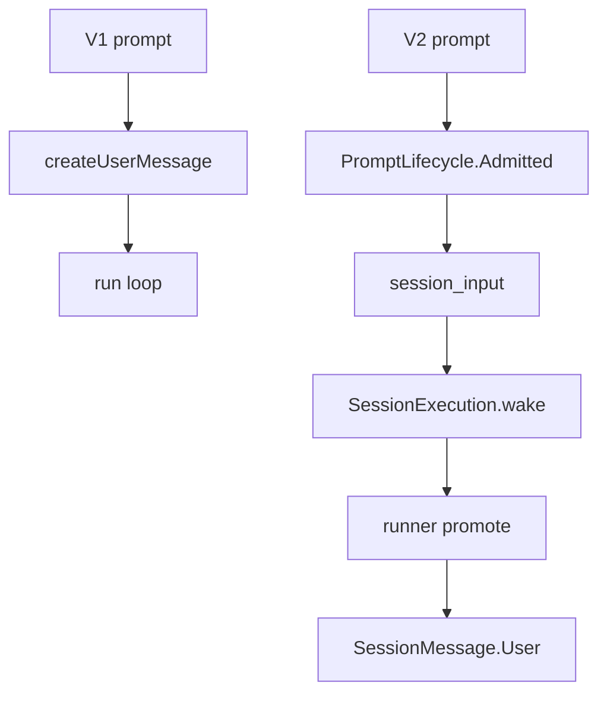
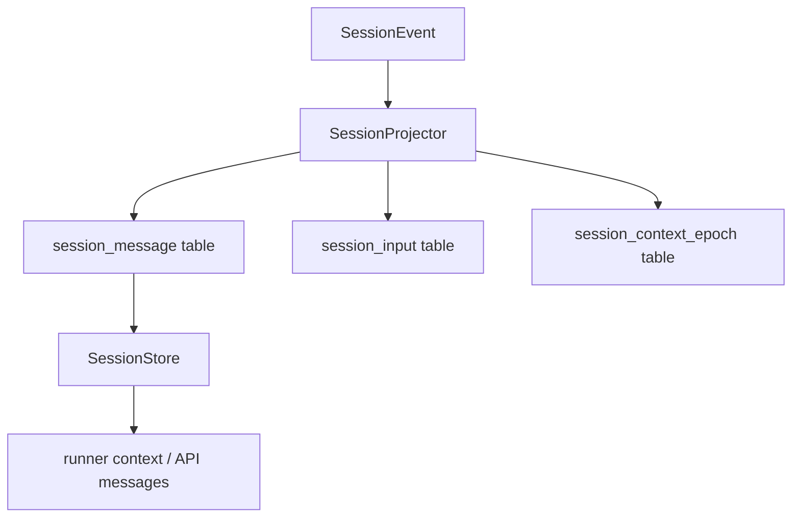
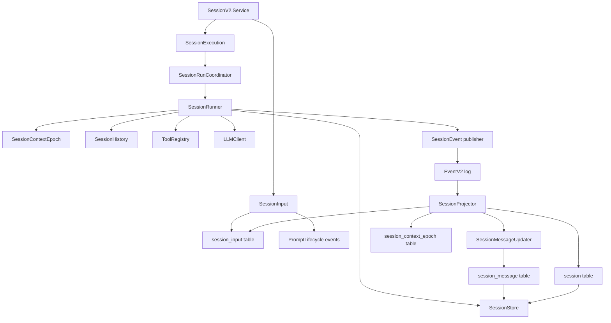

# opencode SessionV1 与 SessionV2 深度对比

本文回答三个问题：

1. 从 SessionV1 到 SessionV2 改变了什么？
2. V2 引入了哪些抽象，它们彼此如何协作？
3. 这些变化背后的设计哲学是什么？

分析基于 `anomalyco/opencode` submodule，源码位于 [`./opencode`](./opencode)。本文延续前两篇报告的范围，只关注 opencode 作为 AI coding agent 的 session/runtime 主干，不展开配置、企业版和 TUI。

## 一句话结论

SessionV1 把 session 主要建模为“可变的对话记录”：session info、message、part 被不断 update，当前 UI 和模型上下文都围绕这个可变 transcript 工作。

SessionV2 则开始把 session 建模为“可恢复的 agent runtime”：用户输入先进入 admission queue，执行由 coordinator 唤醒，LLM step、文本、reasoning、tool call、tool result、compaction 都成为领域事件，再由 projector/reducer 折叠成可查询的 message 视图。

所以 V1 到 V2 的核心变化不是“类型重命名”，而是：

> 从同步一个最终状态，转向记录一串可重放的事实，并用这些事实驱动执行。

## V1：以产品视图为中心的 Session

V1 类型定义集中在 [`packages/core/src/v1/session.ts`](./opencode/packages/core/src/v1/session.ts)，运行服务在 [`packages/opencode/src/session/session.ts`](./opencode/packages/opencode/src/session/session.ts)。

### SessionInfo 是一个大状态对象

V1 的 `SessionInfo` 包含很多产品层字段：

- `slug`
- `projectID` / `workspaceID`
- `directory` / `path`
- `parentID`
- `summary`
- `cost` / `tokens`
- `share`
- `title`
- `agent`
- `model`
- `metadata`
- `time`
- `permission`
- `revert`

这说明 V1 的 session object 本身承担了很多职责：身份、展示、分享、统计、权限、revert、摘要都放在一个“当前状态”里。

### Message 是 user/assistant + parts

V1 message 只有两类主体：

- `User`
- `Assistant`

具体内容放在 `Part` union 中，例如：

- text
- file
- reasoning
- tool
- step-start / step-finish
- snapshot / patch
- retry
- subtask
- compaction

也就是说，V1 的消息模型更接近 UI transcript：一条 assistant message 下挂若干 parts，processor 在 streaming 中持续 update parts，最后形成可展示的对话记录。

### V1 事件是 coarse-grained 状态同步

V1 的事件定义很少：

- `session.created`
- `session.updated`
- `session.deleted`
- `message.updated`
- `message.removed`
- `message.part.updated`
- `message.part.removed`

服务层也对应这种模式。在 [`Session.Service`](./opencode/packages/opencode/src/session/session.ts) 中，`updateMessage` 发布 `SessionV1.Event.MessageUpdated`，`updatePart` 发布 `SessionV1.Event.PartUpdated`。事件携带的是完整 message info 或完整 part。

这是一种“写当前状态”的设计：调用方负责构造最新状态，然后把它发布出去。event 更像同步通知，而不是严格意义上的领域事实。

## V2：以 Agent Runtime 为中心的 Session

V2 拆成多个文件：

- [`schema.ts`](./opencode/packages/core/src/session/schema.ts)：session identity/info。
- [`prompt.ts`](./opencode/packages/core/src/session/prompt.ts)：用户 prompt 的规范形态。
- [`input.ts`](./opencode/packages/core/src/session/input.ts)：admission queue 和 steer/queue promotion。
- [`event.ts`](./opencode/packages/core/src/session/event.ts)：细粒度领域事件。
- [`message.ts`](./opencode/packages/core/src/session/message.ts)：由事件投影出来的 canonical message。
- [`message-updater.ts`](./opencode/packages/core/src/session/message-updater.ts)：把事件折叠成 message 的 reducer。
- [`projector.ts`](./opencode/packages/core/src/session/projector.ts)：把事件投影到 SQL 表。
- [`store.ts`](./opencode/packages/core/src/session/store.ts)：查询 session 和 message context。
- [`execution.ts`](./opencode/packages/core/src/session/execution.ts)：execution wake/resume/interrupt 接口。
- [`run-coordinator.ts`](./opencode/packages/core/src/session/run-coordinator.ts)：每个 session 的执行互斥和 wake 合并。
- [`runner/llm.ts`](./opencode/packages/core/src/session/runner/llm.ts)：V2 agent runner。

这个拆分本身就说明 V2 的 session 已经不是一个大 service，而是一组协作抽象。

## 从 V1 到 V2 改变了什么

### 1. SessionInfo 从大对象收缩为核心身份和运行状态

V2 的 `SessionV2.Info` 位于 [`schema.ts`](./opencode/packages/core/src/session/schema.ts)。它保留：

- `id`
- `parentID`
- `projectID`
- `agent`
- `model`
- `cost` / `tokens`
- `time`
- `title`
- `location`
- `subpath`

对比 V1，V2 明显弱化了 session info 的“万能容器”倾向。`directory/path/workspaceID` 被折成 `Location.Ref` 和 `subpath`；prompt、message、execution、context、permission、tool progress 等不再直接塞进 `SessionInfo` 的中心位置。

这不是字段减少那么简单，而是边界变化：session info 只描述 session 的身份、归属和汇总状态；agent runtime 的过程由事件和专门服务表达。

### 2. Prompt 从“直接写 user message”变成“admit -> promote”

V1 的 [`SessionPrompt.prompt`](./opencode/packages/opencode/src/session/prompt.ts) 会直接 `createUserMessage`，然后进入 `loop`。

V2 的 [`V2Session.prompt`](./opencode/packages/core/src/session.ts) 先调用 [`SessionInput.admit`](./opencode/packages/core/src/session/input.ts)。admit 会发布 `session.next.prompt.admitted`，并写入 `session_input` 表。之后 execution 被 wake，runner 再根据当前状态把 input promote 成真正的 user message。



V2 还引入 `delivery`：

- `steer`：当前工作中的引导消息。
- `queue`：排队到下一个 open activity 的消息。

这让“用户输入已经被接受”和“用户输入已经进入模型上下文”变成两个不同阶段。对于长期运行、并发输入、interrupt/resume 来说，这是非常关键的。

### 3. Message 从 UI parts 变成领域消息

V1 的 `WithParts` 是 `{ info, parts }`。assistant message 通过 `parts` 表达 text、reasoning、tool、step、retry、patch、snapshot 等。

V2 的 [`SessionMessage.Message`](./opencode/packages/core/src/session/message.ts) 是更语义化的 union：

- `agent-switched`
- `model-switched`
- `user`
- `synthetic`
- `system`
- `shell`
- `assistant`
- `compaction`

assistant 的内容是 `AssistantContent[]`：

- `text`
- `reasoning`
- `tool`

这个变化很微妙：V2 message 不再试图保留所有 UI part 类型，而是表达 runner 和模型上下文真正需要的语义单元。`step-start` / `step-finish` 在 V2 中是 event，不是 message part；`tool input delta` 是 ephemeral event，不是长期 message 内容；compaction 是独立 message，不是 user part。

### 4. 事件从状态替换变成领域事实

V1 的事件是：

```text
message.updated(partial? no, full message)
message.part.updated(full part)
```

V2 的 [`SessionEvent`](./opencode/packages/core/src/session/event.ts) 是细粒度生命周期：

- prompt：`admitted`、`promoted`
- control：`agent.switched`、`model.switched`、`interrupt.requested`、`moved`
- context：`context.updated`、`synthetic`
- shell：`started`、`ended`
- LLM step：`step.started`、`step.ended`、`step.failed`
- text：`started`、`delta`、`ended`
- reasoning：`started`、`delta`、`ended`
- tool：`input.started`、`input.delta`、`input.ended`、`called`、`progress`、`success`、`failed`
- compaction：`started`、`delta`、`ended`

并且 V2 明确区分 durable 与 ephemeral：

- durable：可同步、可重放、会进入 projection 的事实。
- ephemeral：delta 类流式事件，用于实时体验，不一定作为 replayable full-value boundary。

这体现出一个重要原则：**持久化边界应落在语义完整的事实上，而不是每一个流式碎片上。**

### 5. Projection 成为一等公民

V1 服务中，写 message/part 的调用方直接构造目标状态；投影表更像最终存储。

V2 的 [`SessionProjector`](./opencode/packages/core/src/session/projector.ts) 明确负责把事件投影到表：

- 旧 V1 events 仍投影到 `session`、`message`、`part`。
- 新 V2 events 投影到 `session_message`、`session_input`、`session_context_epoch` 等。
- `SessionMessageUpdater.update` 作为 reducer，把 `session.next.*` events 折叠成 canonical message。

因此 V2 里“事件”和“可查询视图”不是同一件事：



这让系统可以换投影视图、重放 session、恢复运行状态，也让 runner 更容易从 durable history 中继续。

### 6. Execution 从 prompt loop 内部状态变成独立控制面

V1 的运行互斥主要在 [`run-state.ts`](./opencode/packages/opencode/src/session/run-state.ts) 和 `SessionPrompt.loop` 中。它服务于旧版 `SessionPrompt.runLoop`：确保一个 session 不被多个 prompt 同时跑。

V2 抽出了 [`SessionExecution`](./opencode/packages/core/src/session/execution.ts)：

- `resume(sessionID)`
- `wake(sessionID, seq?)`
- `interrupt(sessionID, seq?)`

local 实现通过 [`SessionRunCoordinator`](./opencode/packages/core/src/session/run-coordinator.ts) 保证每个 session 一条执行 lane。`wake` 可以合并，`run` 可以 join/升级，`interrupt` 可以压制 stale wake。

这说明 V2 把执行控制从“prompt 函数的内部细节”上升为 session runtime 的基础设施。

### 7. Context 从临时组装转向 epoch/baseline

V1 每轮在 `SessionPrompt.runLoop` 里从消息、agent、system、skills、environment 等即时组装上下文。

V2 引入 [`SessionContextEpoch`](./opencode/packages/core/src/session/context-epoch.ts)。它维护：

- system context baseline
- snapshot
- baseline sequence
- replacement sequence
- revision
- agent 绑定

当 agent、model、context 发生变化时，V2 可以通过 epoch 判断是否需要替换 baseline 或请求 context replacement。runner 再用 [`SessionHistory.entriesForRunner`](./opencode/packages/core/src/session/history.ts) 加载 baseline 之后的 message。

这背后的目标是：不要每次都把“系统上下文如何变化”隐含在 prompt 拼接里，而要把 context baseline 也纳入可追踪的 session 状态。

## V2 引入的抽象及关系

下面是 V2 session 主干抽象关系：



这些抽象可以分成五层。

### 入口层：SessionV2.Service

[`SessionV2.Service`](./opencode/packages/core/src/session.ts) 是 API facade。它提供 create/get/list/messages/events/prompt/resume/interrupt 等操作。

重要的是，`prompt` 不直接执行模型，而是 admission + wake。这样入口层只负责“接受事实”，不持有长期运行的控制流。

### 输入层：SessionInput

[`SessionInput`](./opencode/packages/core/src/session/input.ts) 管理 prompt lifecycle：

- `admit`：记录输入已被接受。
- `promoteSteers`：把 steer 输入提升为 user message。
- `promoteNextQueued`：把下一个 queue 输入提升为 user message。
- `guardReservedID`：防止已 admitted 的 message id 被其他事件占用。

它是 V2 中一个很重要的新抽象：**用户输入不再天然等于对话历史，而是需要被 runtime 消费。**

### 执行层：SessionExecution / SessionRunCoordinator / SessionRunner

[`SessionExecution`](./opencode/packages/core/src/session/execution.ts) 定义 wake/resume/interrupt。

[`SessionRunCoordinator`](./opencode/packages/core/src/session/run-coordinator.ts) 解决并发执行问题：同一个 session 只能有一个 active drain；wake 会 coalesce；显式 run 优先。

[`SessionRunner`](./opencode/packages/core/src/session/runner/index.ts) 只暴露 `run({ sessionID, force })`。具体 LLM runner 在 [`runner/llm.ts`](./opencode/packages/core/src/session/runner/llm.ts)：它从 durable state 构造 provider turn，执行工具，发布事件，并决定 continuation。

这层是 V2 的 agent runtime 心脏。

### 事件层：SessionEvent

[`SessionEvent`](./opencode/packages/core/src/session/event.ts) 是 V2 的事实词汇表。它把一次 agent 工作拆成可以独立记录和投影的生命周期事件。

特别值得注意的是 text/reasoning/tool input 的 delta：

- `Delta` 是 live-only。
- `Ended` 是 replayable full-value boundary。

这表达出 V2 对流式体验和 durable replay 的分离：实时 UI 需要 delta，但恢复 session 时更需要稳定的完整值。

### 视图层：SessionProjector / SessionMessageUpdater / SessionStore

[`SessionProjector`](./opencode/packages/core/src/session/projector.ts) 订阅事件并写 SQL projection。

[`SessionMessageUpdater`](./opencode/packages/core/src/session/message-updater.ts) 像 reducer：输入一个事件，更新当前 assistant/shell/message 视图。

[`SessionStore`](./opencode/packages/core/src/session/store.ts) 提供查询接口：

- `get`
- `context`
- `runnerContext`
- `message`

这层把“事实日志”变成 API 和 runner 可消费的读取模型。

## 设计哲学的变化

### 1. 从 transcript-first 到 runtime-first

V1 的中心是 transcript：用户消息、assistant 消息、parts。agent loop 不断修改 transcript，并从 transcript 重新构造下一轮模型输入。

V2 的中心是 runtime：input admission、execution lane、provider step、tool settlement、context epoch。transcript 仍然存在，但它变成事件投影出来的读模型。

这意味着 V2 更关心“工作如何发生”，而不仅是“最后展示成什么”。

### 2. 从 mutable state 到 event-sourced thinking

V1 的 `message.part.updated` 可以反复覆盖同一个 part。读者很难从最终状态反推过程：工具什么时候被调用？输入何时结束？provider 是否执行了工具？本地工具何时 settlement？哪些 delta 是实时流，哪些是 durable 结果？

V2 用领域事件回答这些问题。事件不是简单的 update，而是过程中的事实：

- tool input started
- tool called
- tool success
- step ended

这种设计天然适合 agent：agent 的价值不只在最终回答，还在一系列可审计、可恢复、可打断的行动。

### 3. 从同步调用到 durable work queue

V1 的 prompt 更像同步函数调用：写 user message，然后 loop。

V2 的 prompt 更像提交 durable work：先 admitted，然后 wake runner。runner 何时消费、消费哪些 steer/queue、是否被 interrupt，都由 execution 层协调。

这更适合以下场景：

- 用户连续输入。
- 后台运行。
- 长任务中插入 steer。
- process 崩溃后恢复。
- 多 location 或未来远程 worker 调度。

### 4. 从 UI message schema 到 provider-neutral canonical message

V1 的 parts 很丰富，但有些 part 是 UI 状态，有些是 provider replay 必须字段，有些是 opencode 内部控制信号。它们混在一个 `Part` union 中。

V2 的 `SessionMessage` 更像 provider-neutral canonical history：

- user/synthetic/system/shell/assistant/compaction 都有明确语义。
- assistant content 聚焦 text/reasoning/tool。
- step、tool input、progress、delta 保留在事件层。

这让“展示历史”和“构造模型上下文”之间的映射更清晰。

### 5. 从一体化 service 到分层协作

V1 的 [`Session.Service`](./opencode/packages/opencode/src/session/session.ts) 同时负责 create/list/update/fork/message/part/summary/share/revert 等很多操作。

V2 把职责拆开：

- input lifecycle：`SessionInput`
- execution control：`SessionExecution`
- run coordination：`SessionRunCoordinator`
- model turn：`SessionRunner`
- context baseline：`SessionContextEpoch`
- projection：`SessionProjector`
- query：`SessionStore`

这种拆分有两个效果：

1. 每个模块更容易单独推理和测试。
2. 系统更容易引入 durable recovery、remote execution、多 worker ownership 等未来能力。

### 6. 从“直接执行工具”到“记录后 settlement”

旧版路径中，AI SDK tool execution 承担了很多工具 dispatch，processor 主要消费 tool-result。

V2 runner 的倾向是：先 durable 记录 tool call，再由 core registry settle 本地工具，最后发布 tool result。这个方向在 [`runner/llm.ts`](./opencode/packages/core/src/session/runner/llm.ts) 和 [`tool/registry.ts`](./opencode/packages/core/src/tool/registry.ts) 中已经很明显。

对 coding agent 来说，这个变化很重要：工具调用往往有文件修改、shell 命令、权限询问等副作用。副作用不应只是 provider stream 中的一段 transient callback，而应当成为 session runtime 可观察、可恢复、可审计的一部分。

## 为什么 V2 还保留 V1 影子

当前代码并不是纯 V2。SQL schema 里同时存在：

- V1 projection：`message`、`part`
- V2 projection：`session_message`、`session_input`、`session_context_epoch`

[`SessionProjector`](./opencode/packages/core/src/session/projector.ts) 也同时处理 V1 events 和 V2 events。旧版 `packages/opencode/src/session` 中大量逻辑仍使用 `SessionV1.WithParts`，并通过 `TODO(v2)` 双写 V2 events。

这说明迁移策略是渐进式的：

1. 保持旧 API 和 UI 能继续用 V1 transcript。
2. 在关键流程中双写 V2 durable events。
3. 让 V2 runner 和 store 逐步接管 agent runtime。
4. 最终让 V1 成为兼容层或读模型，而不是执行核心。

这也是为什么读源码时会感到命名有点混杂：`MessageV2` 在旧路径中并不等于完整 SessionV2；它更多是 V1 message 表上的分页/转换 helper。真正的 V2 session message 在 `packages/core/src/session/message.ts`。

## 高层评价

SessionV2 的设计方向很清楚：它把 opencode 从“聊天应用加工具调用”推向“可恢复的编码代理运行时”。

V1 适合快速构建产品体验：message + parts 很直观，UI 和 provider context 都容易从同一份 transcript 生成。但当 agent 任务变长、工具副作用变重、用户输入并发、运行需要打断/恢复时，这种可变 transcript 会变得脆弱。

V2 牺牲了一些简单性，引入事件、projection、admission queue、coordinator、epoch 等抽象。短期看复杂度更高；长期看，它把复杂性放到了更正确的位置：

- 输入是否被接受，由 `SessionInput` 管。
- 输入何时进入上下文，由 promotion 管。
- 同一 session 谁在跑，由 coordinator 管。
- 系统上下文如何演化，由 epoch 管。
- LLM/tool 生命周期，由事件管。
- 可读 transcript，由 projector/reducer 生成。

这是一种典型的 agent runtime 思维：不是把 LLM 当函数，而是把一次编码任务当作有状态、有副作用、可中断、可重放的工作流。

## 后续可继续研究的问题

1. V2 runner 如何完全取代旧版 `SessionPrompt`？
2. `task` subagent、plan mode、permission ask 如何迁移到 V2 typed tool registry？
3. `SessionContextEpoch` 与 compaction 的边界是否会进一步统一？
4. V2 durable events 是否足以支持 crash recovery 和 remote worker ownership？
5. V1 `message/part` 表最终会成为兼容 projection，还是被 `session_message` 完全替代？

这些问题会决定 opencode 最终是“更清晰的本地 agent loop”，还是演进成真正的分布式/可恢复 coding agent runtime。
