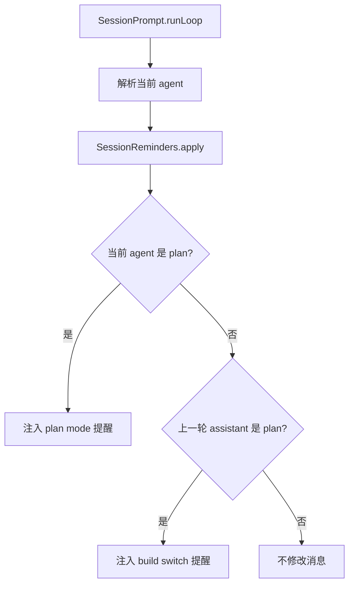
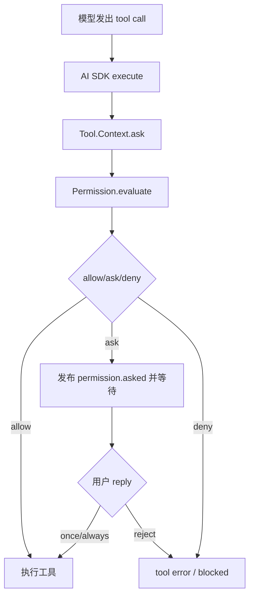
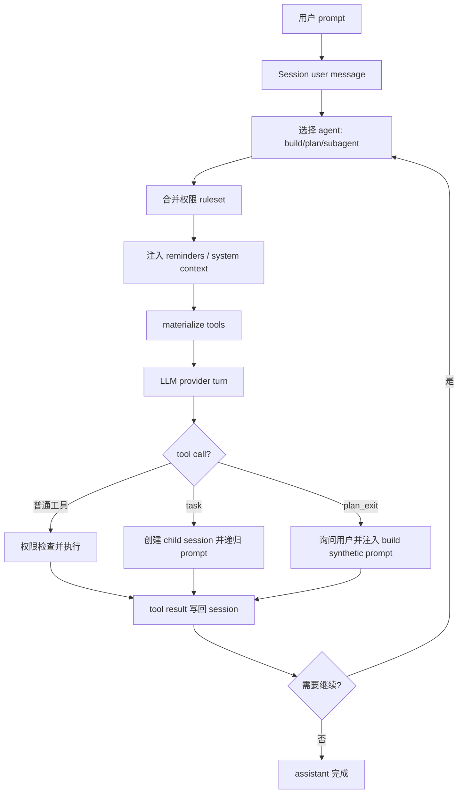

# opencode 工具、Plan 模式与 Subagent 机制

本文承接 [`opencode-agent-core-report.md`](./opencode-agent-core-report.md)，专门分析 opencode 作为 AI coding agent 的“行动能力”：agent 模式、plan/coding 切换、工具注册与权限、子代理递归执行。分析范围仍限定在核心 coding agent 主干，不展开配置、企业版和 TUI。

## 核心结论

opencode 的 plan、coding、subagent 并不是三套独立执行引擎。它们共享同一个 session loop，差别主要来自：

- agent 配置：system prompt、mode、model/options、step limit。
- permission ruleset：哪些工具可用、哪些要问、哪些被拒绝。
- synthetic reminder：在特定状态下往用户消息里注入系统提醒。
- tool 实现：特别是 `plan_exit` 和 `task` 这两个会改变控制流的工具。

因此可以把 opencode 的 coding agent 理解成：

> 同一个 LLM/tool continuation loop，在不同 agent profile 和权限边界下运行。

## Agent：模式首先是权限边界

旧版公开路径的 agent 定义在 [`packages/opencode/src/agent/agent.ts`](./opencode/packages/opencode/src/agent/agent.ts)。核心内置 agent 包括：

- `build`：默认主 agent。允许 `question`，允许进入 plan，工具能力按默认权限和用户配置合并。
- `plan`：主 agent。描述为 plan mode，禁止普通 edit/write，但允许写 plan 文件位置。
- `general`：subagent。面向复杂研究和多步骤任务，但默认禁用 `todowrite`。
- `explore`：subagent。面向代码库探索，默认只允许 grep/glob/list/bash/webfetch/websearch/read 等读/搜索能力，并禁止大多数写操作。
- `compaction`、`title`、`summary`：隐藏 agent，用于维护任务，不是用户主要工作模式。

`plan` agent 的关键不是特殊 runner，而是权限：

- `edit: "*": "deny"`。
- 允许编辑 `.opencode/plans/*.md`。
- 允许编辑全局 data plans 下的 plan 文件相对路径。
- 允许 `plan_exit`。
- 拒绝 `task.general`。

这使 plan 模式可以“产出计划文件”，但不能直接改业务代码。进入 build 后，才使用默认 coding 权限执行计划。

V2 中 agent 结构被抽象到 [`packages/core/src/agent.ts`](./opencode/packages/core/src/agent.ts)，字段包括 `id`、`model`、`request`、`system`、`mode`、`steps`、`permissions`。这说明迁移目标也是把 agent 视为一组 model request 和 permission rules，而不是独立执行器。

## Plan 模式如何进入和退出

plan/coding 切换主要由两个文件完成：

- [`SessionReminders.apply`](./opencode/packages/opencode/src/session/reminders.ts)
- [`PlanExitTool`](./opencode/packages/opencode/src/tool/plan.ts)

`SessionReminders.apply` 在主循环每轮发送 provider request 前运行。它会根据当前 agent 和历史 assistant agent 注入 synthetic text：



在非 experimental plan mode 下，进入 `plan` 时注入 [`prompt/plan.txt`](./opencode/packages/opencode/src/session/prompt/plan.txt)，从 `plan` 回到 `build` 时注入 [`prompt/build-switch.txt`](./opencode/packages/opencode/src/session/prompt/build-switch.txt)。

在 experimental plan mode 下，它会定位 session 的 plan file：

- 如果刚进入 plan，会提示“没有计划文件则创建，有则增量编辑”。
- 如果从 plan 切到 build，会提示 build agent 按计划文件执行。

`plan_exit` 工具则是显式的退出门。模型调用 [`plan_exit`](./opencode/packages/opencode/src/tool/plan.ts) 后，opencode 会询问用户是否切到 build agent。用户同意后，它创建一条 synthetic user message：

```ts
agent: "build",
text: `The plan at ${plan} has been approved, you can now edit files. Execute the plan`
```

这个 synthetic user message 会被同一个 `SessionPrompt` loop 继续消费，于是控制流自然从 plan agent 转到 build agent。这里没有新引擎，只有新 user message、agent 字段和权限集合。

## Plan 的产物究竟是什么？

这里要区分“plan agent”这个基础模式和 `OPENCODE_EXPERIMENTAL_PLAN_MODE` 打开的增强模式。

### 非 experimental plan：主要是 transcript 里的计划

默认 `plan` agent 本身只是一个 primary agent profile：权限上禁止业务代码 edit/write，prompt 上要求只读分析和形成计划。非 experimental plan mode 下，`SessionReminders.apply` 只会注入 [`prompt/plan.txt`](./opencode/packages/opencode/src/session/prompt/plan.txt) 这样的 read-only reminder；它没有要求模型必须写一个计划文件，也没有注册 `plan_exit` 工具。

因此在这条路径里，plan 的产物主要是 assistant 在 session transcript 中输出的自然语言计划。用户可以手动切回 `build`，系统会注入 [`build-switch.txt`](./opencode/packages/opencode/src/session/prompt/build-switch.txt)，提醒 agent 已从 plan 切到 build、可以修改文件。

### Experimental plan：产物是一个 Markdown 计划文件

开启 `OPENCODE_EXPERIMENTAL_PLAN_MODE=true` 后，plan 模式会变得更明确：计划产物是一个文件。

路径由 [`Session.plan(...)`](./opencode/packages/opencode/src/session/session.ts) 生成：

```text
如果项目有 VCS:
  ${worktree}/.opencode/plans/${session.time.created}-${session.slug}.md

否则:
  ${Global.Path.data}/plans/${session.time.created}-${session.slug}.md
```

这不是数据库里的独立 plan record，也不是结构化 JSON。它只是一个由 session `created` 时间和 `slug` 决定路径的 Markdown 文件。

`plan` agent 的权限也围绕这个文件设计：

- 普通 `edit: "*"` 被 deny。
- `.opencode/plans/*.md` 被 allow。
- 全局 data plans 下对应相对路径被 allow。

测试 [`agent.test.ts`](./opencode/packages/opencode/test/agent/agent.test.ts) 覆盖了“plan agent denies edits except `.opencode/plans/*`”这个语义。

### 内容格式是软约定，不是结构化 schema

[`plan-mode.txt`](./opencode/packages/opencode/src/session/prompt/plan-mode.txt) 对计划文件内容有 prompt-level 要求：

- 只写最终推荐方案，不堆所有备选。
- 足够简洁可扫描，但细节足够执行。
- 包含关键修改文件路径。
- 包含 verification section，说明如何端到端验证。

但代码里没有看到计划文件内容的 parser、schema、validator 或 domain model。`plan_exit` 工具的参数 schema 是空对象 `{}`；它不会读取计划文件，也不会检查计划文件是否符合某个机器可读格式。

所以更准确地说：

```text
plan artifact = Markdown file path + prompt-defined content convention
not = typed Plan object / checked checklist / executable workflow spec
```

## Build 阶段如何“按 plan”执行？

opencode 对“按 plan 执行”的保障主要分成硬边界和软约束。

### 硬边界：切换、权限和用户确认

在 experimental plan mode 下，`plan_exit` 是从 plan 到 build 的主要门：

1. `plan_exit` 先计算 plan 文件相对路径。
2. 通过 `Question.Service` 问用户是否切换到 build agent 并开始执行。
3. 用户选 “No” 时抛出 `Question.RejectedError`，不会创建 build user message。
4. 用户选 “Yes” 后，系统写入一条 synthetic user message：

```text
The plan at ${plan} has been approved, you can now edit files. Execute the plan
```

这条 user message 的 `agent` 字段是 `build`，因此后续 loop 使用 build agent 的权限集合。build agent 不再受 plan agent 的 edit deny 约束，可以真正修改业务代码。

此外，如果用户或系统从 plan assistant 之后切到 build，`SessionReminders.apply` 也会注入 build-switch reminder。experimental plan mode 下如果计划文件存在，额外提醒：

```text
A plan file exists at ${plan}. You should execute on the plan defined within it
```

这些是当前代码里能看到的“执行计划”硬入口：用户确认、agent 切换、权限切换、synthetic prompt。

### 软约束：build 需要自己遵循提示并读取计划

build 阶段并没有一个 runtime runner 去解析 Markdown plan 并逐条执行。具体来说，当前代码没有看到：

- 自动把 plan 文件内容 attach 到 build prompt。
- 自动读取 plan 文件并塞进 provider context。
- 根据 plan 中的文件列表限制 edit/write 范围。
- 检查每次 edit 是否对应 plan 条目。
- 维护 plan item 的 completed/in_progress 状态。
- 在任务结束前校验所有 plan 项都完成。

`plan_exit` 只把计划文件路径写进 synthetic message；`SessionReminders.apply` 也只是提示“plan file exists”。因此 build agent 如果要知道计划内容，仍需要自己用 read 工具读取那个 Markdown 文件。

换句话说，build 的“按 plan 执行”不是一个强制执行器，而是：

```text
approved plan file path
  + build-switch reminder
  + build agent prompt compliance
  + normal tool/permission system
  + user/assistant review and verification
```

这解释了一个重要边界：opencode 的 plan 文件是可审计、可恢复、可被用户阅读的计划锚点，但它还不是一个机器解释的 workflow spec。真正的执行顺序、是否偏离计划、是否需要回读 plan，仍由 build agent 在普通 session loop 中根据 prompt 和上下文判断。

## FAQ

### 1. plan/build 是同一个 agent 的不同执行模式吗？

语义上可以粗略理解为“同一个 coding session 的不同执行模式”，但代码上不是同一个 `Agent.Info` 对象切状态。

`build` 和 `plan` 是两个不同的 primary agent profile，二者共享同一套 `SessionPrompt` runtime loop。每轮 loop 会根据最新 user message 的 `agent` 字段调用 `agents.get(lastUser.agent)`，然后用对应 agent 的 prompt、权限、工具可见性和 step policy 继续执行。

因此更准确的说法是：

```text
same session + same SessionPrompt loop
different primary agent profile: build / plan
```

### 2. plan 到 build 的“切换”是不是靠中途插入 system reminder？

不完全是。真正让下一轮使用 build agent 的，是 `plan_exit` 插入的 synthetic user message：

```text
agent: "build"
text: "The plan at ... has been approved, you can now edit files. Execute the plan"
```

这条 message 改变了后续 loop 解析到的 `lastUser.agent`，因此下一轮会以 build agent profile 运行。

`SessionReminders.apply` 的作用是补充上下文提醒：

- plan agent 当前运行时，注入 plan-mode reminder。
- 从 plan assistant 切到 build 时，注入 build-switch reminder。
- experimental plan mode 下，如果 plan 文件存在，还会提醒 build agent 按该 plan 文件执行。

所以切换由 “synthetic user message 的 agent 字段” 驱动，reminder 是提示词层的模式说明和约束补强。

### 3. 如果没有 compaction，最开头的 system context 会因为 plan/build 切换而变化吗？

对内置 `build`/`plan` 来说，通常不会变成另一份专门的 plan/build system prompt。

每轮 provider request 都会重新组装 system prompt。组装逻辑是：如果当前 agent 有 `agent.prompt`，优先使用它；否则使用按 provider/model 选择的默认 prompt，再拼接环境、指令、skills 等 system 内容。当前内置 `build`/`plan` 没有各自专属 `agent.prompt`，所以基础 provider system prompt 通常相同。

变化主要发生在这些地方：

- 当前 agent profile 变了，权限和可见工具集合会变。
- `SessionReminders.apply` 插入的 `<system-reminder>` 作为消息历史进入 model messages。
- 如果发生 compaction，旧的 plan reminder、plan 讨论和 plan 文件路径可能被摘要化，不一定逐字保留。
- 如果用户配置了自定义 agent prompt，那么切换 agent 时 system prompt 开头可能真的不同。

所以“没有 compaction 时，最开头的基础 system prompt 不因内置 plan/build 切换而显著变化”基本成立；但模型输入整体仍会因为 synthetic reminder、agent profile、tools 和 permissions 改变。

## 当前工具系统：从 registry 到 AI SDK tools

旧版工具 registry 位于 [`packages/opencode/src/tool/registry.ts`](./opencode/packages/opencode/src/tool/registry.ts)。内置工具包括：

- `shell`
- `read`
- `glob`
- `grep`
- `edit`
- `write`
- `task`
- `fetch`
- `todo`
- `search`
- `skill`
- `patch`
- `question`
- 可选 `lsp`
- experimental plan mode 下的 `plan`

registry 会按 provider/model 做一些过滤。例如部分 GPT 模型使用 `apply_patch`，而不是 `edit/write`；web search 是否可用也受 provider 和 feature flag 影响。`task` 工具的描述还会动态拼接“当前 agent 可调用哪些 subagent”。

进入一次 provider turn 前，[`SessionTools.resolve`](./opencode/packages/opencode/src/session/tools.ts) 会把这些 tool 包装成 AI SDK `tool`：

1. 构造 `Tool.Context`，包含 `sessionID`、`messageID`、`callID`、当前 agent、历史 messages、abort signal。
2. 暴露 `ctx.metadata`，让工具更新当前 tool part 的标题、metadata、运行状态。
3. 暴露 `ctx.ask`，把权限询问绑定到当前 session 和 tool call。
4. 执行前触发 `tool.execute.before` plugin hook。
5. 调用 tool 自身的 `execute`。
6. 执行后触发 `tool.execute.after` hook。
7. 规范化 attachments，并返回给 AI SDK。

MCP tools 也在同一个 `SessionTools.resolve` 中接入，只是执行前会默认通过 `ctx.ask` 询问对应 MCP tool 权限，并把 MCP content 转成 opencode tool output。

## 权限系统：allow/ask/deny 的最后匹配

旧版权限实现在 [`packages/opencode/src/permission/index.ts`](./opencode/packages/opencode/src/permission/index.ts)。核心函数是 `evaluate(permission, pattern, ...rulesets)`：

- 多个 ruleset flatten。
- 使用 wildcard 匹配 permission 和 pattern。
- 取最后一个匹配规则。
- 默认行为是 `ask`。

`Permission.ask` 会先逐个 pattern 判断：

- 命中 `deny`：立即失败。
- 全部 `allow`：直接返回。
- 存在 `ask`：发布 `permission.asked` event，并等待用户 reply。

用户 reply 为：

- `reject`：拒绝当前请求，并拒绝同 session 下其他 pending 请求。
- `once`：只放行这一次。
- `always`：把 `always` patterns 写入内存 approved rules，后续同类请求自动 allow。

工具实际执行时，权限路径通常是：



此外，[`LLMRequestPrep.resolveTools`](./opencode/packages/opencode/src/session/llm/request.ts) 会在请求发送前过滤被完全禁用的工具。如果某个工具在合并后的 permission ruleset 中对 `*` 是 `deny`，它不会出现在本轮 model request 的 active tools 中。

## Tool part 生命周期

模型发出 tool call 后，processor 在 [`SessionProcessor.handleEvent`](./opencode/packages/opencode/src/session/processor.ts) 中维护 tool part 状态：

- `tool-input-start`：创建 pending tool part。
- `tool-input-delta`：累积模型流式输出的参数文本。
- `tool-input-end`：标记参数输入结束。
- `tool-call`：把 tool part 切到 running，并记录结构化 input。
- `tool-result`：写入 completed output、metadata、attachments。
- `tool-error`：写入 error 状态。

`ensureToolCall` 会保证同一个 call id 只创建一个 tool part；如果 provider 声称自己执行了工具，会用 `metadata.providerExecuted` 标记。processor 还会把这些状态双写到 V2 session events，例如 `SessionEvent.Tool.Called`、`Tool.Success`、`Tool.Failed`。

这套状态机使工具调用既能被 UI/SDK 实时观察，也能在下一轮 model messages 中被序列化回模型。

## Subagent：task 工具递归启动 child session

[`task` 工具](./opencode/packages/opencode/src/tool/task.ts) 是 opencode 多代理能力的核心。它不是开一个完全不同的运行时，而是创建或复用一个 child session，然后通过 `promptOps.prompt` 递归调用同一套 `SessionPrompt` loop。

执行流程：

1. 如果没有 `bypassAgentCheck`，先对 `task` + `subagent_type` 做权限询问。
2. 根据 `subagent_type` 找到目标 agent。
3. 如果传了 `task_id`，尝试恢复已有 child session；否则创建新 child session。
4. 通过 [`deriveSubagentSessionPermission`](./opencode/packages/opencode/src/agent/subagent-permissions.ts) 继承 parent session 的 deny 和 `external_directory` 规则。
5. 若 subagent 自身没有显式允许，默认给 child session 加上 `todowrite` 和 `task` deny，避免无限嵌套和子代理污染主 todo。
6. 把当前 assistant message 的 model/provider/variant 传给子任务，除非 subagent 自己指定 model。
7. 调用 `ops.prompt({ sessionID: childSession.id, agent: next.name, parts })`。
8. 把 child session 最后一段 text 包装成 `<task>` 结果返回给父 agent。

foreground subagent 会等待 child session 完成，把结果作为当前 tool output 返回；background subagent 则把任务放入 [`BackgroundJob`](./opencode/packages/opencode/src/background/job.ts)，立即返回 running 结果，并在完成后向 parent session 注入一条 synthetic prompt。

因此 `task` 的本质是：

> 用 tool call 作为父 session 和子 session 的桥，把子 session 的最终文本再作为父 session 的 tool result。

这让主 agent 可以并行或递归地委派探索任务，同时仍然通过 session/tool result 的普通 continuation 机制把结果纳入上下文。

## V2 工具系统的目标形态

V2 core 下的工具定义在 [`packages/core/src/tool`](./opencode/packages/core/src/tool)。重点文件：

- [`tool.ts`](./opencode/packages/core/src/tool/tool.ts)：定义 typed tool、input/output schema、`ToolDefinition`、`settle`。
- [`registry.ts`](./opencode/packages/core/src/tool/registry.ts)：注册 local/application tools，按 permission materialize definitions，执行 settle。
- [`builtins.ts`](./opencode/packages/core/src/tool/builtins.ts)：组合 V2 已迁移的 built-in tools。

V2 runner 不再依赖 AI SDK 直接执行本地工具，而是在 [`SessionRunner.runTurn`](./opencode/packages/core/src/session/runner/llm.ts) 中看到 `tool-call` 后：

1. 先通过 event publisher durable 记录 tool call。
2. 调用 `toolMaterialization.settle` 执行本地工具。
3. 把 settlement 转成 `LLMEvent.toolResult`。
4. 继续下一轮 provider turn。

这条路径更像一个可恢复的 agent runtime：工具调用和工具结果都先成为 session event，再推动 continuation。当前 V2 builtins 还在迁移中，`builtins.ts` 注释里明确列出 `task`、`plan_exit`、LSP 等尚未完全 port 的工具，因此理解现有产品行为仍应以旧版 `packages/opencode/src` 为准。

## Plan、Coding、Subagent 的统一模型

把上面的模块放在一起，可以得到 opencode 核心 agent 工作模型：



主干不是某个单一函数，而是这些系统的组合：

- `Agent` 定义“我是谁、能做什么”。
- `SessionPrompt` 维持“我是否继续工作”。
- `SessionTools` 和 `ToolRegistry` 提供“我能调用什么”。
- `Permission` 决定“我是否真的可以调用”。
- `SessionProcessor` 把“模型和工具发生了什么”写回 session。
- `task` 和 `plan_exit` 通过 synthetic message 改变后续 loop 的 agent 和上下文。

这也是 opencode 作为 coding agent 的核心：它把 LLM 推理、工具副作用、用户授权、计划文件和子任务全部收束到 session continuation loop 里。
