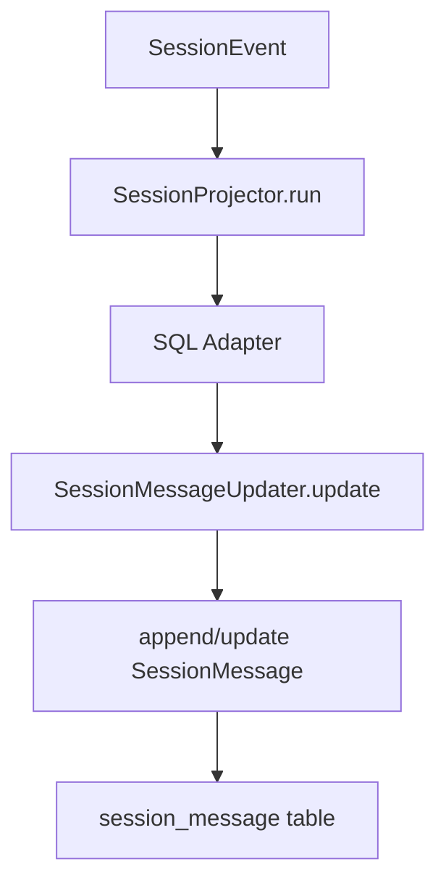
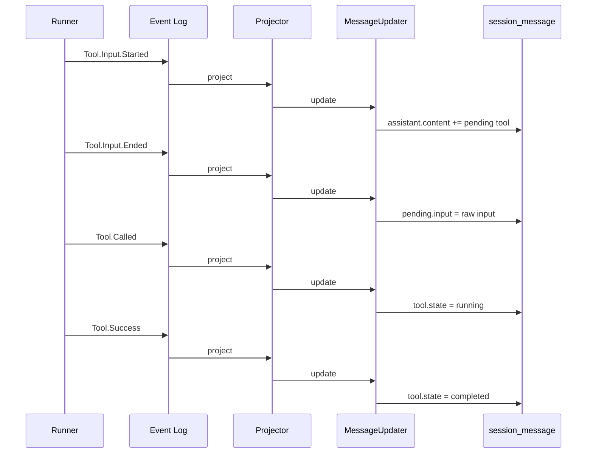
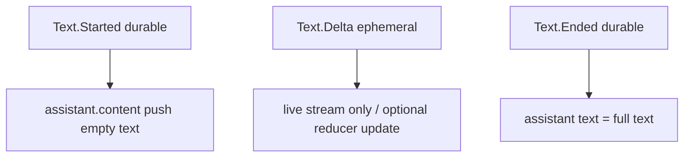

# opencode V2 事件、投影与读模型深挖

本文深挖 V2 的事件系统、projection 和 read model：V2 如何把 agent runtime 中发生的事实，转换成可查询、可展示、可继续喂给模型的 session history。

核心文件：

- [`packages/core/src/session/event.ts`](./opencode/packages/core/src/session/event.ts)
- [`packages/core/src/session/message.ts`](./opencode/packages/core/src/session/message.ts)
- [`packages/core/src/session/message-updater.ts`](./opencode/packages/core/src/session/message-updater.ts)
- [`packages/core/src/session/projector.ts`](./opencode/packages/core/src/session/projector.ts)
- [`packages/core/src/session/store.ts`](./opencode/packages/core/src/session/store.ts)
- [`packages/core/src/session/history.ts`](./opencode/packages/core/src/session/history.ts)
- [`packages/core/src/session/sql.ts`](./opencode/packages/core/src/session/sql.ts)

## 这一层解决什么问题

Agent runtime 中的“事实”和“读模型”不是一回事。

事实是：

- prompt admitted
- tool called
- text ended
- step failed
- compaction ended

读模型是：

- 当前 session 列表怎么显示？
- 一条 assistant message 的 content 是什么？
- runner 下一轮要看到哪些历史？
- API 获取 messages 时返回什么？

V1 更接近“直接写读模型”。V2 则明确引入：

```text
domain event -> projector/reducer -> read model
```

## SessionEvent：V2 的事实词汇表

[`event.ts`](./opencode/packages/core/src/session/event.ts) 定义了 V2 session runtime 的事件 vocabulary。

主要事件分组：

- control：`AgentSwitched`、`ModelSwitched`、`Moved`、`InterruptRequested`
- prompt：`Prompted`、`PromptLifecycle.Admitted`、`PromptLifecycle.Promoted`
- context：`ContextUpdated`、`Synthetic`
- shell：`Shell.Started`、`Shell.Ended`
- step：`Step.Started`、`Step.Ended`、`Step.Failed`
- text：`Text.Started`、`Text.Delta`、`Text.Ended`
- reasoning：`Reasoning.Started`、`Reasoning.Delta`、`Reasoning.Ended`
- tool：`Tool.Input.Started`、`Tool.Input.Delta`、`Tool.Input.Ended`、`Tool.Called`、`Tool.Progress`、`Tool.Success`、`Tool.Failed`
- retry：`Retried`
- compaction：`Compaction.Started`、`Compaction.Delta`、`Compaction.Ended`

这套事件把一次 LLM turn 和工具生命周期拆成了明确阶段。

## durable 与 ephemeral

V2 明确区分 durable event 和 ephemeral event。

durable 包括：

- prompt admitted/promoted
- step started/ended/failed
- text started/ended
- reasoning started/ended
- tool input started/ended
- tool called/progress/success/failed
- compaction started/ended

ephemeral 包括：

- text delta
- reasoning delta
- tool input delta
- compaction delta

源码注释写得很直接：stream fragments 是 live-only；Ended 才是 replayable full-value boundary。

这个选择很重要。它避免 event log 被每一个 token/delta 撑爆，同时保留实时 UI 所需的 delta 事件。恢复或重放时，系统依赖 durable ended event，而不是重放每个 delta。

## SessionMessage：投影后的 canonical message

[`message.ts`](./opencode/packages/core/src/session/message.ts) 定义 V2 read model 中的 message：

- `agent-switched`
- `model-switched`
- `user`
- `synthetic`
- `system`
- `shell`
- `assistant`
- `compaction`

assistant content 进一步拆成：

- `text`
- `reasoning`
- `tool`

和 V1 的 message parts 相比，V2 message 更像 canonical history。step lifecycle、tool input streaming、progress 等都不直接暴露为 message 类型，而是通过 event reducer 转成 assistant content 或 metadata。

## MessageUpdater：事件到 message 的 reducer

[`message-updater.ts`](./opencode/packages/core/src/session/message-updater.ts) 是理解 projection 的关键。

它的输入是：

- 一个 adapter：可读取/更新当前 assistant、shell，可 append message。
- 一个 `SessionEvent.Event`。

它根据 event 类型执行 reducer：

- `session.next.prompted` -> append `SessionMessage.User`
- `session.next.context.updated` -> append `SessionMessage.System`
- `session.next.synthetic` -> append `SessionMessage.Synthetic`
- `session.next.step.started` -> 结束上一个未完成 assistant，并 append 新 assistant
- `session.next.text.started` -> assistant.content push text
- `session.next.text.ended` -> 更新 text 完整内容
- `session.next.tool.input.started` -> assistant.content push pending tool
- `session.next.tool.input.ended` -> 写 pending raw input
- `session.next.tool.called` -> tool 变 running
- `session.next.tool.progress` -> 更新 running tool 的 structured/content
- `session.next.tool.success` -> tool 变 completed
- `session.next.tool.failed` -> tool 变 error
- `session.next.compaction.ended` -> append compaction message

它本质上是一个 event-sourced reducer，只是 adapter 可以是 memory，也可以是 SQL-backed projector。

## Projector：把 event 写入 SQL projection

[`projector.ts`](./opencode/packages/core/src/session/projector.ts) 连接 EventV2 和数据库表。

它同时处理两类事件：

1. V1 compatibility events：`SessionV1.Event.Created/Updated/MessageUpdated/PartUpdated`
2. V2 session events：`SessionEvent.*`

对 V2 events，projector 通常调用 `run(db, event)`，而 `run` 内部创建 SQL-backed `SessionMessageUpdater.Adapter`，让 `MessageUpdater` 折叠事件并更新 `session_message` 表。



这让事件处理逻辑复用：同一个 reducer 可以用于内存测试，也可以用于数据库 projection。

## SQL 表：V1/V2 双轨

[`sql.ts`](./opencode/packages/core/src/session/sql.ts) 中目前同时存在 V1 和 V2 表。

V1 读模型：

- `message`
- `part`

V2 读模型：

- `session_message`
- `session_input`
- `session_context_epoch`

共享 session summary 表：

- `session`

`session_message` 的重要字段：

- `id`
- `session_id`
- `type`
- `seq`
- timestamps
- `data`

`seq` 是 event aggregate sequence。它让 history 可以按事件顺序稳定重放，不依赖时间戳排序。

## FAQ：EventV2 发布与 SQLite 存储

### Q1：Event 的发布方式是怎样的？

`EventV2.Service.publish` 是统一入口。调用方传入 event definition、data 和可选 publish options，service 会构造 `Payload`，并根据事件 definition 是否包含 `sync` 决定走 durable 路径还是 live-only 路径。

带 `sync` 的事件是 durable event，会进入 SQLite event log；不带 `sync` 的事件是 ephemeral/live event，只通过进程内通知分发。

durable event 的发布路径可以概括为：

```text
events.publish(...)
  -> 构造 Payload
  -> commitSyncEvent
     -> 进入 SQLite immediate transaction
     -> 读取 event_sequence，确定 aggregate 当前 seq
     -> 分配 seq = latest + 1
     -> 执行 beforeCommit guards
     -> 执行 projectors
     -> 执行可选 local commit hook
     -> upsert event_sequence
     -> insert event
  -> 通知 aggregateEvents stream
  -> 执行 sync handlers
  -> 执行 listeners
  -> publish 到 typed/all PubSub
```

这里最重要的点是：durable event 的 projector 在同一个 SQLite transaction 里执行。也就是说，event log 和 read model projection 是一起提交的。

### Q2：opencode 里是否存在“事件总线”这一概念？

存在，但不能把它理解成 Kafka、NATS 那类外部异步 broker。

`EventV2` 更像三种能力的组合：

```text
event store + synchronous projector registry + in-process live bus
```

它有进程内 PubSub：

- `subscribe(definition)`：订阅某类 live event。
- `all()`：订阅所有 live event。
- `listen(listener)`：注册 listener callback。
- `aggregateEvents({ aggregateID, after })`：读取某个 aggregate 的 durable event stream，并跟随后续更新。
- `sync(handler)`：durable event 提交后的同步观察者。

其中真正的 durable truth 是 SQLite 的 `event` 表。PubSub 主要用于 live notification 和 stream wakeup。

### Q3：Event 发布是同步还是异步的？

如果调用方 `yield* events.publish(...)`，那么发布流程本身是同步等待的。

对 durable event 来说，`publish` 会等待：

- commit guards 完成；
- projectors 完成；
- event log 写入完成；
- aggregate stream wake signal enqueue；
- sync handlers 完成；
- listeners 完成；
- typed/all PubSub publish 完成。

但它不会等待 `subscribe()` 或 `all()` 的 stream 消费者处理完事件。PubSub publish 只是把事件放进内存队列，后续 consumer 如何消费不在 `publish` 的等待范围里。

所以可以分成三类：

```text
projector      -> 同步、事务内、publish 必须等待
listen/sync    -> 同步等待；durable event 下错误被 observe 包裹并记录
subscribe/all  -> 只等待 PubSub publish，不等待消费者处理
```

这也是为什么 V2 projection 不属于“异步最终一致”。对 session 读模型来说，它更偏强一致：事件提交成功时，相关 SQL projection 也已经完成。

### Q4：listener 或 sync handler 失败会影响发布吗？

对 durable event 来说，`sync` handler 和 `listen` listener 通过 `observe` 包裹。非 interrupt 失败会被记录日志，不会让 `publish` 失败。

projector 不一样。projector 是 transaction 内提交路径的一部分。如果 projector 失败，durable event commit 会失败，event log 和 read model 都不会提交。

这反映了两类扩展点的差异：

```text
projector = 写模型一致性的一部分
listener/sync handler = 事件提交后的观察者
```

### Q5：`aggregateEvents` 是普通 PubSub 推送吗？

不是单纯的内存推送。

`aggregateEvents` 会先读取 SQLite 中某个 aggregate 在 cursor 之后的历史事件，然后订阅一个 per-aggregate wake PubSub。后续有新 durable event 提交时，PubSub 只发一个 wake signal；stream 收到 signal 后再从 SQLite 按 cursor 读取新增事件。

这个设计很稳：即使 wake signal 合并或消费者稍慢，真正的事件仍然在 SQLite 中，可以按 cursor 补齐。

### Q6：SQLite 中 event store 的核心表是什么？

核心表定义在 [`event/sql.ts`](./opencode/packages/core/src/event/sql.ts)。

`event_sequence` 是每个 aggregate 的游标表：

```text
aggregate_id primary key
seq
owner_id
```

`event` 是 durable event log：

```text
id primary key
aggregate_id
seq
type
data json
```

重要索引：

```text
unique(aggregate_id, seq)
index(aggregate_id, type, seq)
```

这里没有全局 event seq。事件顺序是 per aggregate 的。对 session runtime 来说，通常 aggregate 就是 `sessionID`，所以一个 session 有一条自己的 ordered event stream。

### Q7：`event_sequence.owner_id` 有什么作用？

`owner_id` 用于 replay/claim 这类所有权场景。`commitSyncEvent` 在 replay 时可以检查当前 aggregate 是否已经被其他 owner claim；如果 `strictOwner` 开启且 owner 不匹配，会拒绝 replay。

这看起来是在为未来的 durable multi-node ownership 或跨进程同步铺路。目前本地执行仍以 local coordinator 为主，但 event store 已经有 owner 字段来表达“谁拥有这条 aggregate stream 的推进权”。

### Q8：`event.type` 为什么要存 versioned type？

同步事件可能演进 schema，所以 EventV2 把 durable event type 编码成：

```text
${event.type}.${sync.version}
```

写入时通过 sync schema encode `data`，读取/replay 时再通过 `syncRegistry` decode。这样不同版本的 event 可以在持久层区分，而业务侧仍通过当前 definition 处理语义类型。

### Q9：session 相关的 SQLite 表如何分层？

session 相关表可以分成几层：

```text
event/event_sequence        -> durable fact log
session_message             -> V2 canonical history read model
session_input               -> prompt inbox / input lifecycle
session_context_epoch       -> system context baseline/snapshot
session                     -> session summary / listing state
message/part                -> V1 compatibility read model
```

这说明 V2 没有把所有东西都塞进一张 message 表，而是把事实、输入生命周期、上下文 epoch、最终 history 分开存储。

### Q10：`session_message` 有什么值得关注的？

`session_message` 是 V2 的 canonical history 表。它不是 event log，而是 projector/reducer 折叠事件后的读模型。

重要字段：

```text
id primary key
session_id
type
seq
time_created
time_updated
data json
```

`seq` 对应创建或投影该 message 的 aggregate event sequence。它让 runner/API 可以按事件顺序稳定读取历史，而不是依赖时间戳。

重要索引：

```text
unique(session_id, seq)
index(session_id, type, seq)
index(session_id, time_created, id)
```

这些索引分别服务于按 session 顺序读取、按 type 查找、以及 UI/API 分页。

### Q11：`session_input` 有什么值得关注的？

`session_input` 是 V2 prompt 生命周期的核心表。它记录 prompt 从 admitted 到 promoted 的状态：

```text
id primary key
session_id
prompt json
delivery
admitted_seq
promoted_seq nullable
time_created
```

它让系统能区分：

- 用户输入已经 durable 接收；
- 输入尚未进入 LLM history；
- 输入已经 promoted 成 user message；
- 输入是 `steer` 还是 `queue`。

关键索引：

```text
index(session_id, promoted_seq, delivery, admitted_seq)
unique(session_id, admitted_seq)
unique(session_id, promoted_seq)
```

第一个索引用于快速查询 pending steer/queue；后两个索引保证 input lifecycle 与 event sequence 一一对应。

### Q12：`session_context_epoch` 为什么单独成表？

`session_context_epoch` 存的是 system context 的 baseline 与 snapshot：

```text
session_id primary key
baseline
agent
snapshot json
baseline_seq
replacement_seq
revision
```

runner 读取 history 时会结合 `baseline_seq` 过滤 system messages。agent/model/context 变化、compaction 结束等事件会触发 context epoch replacement。这个表让“当前系统上下文基线”从普通 message history 中分离出来，避免每轮都重新从零组装所有 system context。

### Q13：这套 SQLite 设计最值得关注的是什么？

第一，event log 与 projection 强一致。V2 没有把 projection 放到后台异步追赶，而是让 projector 成为 durable event commit 的一部分。

第二，事件顺序是 aggregate-local，不是全局顺序。这非常适合 session runtime：一个 session 只需要自己的严格顺序。

第三，delta 与 ended 分层。流式 delta 可以 live-only，`Ended` 事件保存完整值，避免 event log 被 token 级碎片撑爆。

第四，`aggregateEvents` 用 PubSub 做 wake，用 SQLite 做补齐。这比纯内存 stream 更可恢复。

第五，`session_input` 与 `session_message` 分离。前者表达“用户输入是否被 runtime 消费”，后者表达“被消费后形成了什么 history”。这正是 V2 支撑长任务 agent 的关键结构。

## SessionStore：读模型查询接口

[`store.ts`](./opencode/packages/core/src/session/store.ts) 提供 V2 runner/API 使用的读取接口：

- `get(sessionID)`
- `context(sessionID)`
- `runnerContext(sessionID, baselineSeq)`
- `message(messageID)`

`context` 和 `runnerContext` 都走 [`SessionHistory`](./opencode/packages/core/src/session/history.ts)。

## SessionHistory：compaction 和 baseline 过滤

[`history.ts`](./opencode/packages/core/src/session/history.ts) 负责从 `session_message` 加载历史。

它会考虑：

- 最新 compaction
- context epoch baselineSeq
- system message 是否在 baseline 之后

runner 使用 `entriesForRunner(db, session.id, system.baselineSeq)`。这意味着 runner 看到的不是全量消息，而是：

- compaction 后的有效历史
- 当前 context baseline 之后的消息

这正是 V2 read model 的目的：不是把所有事实都喂给模型，而是生成当前 turn 所需的最小、正确上下文。

## Event -> Projection 的例子：tool call



V1 会更倾向于直接 update 一个 `ToolPart`。V2 则记录 tool 生命周期的每个语义边界，再由 reducer 生成最终 tool content。

## Event -> Projection 的例子：assistant text

text delta 是 ephemeral，text ended 是 durable。



这种设计避免恢复时依赖大量 delta。恢复只要有 `Text.Ended` 的 full text 就够了。

## Event -> Projection 的例子：compaction

compaction 事件包括：

- `Compaction.Started`
- `Compaction.Delta`
- `Compaction.Ended`

投影时，真正进入 `SessionMessage.Compaction` 的是 ended event，包含：

- `messageID`
- `reason`
- `summary`
- `recent`

随后 `SessionProjector` 会触发 `SessionContextEpoch.requestReplacement`，让 runner 后续使用新的 context baseline。

## 设计哲学

### 1. 事实优先，视图次之

V2 不把 message 当作唯一真相。message 是事件投影出来的读模型。真正的语义真相在 event log。

### 2. 事件按语义边界持久化

V2 不持久化每一个流式碎片，而是持久化生命周期边界：

- started
- ended
- called
- success
- failed

这让事件日志足够细，但不过度细。

### 3. Projection 是可替换的

同一份事件可以投影成：

- API message list
- runner history
- live UI stream
- audit log
- future recovery state

当前只实现了一部分，但架构上已经把 event 和 read model 分开了。

### 4. V1 compatibility 是迁移策略，不是最终形态

`projector.ts` 同时处理 V1/V2 event，`sql.ts` 同时保留 V1/V2 表。这不是混乱，而是渐进迁移：旧路径继续工作，新路径积累 durable runtime 能力。

## 当前限制

V2 event/projection 已经有核心骨架，但仍有未完成点：

- `Retried` 在 projector 中暂未启用。
- patch/snapshot/retry 等 V1 part parity 仍在 runner TODO。
- 一些 delta 是 live-only，具体 live event 消费链路还需要结合 API/UI 层继续研究。
- session status 如 busy/retrying/idle 仍未完整 durable 化。

## 小结

V2 事件与投影层的关键价值，是把 opencode 的 agent 工作过程从“更新一段 transcript”提升为“记录一串领域事实”。

这为之后的恢复、审计、多 worker、重新投影、可靠 tool settlement 打下基础。
