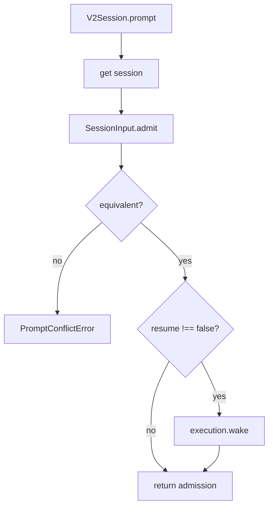
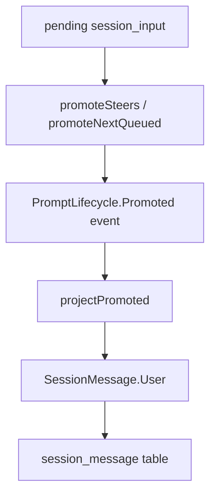
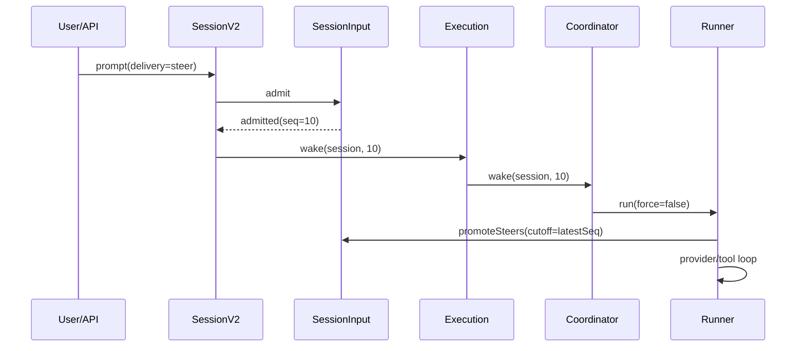
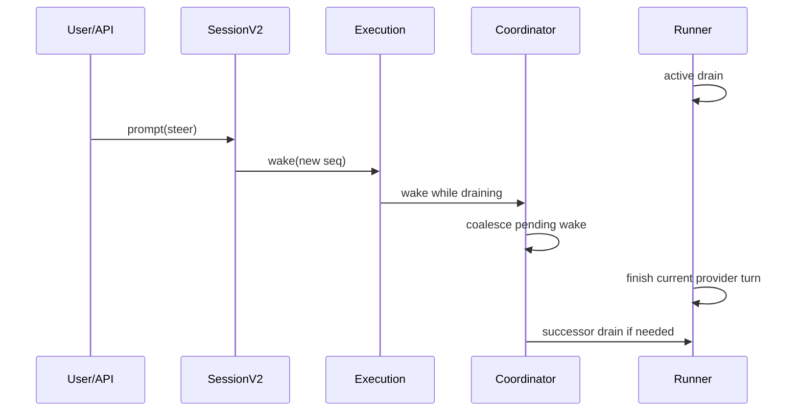

# opencode V2 输入生命周期与执行控制深挖

本文深挖 V2 的输入和执行控制层：用户 prompt 如何被接收、排队、提升为上下文，以及 execution 如何保证同一个 session 不被并发 runner 搅乱。

核心文件：

- [`packages/core/src/session.ts`](./opencode/packages/core/src/session.ts)
- [`packages/core/src/session/prompt.ts`](./opencode/packages/core/src/session/prompt.ts)
- [`packages/core/src/session/input.ts`](./opencode/packages/core/src/session/input.ts)
- [`packages/core/src/session/execution.ts`](./opencode/packages/core/src/session/execution.ts)
- [`packages/core/src/session/execution/local.ts`](./opencode/packages/core/src/session/execution/local.ts)
- [`packages/core/src/session/run-coordinator.ts`](./opencode/packages/core/src/session/run-coordinator.ts)

## 这一层解决什么问题

V1 的 prompt 流程更像：

```text
收到用户输入 -> 直接写 user message -> 直接进入 loop
```

这个模型在简单聊天中很好理解，但对 coding agent 的长任务会遇到几个问题：

- 用户可能在 agent 正工作时继续输入。
- 一个 session 可能被异步 prompt、resume、tool continuation 同时唤醒。
- interrupt 后，旧 wake 不应该复活旧工作。
- prompt 接收成功不等于它已经进入模型上下文。
- 长任务需要区分“当前任务的 steer”和“下一项排队任务”。

V2 的输入/执行层正是为这些问题建模。

## Prompt 的形态

V2 的 prompt 定义在 [`session/prompt.ts`](./opencode/packages/core/src/session/prompt.ts)：

- `text`
- `files`
- `agents`

文件和 agent attachment 都保留 source 信息。和 V1 用户 message parts 相比，V2 prompt 更像“用户输入的原始意图”，还不是 session history。

这个区分很重要：prompt 是输入；message 是输入被 runtime 接纳并投影后的历史。

## SessionV2.prompt：admit 而不是 run

[`V2Session.prompt`](./opencode/packages/core/src/session.ts) 的关键步骤：

1. 确认 session 存在。
2. 生成或使用指定 message id。
3. delivery 默认为 `steer`。
4. 调用 `SessionInput.admit`。
5. 检查 admitted input 是否与 expected 等价，避免幂等冲突。
6. 如果 `resume !== false`，调用 `execution.wake(sessionID, admittedSeq)`。
7. 返回 `SessionInput.Admitted`。



这里最关键的设计是：prompt 接口不承诺马上生成 assistant 回复，只承诺输入被 durable 接收，并按需唤醒 execution。

## SessionInput.Admitted

[`SessionInput.Admitted`](./opencode/packages/core/src/session/input.ts) 包含：

- `admittedSeq`
- `id`
- `sessionID`
- `prompt`
- `delivery`
- `timeCreated`
- `promotedSeq?`

`admittedSeq` 来自 EventV2 aggregate sequence。它是一个很重要的顺序锚点：输入不是单纯按 wall clock 排序，而是按 session event log 的序列进入生命周期。

## admit：记录输入已被接收

`SessionInput.admit` 的核心逻辑：

1. 如果同 id 已存在，返回已有 admission。
2. 发布 `SessionEvent.PromptLifecycle.Admitted`。
3. 从 event seq 构造 `Admitted`。
4. 如果 publish 出现 defect，则再查一遍 db，支持并发幂等。

这说明 admission 是 durable event，而不是内存队列操作。runner 崩溃或进程重启后，仍可以从 `session_input` 表知道哪些输入已接收但未 promoted。

## delivery：steer 与 queue

V2 将输入分成两类：

- `steer`
- `queue`

`steer` 表示当前工作流中的引导。比如 agent 正在跑，用户补充“注意不要改 X 文件”。这类输入应尽快进入当前 activity。

`queue` 表示下一项排队任务。比如当前 activity 还没收束，但用户又提交一个新任务。queue 不应该打断当前 run 的语义，而是在当前 open activity 结束后进入。

runner 的处理逻辑在 [`runner/llm.ts`](./opencode/packages/core/src/session/runner/llm.ts)：

- run 开始时优先检查 pending steer。
- 没有 steer 再检查 queue。
- promotion 为 `queue` 时，会先 promote 一个 queue，再 promote 截止点之前的 steer。
- 每个 provider turn 结束后，若没有 tool continuation，会再检查 pending steer。
- open activity 结束后，再检查 queue。

这套规则体现出一种调度语义：

```text
steer 插入当前工作；queue 开启下一项工作。
```

## FAQ：steer、queue 与 open activity

### Q1：`steer` 和 `queue` 是 prompt 的内容状态吗？

不是。它们更准确地说是 prompt 的 `delivery` 策略。

用户 prompt 进入 V2 后，先被 `SessionInput.admit` 持久化为 pending input。此时它还没有进入 LLM 上下文。runner 后续会根据 `delivery` 决定何时把它 promote 成 `SessionMessage.User`。

所以：

- `steer` 表示这条输入应进入当前正在推进的 activity。
- `queue` 表示这条输入应等待当前 activity 收束后，作为下一项 activity 的入口。

默认策略是 `steer`。调用方不显式传 `delivery` 时，`V2Session.prompt` 会使用 `input.delivery ?? "steer"`。

### Q2：什么情况下是 `steer`？

`steer` 适合表达“当前任务里的补充、纠偏、限制、追加上下文”。例如：

- agent 正在改代码，用户补充“不要改 `package.json`”。
- 用户发现方向不对，补充“先不要写测试，先定位根因”。
- 用户追加约束“保持 public API 不变”。
- 用户补充背景“这个模块只在 CLI 路径下使用”。

如果 session 当前是 idle，`steer` 也会正常开启一个 activity。它不是只有在 busy 时才有效。

### Q3：什么情况下是 `queue`？

`queue` 适合表达“下一项任务”，即不希望当前 activity 的语义被打断。例如：

- 当前正在修 bug，用户又说“完成后再帮我补测试”。
- 当前任务还没结束，用户提交另一个相对独立的任务。
- 用户希望 follow-up prompt 等当前工作自然收束后再执行。

`queue` 不是被忽略，也不是只存在内存里。V2 core 支持把它作为 durable pending input 保存在 `session_input` 中，之后由 runner promote。

### Q4：`steer` 插入当前 activity 的具体时机是什么？

`steer` 不是 token 级别插入，也不会改写正在 streaming 的 provider request。

实际时机是：当前 provider turn 或 tool continuation 到达安全边界后，runner 准备下一次 provider request 之前，先调用 `promoteSteers`，再重新读取 session history 并构造新的 `LLM.request`。

简化流程：

```text
用户提交 steer
  -> admit 为 pending input
  -> wake/resume runner
  -> 当前 provider stream / tool settlement 到达边界
  -> promoteSteers
  -> Promoted event 投影成 User message
  -> entriesForRunner 重新读取历史
  -> toLLMMessages 构造 provider messages
  -> llm.stream(request)
```

因此，`steer` 的“尽快”含义是 runner turn 边界上的尽快，不是中断当前 provider stream 后即时注入。

相关代码在 [`runner/llm.ts`](./opencode/packages/core/src/session/runner/llm.ts)：`promotion === "steer"` 时先 promote，再构造 request。

### Q5：不同 provider 对 `steer` 的插入时机有区别吗？

核心插入机制没有 provider 差异。

`steer` 的 promote 发生在 opencode runner 层，在调用 `llm.stream(request)` 之前完成。provider adapter 接收到的是已经构造好的 messages。因此 OpenAI、Anthropic、Gemini 等 provider 不决定 `steer` 如何插入。

provider 差异主要体现在后续 provider turn 的行为上：

- streaming 何时结束；
- tool call 如何表达；
- tool 是否 provider-executed；
- provider error、context overflow、reasoning metadata 如何表达；
- V2 session message 如何 lower 成 provider 所需的消息格式。

但这些差异不改变 `steer` 的调度语义。

### Q6：用户 prompt 是怎么被判定为 `steer` 或 `queue` 的？有专门的意图识别 agent 吗？

没有专门的意图识别 agent，也不是模型根据 prompt 文本自动分类。

判定来源是调用方显式传入的 `delivery` 参数；如果调用方不传，core 默认是 `steer`。HTTP/API schema 中 `delivery` 是可选字段，取值为 `"steer" | "queue"`。

也就是说：

```text
delivery: "steer" -> steer
delivery: "queue" -> queue
未传 delivery      -> steer
```

app 层可以提供 follow-up behavior 之类的交互策略，但那属于 UI/API 调用策略，不是 core 里的 LLM 意图识别。

### Q7：`open activity` 指的是什么？

`open activity` 不是数据库中的实体，也不是用户可见的 message 类型。它是 runner 内部的调度概念，表示“当前还有一段工作没有收束，runner 应继续推进”。

一个 activity 可以包含：

- 一次或多次 provider turn；
- local tool call；
- tool result 回灌后的 continuation；
- context overflow 后的重建；
- 当前 activity 内追加的 pending steer。

当 provider turn 不再需要 continuation，且没有 pending steer 时，当前 activity 才算收束。此时 runner 才检查是否有 pending queue；如果有，就打开下一个 activity。

相关控制流在 [`runner/llm.ts`](./opencode/packages/core/src/session/runner/llm.ts) 的 `openActivity` loop 中。

### Q8：能否理解为 `steer` 是当前 activity 内附加 prompt，而 `queue` 是新开一个 activity？

可以这样理解，但要加一个限定：activity 隔离的是调度边界，不是上下文边界。

更准确地说：

```text
steer = 当前 activity 内追加用户输入
queue = 当前 activity 收束后，打开下一项 activity
```

但 queued activity 仍运行在同一个 session 中。它不会自动清空 history，不会创建新 session，也不会隔离文件系统副作用。

### Q9：不同 activity 之间隔离了什么？

主要隔离的是执行节奏和任务边界：

- queued prompt 不会中途进入当前 activity；
- 一个 activity 内可以经历多轮 provider turn 和 tool continuation；
- activity 内新来的 `steer` 会优先并入当前 activity；
- 当前 activity 收束后，runner 才检查 queue；
- 多个 queued prompt 按 FIFO 一个 activity 接一个 activity 打开；
- 每个 activity 有自己的 step budget，不会把前一个 activity 的步数消耗延续到下一个 queued activity。

这保证了“当前任务的纠偏”和“下一项任务”不会混在同一个调度单元里。

### Q10：不同 activity 之间没有隔离什么？

activity 不是会话子空间。它不会隔离：

- session history；
- assistant message；
- tool result；
- 文件系统副作用；
- agent 的 system context；
- 当前 session 的 agent/model 选择。

第二个 activity 构造 request 时，会重新读取同一个 session 的 projected history。前一个 activity 的用户输入、assistant 输出和 tool 结果仍然可能进入上下文，除非被 compaction 或 context baseline 规则裁剪。

### Q11：从一个 activity 切到下一个 queued activity 时，runner 做了哪些工作？

当前 activity 收束后，runner 检查是否还有 pending queue。如果有，就设置下一轮 `promotion = "queue"`。

下一轮 provider turn 开始前，`promotion === "queue"` 会触发：

1. `promoteNextQueued`：只提升最早的一条 queued input。
2. `promoteSteers(cutoff)`：再提升截止点之前的 pending steer。
3. 准备或校验 `SessionContextEpoch`。
4. 重新读取 runner history。
5. 重新 materialize tool definitions。
6. 重新 resolve model。
7. 构造新的 `LLM.request`。
8. 开始新的 provider stream。

这里的关键是：切换 activity 不等于清空环境，而是在同一个 session history 上打开下一段可独立调度的工作。

## promote：输入进入 session history

`SessionInput.promoteSteers` 和 `promoteNextQueued` 不直接插入 message，而是发布 `PromptLifecycle.Promoted`。projector 收到 promoted event 后，调用 `SessionInput.projectPromoted`，最终插入 `SessionMessage.User`。



这说明 V2 把“用户输入被 runtime 消费”也变成了可审计事实。

## ID 防冲突：guardReservedID

`SessionInput.guardReservedID` 注册在 [`SessionProjector`](./opencode/packages/core/src/session/projector.ts) 的 `events.beforeCommit` 中。

它检查：如果某个 event 使用了 reserved message id，而这个 id 已经属于 admitted input，则会触发 lifecycle conflict。

这解决了一个细节但很重要的问题：admitted input 的 message id 已经被保留，不能被 step、synthetic、shell、compaction 等其他事件抢占。

## Execution 接口

[`SessionExecution`](./opencode/packages/core/src/session/execution.ts) 定义三个操作：

- `resume(sessionID)`：显式 drain，一个手动恢复动作。
- `wake(sessionID, seq?)`：durable work 已记录，调度执行。
- `interrupt(sessionID, seq?)`：中断当前进程拥有的 active work。

这个接口很薄，但语义很重：它把执行从 prompt 函数里抽离出来。

## local execution：按 location 路由 runner

[`session/execution/local.ts`](./opencode/packages/core/src/session/execution/local.ts) 做两件事：

1. 根据 session id 读取 session，拿到 session location。
2. 从 `LocationServiceMap` 取出 location-scoped layer，然后在该 layer 中调用 `SessionRunner.run`。

这意味着 runner 不是全局服务，而是 location-owned 服务。一个 session 必须在它的工作目录对应 runtime 中执行。

## RunCoordinator：每个 session 一条执行 lane

[`SessionRunCoordinator`](./opencode/packages/core/src/session/run-coordinator.ts) 是执行控制的核心。

源码注释给出的状态机是：

```text
idle --run/wake--> draining --run/wake--> draining + one coalesced rerun --> idle
```

它维护每个 key 的 `Entry`：

- `current`
- `pending`
- `explicitWaiter`
- `interruptSeq`
- `owner`
- `stopping`

它把 demand 分成：

- `run`
- `wake(seq?)`

并规定：

- 同一个 session 同时只有一个 active owner fiber。
- wake 如果发生在 draining 时，会合并到 pending。
- 多个 wake collapse。
- run 优先于 wake。
- interrupt 会中断 owner，并压制 interrupt 边界之前的 stale wake。

## wake 的语义

`wake(key, seq?)` 是 advisory demand：它表示“可能有 durable work 可处理”。

如果当前 session idle：

- 创建 entry。
- 启动 owner。

如果正在 draining：

- 判断这个 wake 是否在 interrupt 边界之后。
- 合并到 pending demand。

这使 prompt admission 可以频繁 wake，而不会导致多个 runner 并行。

## run 的语义

`run(key)` 是 explicit demand：用户或 API 要求显式 drain。

如果当前已有 wake 正在跑，run 会把 pending demand 升级成 run，并让调用者等待 explicit waiter。

这表达了 run 与 wake 的优先级差异：

- wake 是“有活了，方便时跑”。
- run 是“我现在要等它 drain 完”。

## interrupt 的语义

`interrupt(key, seq?)` 会：

- 记录 interrupt seq。
- 标记 entry stopping。
- 清理或压制 pending wake。
- interrupt owner fiber。

如果后续 wake 的 seq 小于等于 interrupt seq，会被忽略。只有 interrupt 之后的新 durable work 才会重新触发执行。

这对 coding agent 很关键：用户中断不是单纯取消当前 Promise，还要防止旧 wake 在清理后又把被中断的旧工作拉起来。

## Prompt / Wake / Run 的组合语义



如果用户在 runner 运行中再次输入：



## 设计哲学

这一层体现了 V2 的几个核心思想。

### 1. 接收输入和执行输入分离

admit 是 durable 接收；promote 是 runtime 消费。这个分离让系统可以处理并发、恢复、排队、steer。

### 2. 执行是 session-owned lane，不是 request-owned promise

一个 HTTP/API request 可以提交 prompt，但真正跑的是 session execution lane。这样长任务不会被某个请求生命周期绑定死。

### 3. 中断是有顺序边界的

interrupt 不只是 abort signal，而是带 seq 的 session 事件边界。旧 wake 被压制，新 wake 可以继续。

### 4. location 是执行所有权的一部分

runner 在 location layer 中运行。coding agent 的工具、文件系统、权限、context 都属于 location，不只是 session。

## 当前限制

当前 V2 execution 仍是 local coordinator。源码注释明确提到未来可能替换为 durable multi-node ownership。

此外，V2 facade 中 `wait`、`shell`、`compact` 等仍未完整实现。这说明 V2 输入/执行主干已经成型，但外围控制能力仍在迁移中。

## 小结

V2 输入与执行控制层的价值在于，它把“用户发消息，agent 开始工作”拆成可持久化、可调度、可中断的生命周期。

这一层不是为了代码更优雅，而是为了让 coding agent 从短请求模型走向长任务 runtime 模型。
