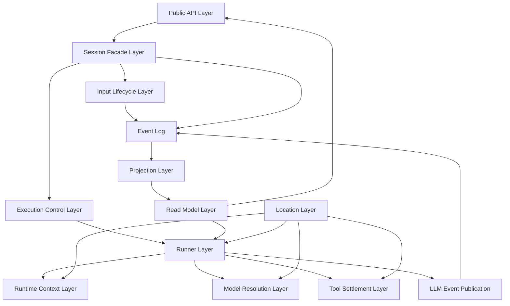
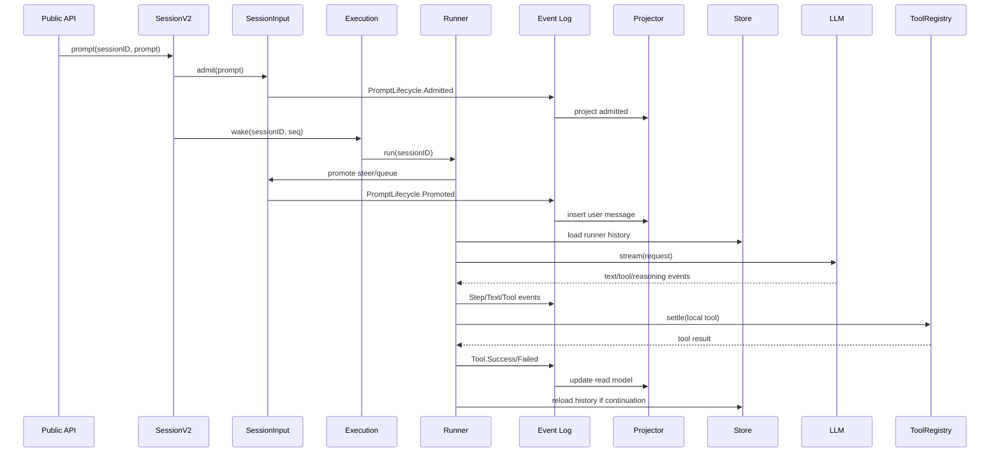

# opencode V2 抽象分层总览

本文从抽象层次切入，给 opencode SessionV2 的各部分建立一张“地图”。后续几篇深挖报告会沿着这张地图展开：

- [`opencode-v2-input-execution.md`](./opencode-v2-input-execution.md)：输入生命周期与执行控制。
- [`opencode-v2-events-projection.md`](./opencode-v2-events-projection.md)：领域事件、投影和读模型。
- [`opencode-v2-runner-context-tools.md`](./opencode-v2-runner-context-tools.md)：runner、context epoch、tool settlement。

分析对象是 `anomalyco/opencode` submodule，源码位于 [`./opencode`](./opencode)。这里仍只关注 V2 coding agent runtime 主干。

## 总体判断

SessionV2 不是把 V1 的 session service 机械拆文件，而是在重新定义“一个 AI coding session 是什么”。

V1 的 session 更像一个可变 transcript：用户消息、assistant parts、tool parts、step parts 不断更新。

V2 的 session 更像一个 durable runtime：

- prompt 先被 durable admission。
- execution 被 wake/resume/interrupt 控制。
- runner 从投影后的 history 构造 provider turn。
- LLM/tool 生命周期被记录为领域事件。
- projector 把事件折叠成可查询 message。
- context baseline 和 tool settlement 变成 runtime 自身的一部分。

因此 V2 的设计重点不是“message schema 更好看”，而是让 agent 工作过程可观察、可恢复、可重放、可协调。

## 分层图

可以把 V2 分成 8 层。

## 1. Public API Layer

入口在 [`packages/core/src/public/opencode.ts`](./opencode/packages/core/src/public/opencode.ts) 和 [`packages/core/src/public/session.ts`](./opencode/packages/core/src/public/session.ts)。

public API 暴露得很薄：

- `sessions.create/get/list/prompt/messages/message/context/events/switchModel/interrupt`
- `tools.register`

真正的 runner、event projector、execution local、location service 都藏在 layer 组合里。`OpenCode.layer` 把这些服务组合起来：

- `SessionV2.layer`
- `SessionProjector.layer`
- `SessionExecutionLocal.layer`
- `SessionStore.layer`
- `LocationServiceMap.layer`
- `ApplicationTools.layer`

这体现出 V2 的第一个设计原则：**外部 API 只提交意图和读取视图；内部 runtime 负责把意图变成可恢复的工作。**

## 2. Session Facade Layer

核心 facade 是 [`packages/core/src/session.ts`](./opencode/packages/core/src/session.ts)。

它做的事情很克制：

- create/list/get session。
- 读取 messages/context/events。
- prompt admission + wake。
- switch model 发布事件。
- interrupt 发布事件并中断 execution。
- resume 调用 execution。

一些旧版能力在 V2 中还直接返回 `OperationUnavailableError`，例如 shell、skill、switchAgent、compact、wait。这不是因为它们不重要，而是说明 V2 正在有意收窄 facade，先把 durable session/runtime 主干站稳。

## 3. Input Lifecycle Layer

核心是 [`SessionInput`](./opencode/packages/core/src/session/input.ts)。

它引入两个关键阶段：

- `admit`：系统承认用户输入已经被接收。
- `promote`：runner 决定把输入提升为 session history 中的 user message。

并引入两种 delivery：

- `steer`：当前 active run 中的引导。
- `queue`：排队到下一项 open activity 的输入。

这个层次让 V2 能表达一个 V1 很难表达清楚的事实：用户输入可以已经进入 durable 队列，但还没有进入模型上下文。

## 4. Execution Control Layer

核心接口是 [`SessionExecution`](./opencode/packages/core/src/session/execution.ts)，local 实现在 [`session/execution/local.ts`](./opencode/packages/core/src/session/execution/local.ts)，并通过 [`SessionRunCoordinator`](./opencode/packages/core/src/session/run-coordinator.ts) 管理并发。

这一层处理：

- `wake`：durable work 可能可用。
- `resume`：显式 drain。
- `interrupt`：中断当前 ownership chain。
- coalescing：多个 wake 合并。
- single active drain：同一 session 同时只有一条执行链。

这层是从“函数调用式 prompt loop”到“runtime 调度”的关键过渡。

## 5. Runner Layer

核心是 [`runner/llm.ts`](./opencode/packages/core/src/session/runner/llm.ts)。

runner 做一次或多次 provider turn：

1. 读取 session。
2. 检查 location ownership。
3. 选择 agent。
4. 初始化/准备 context epoch。
5. promote steer/queue input。
6. 解析 model。
7. 加载 runner history。
8. materialize tools。
9. 构造 `LLM.request`。
10. 调用 `llm.stream(request)`。
11. 发布 text/reasoning/tool/step events。
12. settle 本地 tool。
13. 根据 tool result 或新 steer 决定 continuation。

runner 是 V2 的 orchestration 层。源码注释明确提醒：不要重建 legacy `SessionPrompt` monolith，而是让 runner 只编排更小的 collaborator。

## 6. Runtime Context Layer

核心是 [`SessionContextEpoch`](./opencode/packages/core/src/session/context-epoch.ts)、[`SessionHistory`](./opencode/packages/core/src/session/history.ts) 和 [`to-llm-message.ts`](./opencode/packages/core/src/session/runner/to-llm-message.ts)。

它解决的问题是：一段长 session 中，系统上下文、skill/reference guidance、agent、compaction 都会变化。runner 不能每次都盲目把全量历史塞给模型。

V2 用 context epoch 维护：

- baseline
- baseline sequence
- snapshot
- replacement sequence
- revision
- agent ownership

runner 只加载 baseline 之后的 history，再把它转成 canonical LLM messages。

## 7. Tool Settlement Layer

核心是：

- [`tool/tool.ts`](./opencode/packages/core/src/tool/tool.ts)
- [`tool/registry.ts`](./opencode/packages/core/src/tool/registry.ts)
- [`tool/application-tools.ts`](./opencode/packages/core/src/tool/application-tools.ts)
- [`tool/builtins.ts`](./opencode/packages/core/src/tool/builtins.ts)

V2 的 tool 不再只是 AI SDK 的 execute callback，而是 typed definition + typed settlement：

- input schema
- output schema
- toModelOutput
- permission identity
- settlement result
- bounded output storage

runner 看到 tool-call 后，先通过 event publisher 记录 call，再通过 `ToolRegistry.settle` 执行本地工具，最后发布 tool result 并继续下一轮 provider turn。

## 8. Event / Projection / Read Model Layer

核心文件：

- [`event.ts`](./opencode/packages/core/src/session/event.ts)
- [`projector.ts`](./opencode/packages/core/src/session/projector.ts)
- [`message-updater.ts`](./opencode/packages/core/src/session/message-updater.ts)
- [`message.ts`](./opencode/packages/core/src/session/message.ts)
- [`store.ts`](./opencode/packages/core/src/session/store.ts)

这一层把 runtime 的事实转换成可查询视图。

事件层表达“发生了什么”：

- prompt admitted/promoted
- step started/ended/failed
- text started/ended
- tool called/success/failed
- compaction ended

projection 层表达“现在怎么读”：

- session 表
- session_message 表
- session_input 表
- session_context_epoch 表

read model 层供 API 和 runner 读取：

- `SessionStore.get`
- `SessionStore.context`
- `SessionStore.runnerContext`
- `SessionStore.message`

## Location Layer：横切边界

[`LocationServiceMap`](./opencode/packages/core/src/location-layer.ts) 是 V2 很重要的横切层。它为每个 `Location.Ref` 组合一套 location-scoped services：

- policy/config/plugin/catalog/agent
- filesystem/watcher/pty
- skill/reference guidance
- permission/tool registry
- model resolver
- session runner

这说明 V2 的 runtime 是“按工作目录装配”的。对 coding agent 来说，这个边界比纯 session ID 更有意义，因为文件系统、权限、工具、system context 都与 location 强相关。

## 分层后的核心数据流

## 当前完成度

V2 不是完全替代 V1 的最终形态。源码注释和实现显示：

已完成较多的部分：

- prompt admission / promotion
- execution wake/resume/interrupt 接口
- local coordinator
- V2 runner 的 provider turn
- V2 event publisher
- typed tool settlement 基础
- context epoch
- projection 到 `session_message`

仍在迁移中的部分：

- HTTP/SDK 主路径仍大量走 V1 `SessionPrompt`
- V2 built-in tools 尚未完整覆盖 V1 工具，`task`、`plan_exit` 等仍待 port
- MCP/plugin/structured output 尚未完全接入 V2 materialization
- durable busy/retrying/idle 状态仍是 TODO
- multi-node durable ownership 仍是 TODO

这意味着 V2 最值得研究的不是“它已经替代了全部 V1”，而是它如何定义未来 runtime 的边界。

## 建议阅读路线

1. 先读本总览，建立层次图。
2. 读 [`opencode-v2-input-execution.md`](./opencode-v2-input-execution.md)，理解 prompt 如何进入 runtime，以及 execution 如何避免并发踩踏。
3. 读 [`opencode-v2-events-projection.md`](./opencode-v2-events-projection.md)，理解 V2 为什么是事件优先。
4. 读 [`opencode-v2-runner-context-tools.md`](./opencode-v2-runner-context-tools.md)，理解一次真实 agent turn 如何运行。
