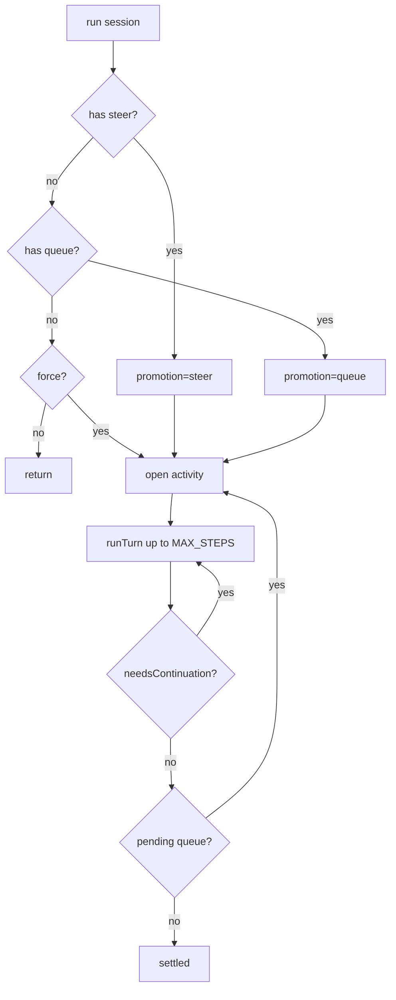
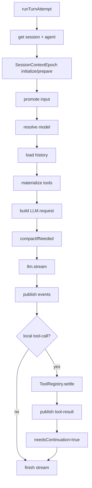
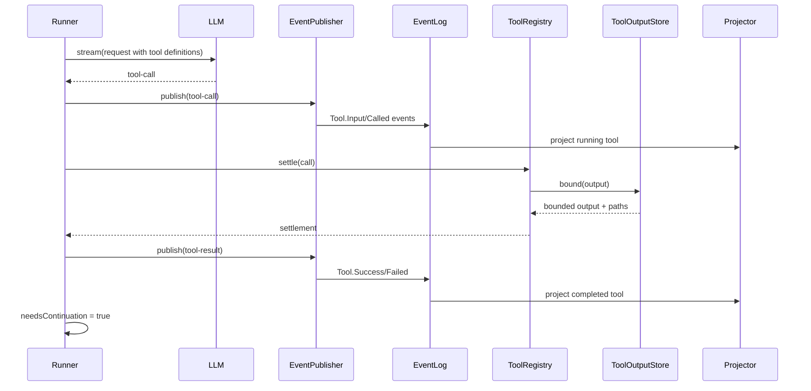

# opencode V2 Runner、Context 与 Tool Settlement 深挖

本文深挖 V2 中真正推动 agent 工作的一层：runner 如何构造 provider turn，context epoch 如何控制系统上下文，tool registry 如何把模型 tool call 变成可记录、可限制、可继续的本地副作用。

核心文件：

- [`packages/core/src/session/runner/llm.ts`](./opencode/packages/core/src/session/runner/llm.ts)
- [`packages/core/src/session/runner/model.ts`](./opencode/packages/core/src/session/runner/model.ts)
- [`packages/core/src/session/runner/to-llm-message.ts`](./opencode/packages/core/src/session/runner/to-llm-message.ts)
- [`packages/core/src/session/runner/publish-llm-event.ts`](./opencode/packages/core/src/session/runner/publish-llm-event.ts)
- [`packages/core/src/session/context-epoch.ts`](./opencode/packages/core/src/session/context-epoch.ts)
- [`packages/core/src/session/compaction.ts`](./opencode/packages/core/src/session/compaction.ts)
- [`packages/core/src/tool/registry.ts`](./opencode/packages/core/src/tool/registry.ts)
- [`packages/core/src/tool/tool.ts`](./opencode/packages/core/src/tool/tool.ts)
- [`packages/core/src/permission.ts`](./opencode/packages/core/src/permission.ts)

## Runner 的定位

V2 runner 的源码注释说得很明确：它要运行一个 durable coding-agent session，直到 settle；但要保持 orchestration，而不是重建旧版 `SessionPrompt` monolith。

这句话是理解 runner 的核心。runner 不应该拥有所有业务细节，而是协调这些 collaborator：

- `SessionInput`
- `SessionContextEpoch`
- `SessionHistory`
- `SessionRunnerModel`
- `ToolRegistry`
- `LLMClient`
- `SessionCompaction`
- `createLLMEventPublisher`

## SessionRunner.run：外层 activity loop

[`runner/llm.ts`](./opencode/packages/core/src/session/runner/llm.ts) 的 `run` 做外层调度：

1. 检查 pending steer。
2. 如果没有 steer，检查 pending queue。
3. 如果不是 force 且没有 pending input，直接返回。
4. 先把之前中断的 pending/running tools 标记失败。
5. 进入 open activity loop。
6. 每个 activity 最多执行 `MAX_STEPS = 25` 个 provider turn。
7. 每个 provider turn 后，如果没有 tool continuation，再检查 pending steer。
8. activity 结束后检查 queue，决定是否开启下一项 activity。

这里的 activity 概念不是显式类型，但从逻辑上存在：一组 steer/tool continuation 形成当前活动；queue 会开启下一组活动。

## runTurnAttempt：一次 provider turn

`runTurnAttempt` 是 V2 runner 最重要的函数。它做的是一次 provider turn 的完整准备、执行和收尾。

流程：

1. 读取 session。
2. 检查 session location 与当前 location layer 是否匹配。
3. 选择 agent。
4. 初始化或准备 context epoch。
5. 根据 promotion promote steer/queue。
6. 重新检查 agent/model 是否在准备过程中改变。
7. 解析 model。
8. 从 `SessionHistory.entriesForRunner` 加载 history。
9. materialize tools。
10. 构造 `LLM.request`。
11. 检查是否需要 compaction。
12. 创建 event publisher。
13. 调用 `llm.stream(request)`。
14. 发布 LLM events。
15. 对本地 tool call 执行 `toolMaterialization.settle`。
16. 等待 tool fibers。
17. 根据是否有本地 tool call 决定 continuation。

## ContextEpoch：系统上下文的版本化边界

[`SessionContextEpoch`](./opencode/packages/core/src/session/context-epoch.ts) 维护 runner 使用的 system baseline。

它存储在 `session_context_epoch` 表中：

- `baseline`
- `agent`
- `snapshot`
- `baseline_seq`
- `replacement_seq`
- `revision`

它解决的问题是：系统上下文不是静态字符串。配置、skills、references、agent、location 都可能改变。runner 需要知道当前 baseline 是否仍然有效。

### initialize

`initialize` 只在还没有 epoch 时插入 baseline。它不会强制替换已有 context。

### prepare

`prepare` 会：

- 加载当前 system context。
- 查找 stored epoch。
- 如果没有 stored，初始化。
- 如果 stored 存在，调用 `SystemContext.reconcile` 或 `SystemContext.replace`。
- 如果 context 有增量更新，发布 `SessionEvent.ContextUpdated`。
- 如果需要 replacement，更新 baseline 和 baselineSeq。

### requestReplacement

当 agent/model/context 相关事件发生时，projector 会调用 `SessionContextEpoch.requestReplacement`，记录 replacement_seq。

下次 runner 准备 context 时，会知道某个 seq 之后需要替换 baseline。

### current

runner 在发 provider request 前调用 `SessionContextEpoch.current`，确认 agent 和 revision 仍然匹配。如果准备过程中 session 被切 agent 或 context 变化，runner 会触发 `RebuildPreparedTurn`。

这是一种乐观并发控制：不是全程锁住 context，而是在关键点验证 revision。

## History：runner 看到什么

[`SessionHistory.entriesForRunner`](./opencode/packages/core/src/session/history.ts) 根据 baselineSeq 和 compaction 过滤 history。

runner 不直接读取全量 event log，而读取 projected `SessionMessage`：

- 排除 baseline 之前的 system message。
- 如果有 compaction，只保留 compaction 后相关消息。
- 保留 baseline 后的有效消息。

之后 [`toLLMMessages`](./opencode/packages/core/src/session/runner/to-llm-message.ts) 把 `SessionMessage` 转成 `@opencode-ai/llm` 的 canonical messages。

这个转换会处理：

- user text/files
- synthetic/system/shell
- assistant text/reasoning/tool call/tool result
- compaction checkpoint
- provider-executed tool 的特殊 replay
- 不同模型时 reasoning/provider metadata 的降级

这层把 V2 read model 和 provider-neutral LLM protocol 解耦。

## Model resolution

[`SessionRunnerModel`](./opencode/packages/core/src/session/runner/model.ts) 从 catalog 解析模型。

它做几件事：

- 等待 plugin boot，因为 location plugins 可能 populate/filter catalog。
- 如果 session 指定 model，取指定 model；否则取默认 supported model。
- 根据 variant 合并 model request。
- 根据 provider/model api 创建 `@opencode-ai/llm` route model。

目前 supported path 包括：

- OpenAI Responses
- Anthropic Messages
- OpenAI-compatible chat

这说明 V2 runner 正在从旧 AI SDK provider abstraction 迁向 `@opencode-ai/llm` 自己的 provider-neutral route。

## Event publisher：LLMEvent 到 SessionEvent

[`publish-llm-event.ts`](./opencode/packages/core/src/session/runner/publish-llm-event.ts) 把 `LLMEvent` 转成 V2 session events。

它维护临时状态：

- 当前 assistant message id
- text fragments
- reasoning fragments
- tool input fragments
- tool call state
- provider failure 状态

主要职责：

- `text-start/delta/end` -> `Text.Started/Delta/Ended`
- `reasoning-start/delta/end` -> `Reasoning.Started/Delta/Ended`
- `tool-input-*` -> `Tool.Input.*`
- `tool-call` -> `Tool.Called`
- `tool-result` -> `Tool.Success/Failed`
- `finish` -> `Step.Ended`
- provider error -> `Step.Failed` 或 provider error 状态

publisher 的关键点是：它不会让 tool call 只是 transient stream item。每个 tool call 先 durable 记录，再执行 settlement。

## ToolRegistry：materialize + settle

[`ToolRegistry.materialize`](./opencode/packages/core/src/tool/registry.ts) 返回：

- `definitions`
- `settle(input)`

materialize 发生在 provider turn 构造前。它会：

1. 合并 application tools 和 local scoped tools。
2. 根据 agent permissions 过滤完全 deny 的工具。
3. 返回 LLM tool definitions。
4. 捕获当时的 registration identity。

settle 时，如果当前 registry 中的 tool identity 和 advertised identity 不一致，会返回 stale tool call error。

这解决了一个细节问题：模型看到的工具定义属于某一轮 request。若工具在请求后被替换，旧 call 不应执行新工具。

## Tool 定义：typed tool

[`tool/tool.ts`](./opencode/packages/core/src/tool/tool.ts) 中的 tool 是 typed definition：

- input codec
- output codec
- execute
- optional toModelOutput

settle 流程：

1. decode tool input。
2. 执行 tool。
3. encode tool output，验证输出 schema。
4. 转成 `ToolOutput`，包括 structured + content。

这个设计比旧 AI SDK tool wrapper 更强：工具的输入输出 schema 是 core 类型系统的一部分，settlement 可以统一验证和规范化。

## ToolOutputStore：输出边界

`ToolRegistry.settleWith` 会调用 `ToolOutputStore.bound`。

这说明 V2 不希望工具输出无限制进入 event/message/model context。大输出可以被 bound，并产生 `outputPaths`。runner 发布 tool result 时也会带上这些 output paths。

对于 coding agent，这一点很现实：shell/read/grep 等工具可能输出巨大内容，必须有统一边界。

## PermissionV2：action/resource/effect

[`PermissionV2`](./opencode/packages/core/src/permission.ts) 使用：

- `action`
- `resource`
- `effect`

而 V1 是：

- `permission`
- `pattern`
- `action`

V2 的命名更接近通用 policy model。

权限评估逻辑：

1. 加载 agent configured permissions。
2. 如果 configured rules 中命中 deny，直接 deny。
3. 合并 project saved rules。
4. 对每个 resource evaluate。
5. 得到 allow/ask/deny。

`assert` 会在 ask 时创建 pending request 并等待 reply。`reply(always)` 可以写入 `PermissionSaved`，形成 project 级持久 allow。

注意当前 `ToolRegistry.materialize` 只做“完全 deny 的工具不暴露”。更细的 per-resource permission 通常应在具体工具执行中 assert。

## Compaction：runner 内的上下文维护

[`SessionCompaction`](./opencode/packages/core/src/session/compaction.ts) 负责自动压缩。

它做两类检查：

- `compactIfNeeded`：估算 request system/messages/tools 是否超出 context buffer。
- `compactAfterOverflow`：provider 报 context overflow 且 assistant 未开始时，尝试压缩后重跑。

compaction 会：

1. 从 history 选择 head 和 recent。
2. 构造 summary prompt。
3. 调 LLM 生成 summary。
4. 发布 `Compaction.Started`。
5. 发布 `Compaction.Ended`，包含 summary 和 recent。

projector 收到 compaction ended 后，会插入 `SessionMessage.Compaction` 并 request context replacement。

这让 compaction 不再只是旧 transcript 的 part，而是 context runtime 的维护事件。

## 一次 tool continuation 的完整链路

之后 runner 会 reload projected history，并开启下一次 provider turn。

## 失败和中断处理

runner 对几类失败有显式处理：

- provider context overflow：如果 assistant 还没开始，尝试 compaction 后重建 turn。
- LLM failure：发布 `Step.Failed`，并 fail unsettled tools。
- interrupt：清理 tool fibers，并把未完成工具标记为 interrupted。
- question rejected：匹配 V1 行为，halt loop 而不是作为 tool output 喂给模型。
- tool settlement failure：fail unsettled tools。
- step limit exceeded：最多 25 个 provider turns。

这说明 V2 runner 已经把 agent loop 中最危险的部分显式化：无限循环、provider failure、tool half-settled、中断清理。

## Location layer 对 runner 的影响

runner 是 location-scoped。它依赖的 services 都来自 [`LocationServiceMap`](./opencode/packages/core/src/location-layer.ts)：

- AgentV2
- Config
- Catalog
- PermissionV2
- ToolRegistry
- FileSystem
- SkillGuidance
- ReferenceGuidance
- SessionRunnerModel

所以同一个 session 的 execution 必须在对应 location 中运行。这样工具和上下文不会跨工作目录泄漏。

## 当前未完成的设计位

源码注释中明确列出一些 TODO：

- durable multi-node ownership
- durable busy/retrying/idle/interrupted status
- provider retries 和重复 tool call 限制
- MCP/plugin/structured-output tool definitions
- snapshots/patches/retry notices 增量持久化
- scoped runtime context、progress updates、attachment normalization、plugins、cancellation settlement
- post-run title/summary/cleanup

这些 TODO 很有信息量：V2 的目标不是只支持本地单进程 prompt loop，而是朝完整 durable agent runtime 演进。

## 小结

Runner、Context、Tool 这三层合起来，构成 V2 的真正执行内核：

- runner 编排一次次 provider turn。
- context epoch 决定系统上下文的稳定边界。
- history/toLLMMessages 决定模型看到什么。
- event publisher 把 stream 转成 durable facts。
- tool registry 把模型意图变成可验证、可限制、可记录的副作用。

V2 的设计取向非常明确：把 LLM 当成 runtime 的一个组件，而不是把 runtime 写成 LLM callback 的附属品。
